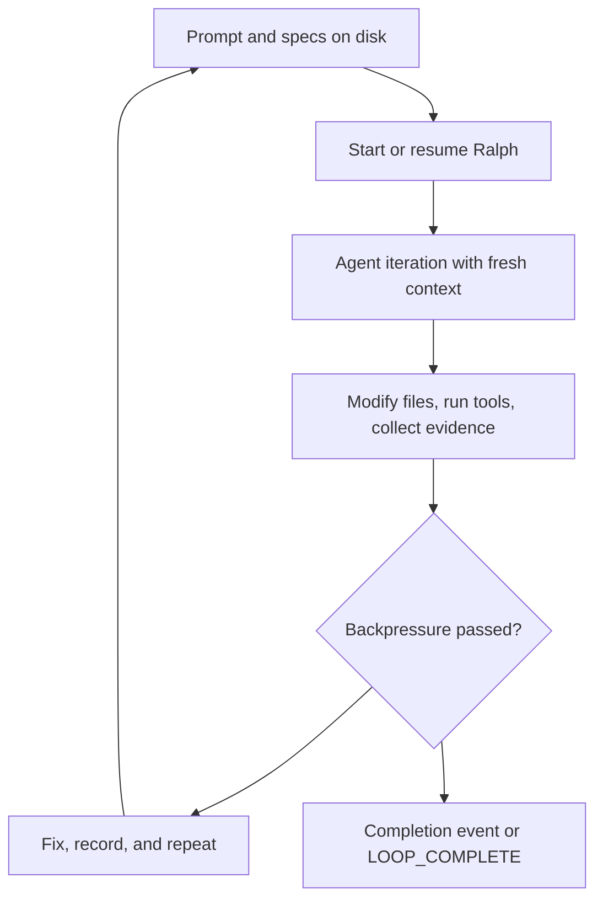

# The Ralph Wiggum Method

Ralph starts with a deliberately simple idea: put an agent in a loop, make the
goal explicit, and keep going until the goal is proven complete.

This project adds Rust structure around that idea. It keeps the loop, but makes
the evidence stream, routing model, and failure boundaries explicit.

## The Loop

The important part is not the shell loop itself. The important part is where
state lives between iterations:

- the repository files
- git history
- `.agent/memories.md`
- `.agent/tasks.jsonl`
- record-session JSONL
- Ralph-specific runtime files under `.ralph/`

## Six Tenets

The local project contract in `AGENTS.md` defines the practical method:

| Tenet | Design consequence |
| --- | --- |
| Fresh Context Is Reliability | Every iteration should re-read specs, plans, and code instead of relying on hidden memory. |
| Backpressure Over Prescription | Tests, builds, lint, and deterministic checks reject incomplete work. |
| The Plan Is Disposable | A bad plan can be regenerated more cheaply than defended. |
| Disk Is State, Git Is Memory | Files are the handoff mechanism across fresh contexts. |
| Steer With Signals, Not Scripts | Add events, gates, and signs that guide agents without over-scripting them. |
| Let Ralph Ralph | Keep the orchestrator thin; let hats and agents do the work. |

## How Ralph Orchestrator Extends The Original Pattern

| Original pattern | Ralph Orchestrator implementation |
| --- | --- |
| One agent repeats a task | A coordinator can route work to hats and hat instances. |
| Prompt and files carry state | Memories, tasks, record-session files, and runtime snapshots make state inspectable. |
| Human watches terminal output | TUI, record summaries, diagnostics, and `ralph agents` expose what happened. |
| Completion is a marker | `LOOP_COMPLETE`, `build.done`, and backpressure evidence are parsed by runtime code. |
| Failure feeds the next loop | Failed gates become structured feedback instead of silent retries. |

## Where The Method Shows Up In Code

- `crates/ralph-core/src/event_loop/mod.rs` owns loop execution and termination behavior.
- `crates/ralph-core/src/event_parser.rs` parses in-band events and backpressure evidence.
- `crates/ralph-core/src/memory_store.rs` persists cross-session memories.
- `crates/ralph-core/src/task_store.rs` persists runtime work tracking.
- `crates/ralph-core/src/parallel/supervisor.rs` coordinates parallel hat instances.
- `crates/ralph-cli/src/record_cli.rs` summarizes and watches JSONL evidence.

## When Ralph Fits

Ralph fits work that has a clear definition of done and a repeatable way to
reject bad output:

- refactors with tests
- documentation sweeps with strict builds
- smoke-test fixture work
- CLI behavior fixes with recorded sessions
- batch migrations where success can be checked

It is weaker when the goal is mostly subjective or the boundary is still
unknown. In that case, write or refine a spec first.

## External Reading

- Geoffrey Huntley's original Ralph Wiggum article: <https://ghuntley.com/ralph/>
- MkDocs deployment guidance: <https://www.mkdocs.org/user-guide/deploying-your-docs/>
- GitHub Pages custom workflow guidance: <https://docs.github.com/pages/getting-started-with-github-pages/using-custom-workflows-with-github-pages>
