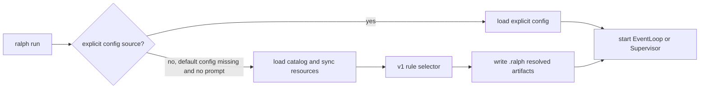

# Startup Resource Bootstrap

Startup resource bootstrap is Ralph's fallback path for an empty workspace.
It runs before the real orchestration loop starts.

Use this page when you want to know what happens if there is no `ralph.yml` and
no `PROMPT.md` in the current directory.

## What Triggers It

Bootstrap v1 runs only when all of these are true:

- the run uses the default config path, `ralph.yml`
- that default config file does not exist
- the user did not pass `--config` / `-c`
- the user did not pass `-p` / `--prompt`
- the user did not pass `-P` / `--prompt-file`
- the run is not `ralph run --continue`

If the user explicitly passes a config source, Ralph skips the bootstrap selector
and uses that explicit source path or preset directly.

## Resource Root

Bootstrap resources are synchronized into a user-editable resource root.
The v1 resolver uses this order:

1. `RALPH_HOME/resources`
2. `$HOME/.ralph/resources`
3. `.ralph/resources` as a workspace fallback when no home directory is visible

The sync step materializes embedded resources on first use and preserves files
that already exist. That means a user-edited resource file is not silently
replaced by a later run.

## Catalog Kinds

The startup catalog uses structured metadata. It does not depend on YAML header
comments at runtime.

Current kinds:

| Kind | Role |
| --- | --- |
| `workflow_preset` | A startup workflow candidate. |
| `backend_preset` | A backend config template users can copy or compose explicitly. |
| `prompt_template` | A task or idle/bootstrap prompt source. |
| `example_bundle` | A materialize/template bundle, not a default workflow candidate. |

Example bundles stay available for explicit use, but they are selector-ineligible
by default.

## Startup Flow



The selector result is written before `EventLoop` or the parallel `Supervisor`
starts.

## Artifacts

A bootstrap run writes two audit files:

| Artifact | Meaning |
| --- | --- |
| `.ralph/bootstrap-selection.json` | Why the selector chose the resources it chose. |
| `.ralph/resolved-config.yml` | The final config that will be used to start the real run. |

The resolved config is written after CLI overrides and validation/auto-detection,
but before dry-run output or the real loop begins.

## Boundaries

Bootstrap v1 is startup-only.

It does not hot-switch the live topology after the real run begins. It also does
not implement runtime workflow or hat invocation. That follow-up belongs to the
`runtime-capability-invocation` change and should reuse the same catalog metadata
without rewriting the active `EventLoop` / `Supervisor` topology.

## Smoke Command

To inspect bootstrap behavior without starting a backend:

```bash
mkdir -p /tmp/ralph-empty-workspace
cd /tmp/ralph-empty-workspace
RALPH_HOME=/tmp/ralph-home ralph run --dry-run --no-tui
```

Expected evidence:

- dry-run output shows an inline bootstrap prompt
- `.ralph/bootstrap-selection.json` exists
- `.ralph/resolved-config.yml` exists
- `/tmp/ralph-home/resources/catalog-manifest.json` exists
