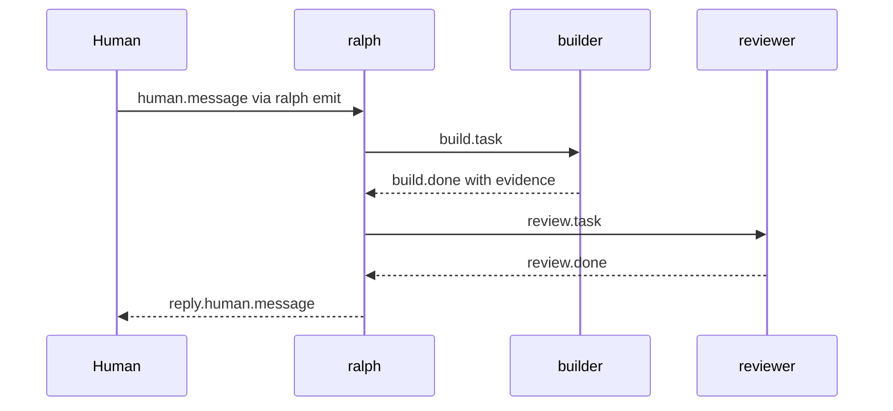

# Events And Hats

Ralph's collaboration API is the event stream. Hats do not call each other
directly. They publish events, and the supervisor routes those events according
to targets, topic contracts, and trigger configuration.

## Vocabulary

| Term | Meaning |
| --- | --- |
| Agent | A tool-using model process that can read context and produce work. |
| Hat | A stable instruction set plus trigger/publish boundaries. |
| Hat instance | A concrete instance such as `writer#1`, used for parallelism or isolation. |
| Ralph | The coordinator that routes events, applies backpressure, and drives convergence. |
| Event | The only collaboration API between agents and hats. |

## Event Channels

There are two different ways events enter the system:

| Channel | Use it for | Do not use it for |
| --- | --- | --- |
| In-band `<event ...>` | A current hat job reporting its normal result through parsed stdout. | External human injection while a run is already active. |
| Out-of-band `ralph emit` | Human/tool injection into the active run's external events file. | Replacing the current hat job's own result event. |

That split is specified in `specs/parallel-event-channels.spec.md`.
It prevents event parser confusion and keeps job stdout as the source for normal
workflow results.

## Delivery Flow



## Targeting Rules

Use `target` when you want the supervisor to choose or spawn a hat instance.

```text
<event topic="human.message" target="writer" spawn_instance="true">...</event>
```

Use `target_instance` when you need a specific instance.

```text
<event topic="human.message" target_instance="writer#1">...</event>
```

Use `turn_action="steer"` only for external control-plane input to `ralph#1`.
The spec explicitly keeps hat-to-hat collaboration on data-plane topics.

## Completion Semantics

`LOOP_COMPLETE` has two meanings depending on runtime mode:

- headless serial runs may terminate naturally
- parallel TUI runs treat it as a pause signal and continue watching external events

This difference is intentional. Interactive parallel sessions need to remain
available so a human can continue the conversation after a quiet point.

## Backpressure Evidence

`build.done` is not just a label. Runtime code parses evidence such as:

- `tests: pass`
- `lint: pass`
- `typecheck: pass`

If a build event lacks the required evidence, the event loop can reject it and
feed the failure back to the agent.

## Practical Guidance

- Send intent to `ralph#1` first when you want coordination.
- Directly emit business topics only when you know the target contract and can
  provide the required payload.
- Keep event payloads brief. Store detailed findings in files or memories.
- Use record-session summaries to prove what was actually published.
