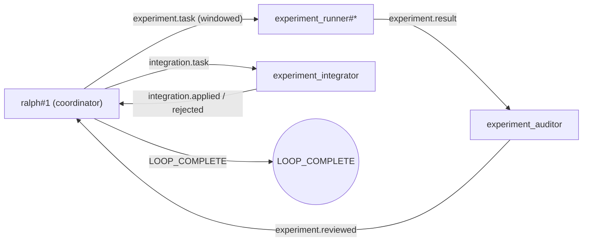

# 并行实验开发永动机（Parallel Experimental Dev Engine）

这是一份“配置方案型”的 example。
它的目标不是演示某个具体业务功能。
它的目标是提供一份**适合探索型开发任务**的 `ralph.yml`：

- 并行实现（多实例 runner 并发跑）
- 批量验证（每个实验必须给出验证证据）
- 多轮实验性开发（失败→下一轮实验建议；成功→收敛）

你可以把它当作：
“我不知道该怎么改最稳。
我需要多次试验、多次验证。
而且我希望并行跑起来”的默认起手式。

---

## 工作流（高层）



补充说明：
- `ralph hats graph` 默认输出的是 `--view physical`（会包含 `ralph#1`），因此与上图的“全貌工作流”一致。
- 如果你只想看更干净的 Hat→Hat 逻辑连线（隐藏 `ralph#1`），使用：`ralph hats graph --view logical`。

核心 topic：

- `experiment.start`：入口事件（payload 是 EXPERIMENT_PLAN）
- `experiment.task`：单个实验任务（包含 what/how/verify）
- `experiment.result`：单个实验结果（包含验证证据 + commit）
- `experiment.reviewed`：审计结果（证据是否足够；证据不足则拒绝收敛）
- `integration.task`：集成任务（由 ralph#1 发布，驱动 integrator 在主工作区 cherry-pick commit + 最终验收）
- `integration.applied`：集成成功（含最终验收证据，推荐包含最终 commit hash）
- `integration.rejected`：不采纳/集成失败（含原因与证据；此时不得收敛）
- `integration.blocked`：集成阻塞（外部依赖/权限/环境问题；此时不得收敛）
- `experiment.complete`：收敛完成候选事件
  - 默认由 `experiment_integrator` 在成功集成后发布（配合 `event_loop.complete_publishes`）
  - 若缺失，`ralph#1` 允许兜底补发（避免卡死）

---

## 如何使用

### 1) 填写你的实验计划（最重要）

打开 `examples/parallel-experimental-dev-engine/PROMPT.md`。
它是一份 Markdown 的 `EXPERIMENT_PLAN` 模板。
你只需要按模板把字段填成你自己的任务即可。
如果你暂时不知道怎么拆实验，
可以把 “实验任务（可选）” 留空，
由 `ralph#1` 先分析项目再自动生成多条实验方案并派发。

这个配置方案的核心约束是：
- 如果你写了实验任务条目：每个实验的 “做什么 / 怎么做 / 怎么验证” 由你提供。
- 如果你没写（或只留 TODO 占位）：由 `ralph#1` 先分析项目并自动生成实验方案，再派发给 runner。

无论走哪条路：
- runner 都必须产出验证证据 + commit（强 backpressure）。
- Ralph 负责把它并行化、结构化。
并且会**自适应决定并行度**（激进起步 + AIMD 动态调参）。
同时强制产出验证证据。

说明（固定 vs 可变）：
- `PROMPT.md`：只放你需要改的实验计划（Markdown，尽量别把“固定协议”写进来，避免误改）。
- `ralph.yml`：固定协议/协调语义锚点在 `event_loop.ralph_prompt`（一般不需要改）。

### 2) 运行

在仓库根目录执行：

```bash
# 只使用配置（目标 prompt 在 examples/parallel-experimental-dev-engine/PROMPT.md）
cargo run --bin ralph -- run \
  -c examples/parallel-experimental-dev-engine/ralph.yml \
  --no-tui
```

可选：在 CLI 上覆盖 backend（如果你默认 backend 没配好，建议显式指定）：

```bash
cargo run --bin ralph -- run \
  -c examples/parallel-experimental-dev-engine/ralph.yml \
  -b codex \
  --no-tui
```

---

## 你应该看到什么（最小成功标准）

一次正常的“跑通并收敛”至少包含：

1. `ralph#1` 按“在途窗口（in-flight window）”分批发出 N 个 `experiment.task`
   - 并行度会运行中动态调参（激进 + AIMD），不会一次性洪水式派发
2. 多个 `experiment_runner#*` 并行产出 `experiment.result`
3. `experiment_auditor` 对每个 `experiment.result` 产出 `experiment.reviewed`
   - 证据充分：`evidence_ok=true`，并给出 `verdict=approved|rejected`
   - 证据不足：`verdict=needs_more_evidence`（此时不得收敛）
4. 实验就是实验：
   - runner 的结果可能不理想（failed/blocked），这是正常现象
   - auditor 允许明确 `verdict=rejected` 放弃该实验
   - workflow 不应因为“有实验不理想”而卡住
5. 只要存在至少一个 `verdict=approved` 的候选实验结果：
   - `ralph#1` 就可以发布 `integration.task`
   - 不需要等待所有实验都变成 “OK”
6. `experiment_integrator` 必须对 `integration.task` 产出：
   - 成功：`integration.applied`（并额外发布 `experiment.complete`）
   - 失败：`integration.rejected`（此时不得收敛）
   - 阻塞：`integration.blocked`（此时不得收敛）
7. 只有当收到 `experiment.complete` 后：
   - `ralph#1` 才会输出 `LOOP_COMPLETE`

---

## 安全与生产建议

这个 example 为了“一条命令跑通”，默认把：

- `parallel.permissions.worktree: allow`
- `parallel.permissions.hooks: allow`

在真实团队/生产环境里，建议至少把 `worktree` 改成 `ask`（需要显式 gate 批准）：

等价写法（便于 grep/交流）：`parallel.permissions.worktree: ask`、`parallel.permissions.hooks: allow`。

```yaml
parallel:
  permissions:
    worktree: ask
    # 约定：hooks 默认不需要批准（避免每次 on_acquire/on_release 都打断流程）
    hooks: allow
```

这样当 workflow 想做高风险操作（例如 worktree acquire）时，会走 `gate.request` / `gate.resolve` 的审批流程。
如果你希望“等待过久能自动继续/失败”，可以配合 `parallel.gate.default_timeout_secs` 使用：

- `default_timeout_secs: 0` 表示不超时（一直等）
- `default_timeout_secs: 60` 表示等 60 秒后超时（会触发 `gate.timeout` 语义）

---

### 工具沙箱兼容性(worktree_backend)

如果你的 runner 后端运行在"只能写当前目录"的沙箱里,`git worktree` 会出现一个典型问题:

- workdir 的 `.git` 会指向上级仓库的 `.git/worktrees/...`
- runner 在 worktree 内执行 `git commit` 时,会尝试写入上级路径
- 结果可能报错类似:
  - `fatal: Unable to create .../.git/worktrees/.../index.lock: Operation not permitted`

因此,本 example 默认启用 `worktree_backend: clone`:

```yaml
parallel:
  workspace:
    worktree_backend: clone
```

如果你在本机/CI 环境里没有上述限制,并且更看重速度与磁盘占用,可以切回 `worktree`:

```yaml
parallel:
  workspace:
    worktree_backend: worktree
```
