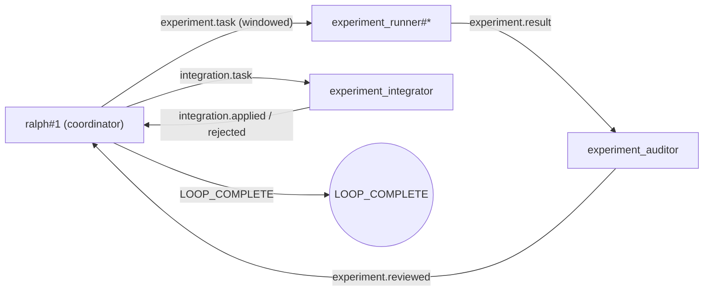

# 并行实验开发永动机（Parallel Experimental Dev Engine）

这是一份“配置方案型”的 example。
它的目标不是演示某个具体业务功能。
它的目标是提供一份**适合探索型开发任务**的 `ralph.yml`：

- 并行实现（多实例 runner 并发跑）
- 批量验证（每个实验必须给出验证证据）
- 多轮实验性开发（失败→下一轮实验建议；成功→收敛）

你可以把它当作：
“我不知道该怎么改最稳。
我需要多次试验、多次验证。
而且我希望并行跑起来”的默认起手式。

---

## 工作流（高层）



补充说明：
- `ralph hats graph` 默认输出的是 `--view physical`（会包含 `ralph#1`），因此与上图的“全貌工作流”一致。
- 如果你只想看更干净的 Hat→Hat 逻辑连线（隐藏 `ralph#1`），使用：`ralph hats graph --view logical`。

核心 topic：

- `task.start`：控制面入口事件（由 `ralph#1` 直接解析为首批 `experiment.task`）
  - 不再发布 `experiment.start`，因为该 topic 在本 example 中没有接收器
- `experiment.task`：单个实验任务（包含 what/how/verify）
- `experiment.result`：单个实验结果（包含验证证据 + commit）
- `experiment.reviewed`：审计结果（证据是否足够；证据不足则拒绝收敛）
- `integration.task`：集成任务（由 ralph#1 发布，驱动 integrator 在主工作区 cherry-pick commit + 最终验收）
- `integration.applied`：集成成功（含最终验收证据，推荐包含最终 commit hash）
- `integration.rejected`：不采纳/集成失败（含原因与证据；此时不得收敛）
- `integration.blocked`：集成阻塞（外部依赖/权限/环境问题；此时不得收敛）
- `experiment.complete`：收敛完成候选事件
  - 默认由 `experiment_integrator` 在成功集成后发布（配合 `event_loop.complete_publishes`）
  - 若缺失，`ralph#1` 允许兜底补发（避免卡死）

---

## 如何使用

### 1) 填写你的实验计划（最重要）

打开本目录的 `PROMPT.md`。
它是一份 Markdown 的 `EXPERIMENT_PLAN` 模板。
你只需要按模板把字段填成你自己的任务即可。
如果你暂时不知道怎么拆实验，
可以把 “实验任务（可选）” 留空，
由 `ralph#1` 先分析项目再自动生成多条实验方案并派发。

这个配置方案的核心约束是：
- 如果你写了实验任务条目：每个实验的 “做什么 / 怎么做 / 怎么验证” 由你提供。
- 如果你没写（或只留 TODO 占位）：由 `ralph#1` 先分析项目并自动生成实验方案，再派发给 runner。

无论走哪条路：
- runner 都必须产出验证证据 + commit（强 backpressure）。
- Ralph 负责把它并行化、结构化。
并且会**自适应决定并行度**（激进起步 + AIMD 动态调参）。
同时强制产出验证证据。

说明（固定 vs 可变）：
- `config/all_hat.md`: 项目级通用定义/原则(会注入所有 hat prompt,且编译期内嵌).
- `PROMPT.md`：只放你需要改的实验计划(Markdown,尽量别把"固定协议"写进来,避免误改).
- `ralph.yml`: 只保留本 example 独有的 topic 与硬门槛;协调语义锚点在 `event_loop.ralph_prompt`(一般不需要改).

提示：
- `config/all_hat.md` 当前是编译期内嵌配置,修改后需要重新编译才能生效.
  - 用 `cargo run` 运行时通常会自动触发重编译.
  - 如果你直接运行已构建的 `target/release/ralph`,需要显式重新 `cargo build --release -p ralph-cli --bin ralph`.

### 2) 运行

推荐在本 example 目录执行(默认 `ralph.yml` + `PROMPT.md`,最省心):

```bash
# 推荐(TUI,可对话/可 steer):
# - 目标 prompt 在本目录 PROMPT.md
cd examples/parallel-experimental-dev-engine
cargo run --bin ralph -- run
```

如果你希望在仓库根目录执行(不切目录),请显式指定 prompt_file:

```bash
cargo run --bin ralph -- run \
  -c examples/parallel-experimental-dev-engine/ralph.yml \
  -P examples/parallel-experimental-dev-engine/PROMPT.md
```

提示:
- TUI 模式在 workflow 完成后不会立刻退出.
  你可以继续查看输出,或继续在 chat 里追加输入.
  需要退出时按 `q` 即可.

日志模式(无人值守,无交互输入,适合 CI/脚本):

```bash
cd examples/parallel-experimental-dev-engine
cargo run --bin ralph -- run \
  --no-tui
```

仓库根目录执行(不切目录)的等价写法:

```bash
cargo run --bin ralph -- run \
  -c examples/parallel-experimental-dev-engine/ralph.yml \
  -P examples/parallel-experimental-dev-engine/PROMPT.md \
  --no-tui
```

注意:
- `--no-tui` 会在看到 completion promise(`LOOP_COMPLETE`)后退出进程.
  因此它不适合做"持续对话".
  如果你需要对话/steer,请用 TUI.

可选：在 CLI 上覆盖 backend（如果你默认 backend 没配好,建议显式指定）：

```bash
cargo run --bin ralph -- run \
  -c examples/parallel-experimental-dev-engine/ralph.yml \
  -P examples/parallel-experimental-dev-engine/PROMPT.md \
  -b codex
```

### 3) 交互与对话(可选)

并行模式下,"在运行中追加输入"有两种方式:

1) TUI 内置 chat(推荐):
   - `hello`:
     - 发送 `human.message` 到"当前选中实例".
     - 如果提示 `send failed: no instance selected`,先在实例列表里选中一个实例(例如 `ralph#1`).
   - `@ralph#1 hello`: 定向发送到 `ralph#1`.
   - `!steer <text...>`: 以 app-server 的 `turn/steer` 方式追加输入(仅允许目标为 `ralph#1`)。
     - 如果当前选中实例不是 `ralph#1`,TUI 会直接报错并拒绝写入外部事件。
   - `!steer @ralph#1 <text...>`: 定向 steer 到 `ralph#1`.
   - `!interrupt [@ralph#1]`: 中断当前 turn(不中断 thread,仅允许 `ralph#1`)。

2) 另开一个终端,通过"外部事件文件(JSONL)"注入消息(适合 `--no-tui` 或你不方便进 TUI):

   先确认当前 run 正在读哪个事件文件:

   ```bash
   cat .ralph/current-events
   ```

   方式A(推荐): 用 `ralph emit` 注入 `human.message`:

   ```bash
	   # 注意: 最好在启动 ralph 的同一工作区根目录执行,避免写错文件
	   cargo run --bin ralph -- emit human.message "继续" --target-instance ralph#1
	   ```

   方式B(推荐,用于 steer/interrupt): 直接用 `ralph emit` 写入控制字段:

   - steer(等价 TUI 的 `!steer @ralph#1 ...`):

     ```bash
     cargo run --bin ralph -- emit human.message "继续,把窗口扩大到2" \
       --target-instance ralph#1 \
       --session-strategy app_server \
       --turn-action steer
     ```

   - interrupt(等价 TUI 的 `!interrupt @ralph#1`):

     ```bash
     cargo run --bin ralph -- emit human.message "" \
       --target-instance ralph#1 \
       --turn-action interrupt
     ```

   重要边界:
   - `turn_action=steer|interrupt` 仅允许 `--target-instance ralph#1`。
   - hats/worker 之间协作请使用普通 data-plane topic,不要使用 `--turn-action`。

   方式C(高级,可选): 手工追加一行 JSONL,支持 steer/interrupt(当你不想依赖 CLI 参数时):

   - steer(等价 TUI 的 `!steer @ralph#1 ...`):

     ```bash
     python3 - <<'PY'
import json
from datetime import datetime, timezone

events_path = open(".ralph/current-events", "r", encoding="utf-8").read().strip()
event = {
    "topic": "human.message",
    "payload": "继续,把窗口扩大到2",
    "ts": datetime.now(timezone.utc).isoformat(),
    "target_instance": "ralph#1",
    "session_strategy": "app_server",
    "turn_action": "steer",
}
with open(events_path, "a", encoding="utf-8") as f:
    f.write(json.dumps(event, ensure_ascii=False) + "\n")
print(f"appended: {events_path}")
PY
     ```

   - interrupt(等价 TUI 的 `!interrupt @ralph#1`):

     ```bash
     python3 - <<'PY'
import json
from datetime import datetime, timezone

events_path = open(".ralph/current-events", "r", encoding="utf-8").read().strip()
event = {
    "topic": "human.message",
    "payload": "",
    "ts": datetime.now(timezone.utc).isoformat(),
    "target_instance": "ralph#1",
    "turn_action": "interrupt",
}
with open(events_path, "a", encoding="utf-8") as f:
    f.write(json.dumps(event, ensure_ascii=False) + "\n")
print(f"appended: {events_path}")
PY
     ```

   常见"无回应"的原因与排查:
   - 你用的是 `--no-tui`,并且 workflow 已经输出 `LOOP_COMPLETE` 并退出进程.
   - 你在错误的目录执行注入,导致写入的不是当前 run 的 `.ralph/current-events` 指向文件.
   - 你写错了 `target_instance`(例如实例不存在/拼写不一致).
   - steer 的前提是目标实例当前存在 in-flight turn 且运行在 `session_strategy=app_server`.
     否则会降级为普通 message,只会在下一轮被消费.

---

## 你应该看到什么（最小成功标准）

一次正常的“跑通并收敛”至少包含：

1. `ralph#1` 按“在途窗口（in-flight window）”分批发出 N 个 `experiment.task`
   - 并行度会运行中动态调参（激进 + AIMD），不会一次性洪水式派发
2. 多个 `experiment_runner#*` 并行产出 `experiment.result`
3. `experiment_auditor` 对每个 `experiment.result` 产出 `experiment.reviewed`
   - 证据充分：`evidence_ok=true`，并给出 `verdict=approved|rejected`
   - 证据不足：`verdict=needs_more_evidence`（此时不得收敛）
4. 实验就是实验：
   - runner 的结果可能不理想（failed/blocked），这是正常现象
   - auditor 允许明确 `verdict=rejected` 放弃该实验
   - workflow 不应因为“有实验不理想”而卡住
5. 只要存在至少一个 `verdict=approved` 的候选实验结果：
   - `ralph#1` 就可以发布 `integration.task`
   - 但前提是该候选已经在 `experiment.reviewed` 里带出明确的顶层 `commit`
   - 不需要等待所有实验都变成 “OK”
6. `experiment_integrator` 必须对 `integration.task` 产出：
   - 成功：`integration.applied`（并额外发布 `experiment.complete`）
   - 失败：`integration.rejected`（此时不得收敛）
   - 阻塞：`integration.blocked`（此时不得收敛）
   - `integration.task.commit` 应直接来自被采纳候选的 `experiment.reviewed.commit`
7. 只有当收到 `experiment.complete` 后：
   - `ralph#1` 必须先输出完成总结（run_id、被采纳实验、证据摘要、剩余风险）
   - 然后才在最后单独一行输出 `LOOP_COMPLETE`

---

## 安全与生产建议

这个 example 为了“一条命令跑通”，默认把：

- `parallel.permissions.worktree: allow`
- `parallel.permissions.hooks: allow`

在真实团队/生产环境里，建议至少把 `worktree` 改成 `ask`（需要显式 gate 批准）：

等价写法（便于 grep/交流）：`parallel.permissions.worktree: ask`、`parallel.permissions.hooks: allow`。

```yaml
parallel:
  permissions:
    worktree: ask
    # 约定：hooks 默认不需要批准（避免每次 on_acquire/on_release 都打断流程）
    hooks: allow
```

这样当 workflow 想做高风险操作（例如 worktree acquire）时，会走 `gate.request` / `gate.resolve` 的审批流程。
如果你希望“等待过久能自动继续/失败”，可以配合 `parallel.gate.default_timeout_secs` 使用：

- `default_timeout_secs: 0` 表示不超时（一直等）
- `default_timeout_secs: 60` 表示等 60 秒后超时（会触发 `gate.timeout` 语义）

---

### 工具沙箱兼容性(worktree_backend)

如果你的 runner 后端运行在"只能写当前目录"的沙箱里,`git worktree` 会出现一个典型问题:

- workdir 的 `.git` 会指向上级仓库的 `.git/worktrees/...`
- runner 在 worktree 内执行 `git commit` 时,会尝试写入上级路径
- 结果可能报错类似:
  - `fatal: Unable to create .../.git/worktrees/.../index.lock: Operation not permitted`

因此,本 example 默认启用 `worktree_backend: worktree`:

```yaml
parallel:
  workspace:
    worktree_backend: worktree
```

如果你的 runner 后端确实运行在"只能写当前目录"的沙箱里,并遇到上述权限报错,
再切换为 `clone`(更稳,但更慢):

```yaml
parallel:
  workspace:
    worktree_backend: clone
```
