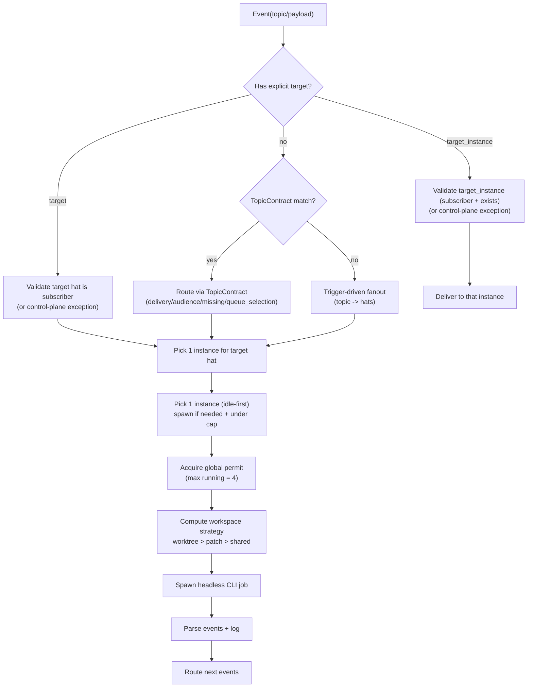

## Context

### 背景

我们希望 `parallel.enabled: true` 的核心语义是：

- 默认按 `hats.*.triggers` 做路由（topic → hats）。
- 同一 topic 的多个订阅者 hat 会真正并发启动（各自一个 headless CLI job）。
- 对于同一个 hat，即使它有多个实例，默认也只选择 **一个实例**执行（hat-level fanout，instance-level queue）。

但当前并行模式把 `parallel.topic_contracts` 当作硬门槛：

> Parallel mode requires **explicit topic routing contracts** (`parallel.topic_contracts`). There is no implicit broadcast.
>
> —— `README.md`

并且在运行时直接拒绝启动（topic_contracts 为空就 bail）：

> parallel.enabled=true 但 parallel.topic_contracts 为空：并行模式要求每个 topic 都能解析到显式 TopicContract。建议先配置一个 "*" 作为兜底（仍属于显式配置）。
>
> —— `crates/ralph-core/src/parallel/supervisor.rs`

这导致用户必须同时维护两套语义（triggers + contracts），并且并行“默认行为”无法从 triggers 直觉推导。

本设计要把并行路由收敛为“两层语义”，并让 TopicContract 回归为可选覆盖层：

1. **topic → hats**：默认 fanout 给所有订阅 hats（行为对齐顺序模式 EventBus）。
2. **hat → instance**：对每个 hat 只选择一个实例执行（idle-first + autoscale + 全局并发上限）。

### 现状入口点（主要受影响）

- 并行运行时入口：`crates/ralph-core/src/parallel/supervisor.rs`
  - 当前强制要求 `parallel.topic_contracts` 不为空。
- 并行路由实现：`crates/ralph-core/src/parallel/supervisor/routing.rs`
  - 当前路由主要依赖 TopicContract 的 audience/delivery。
- 顺序模式订阅语义（我们要对齐的默认）：`crates/ralph-proto/src/event_bus.rs`
  - 默认 publish 会 fanout 到所有订阅 hats（优先 specific subscriptions）。

## Goals / Non-Goals

**Goals:**

- 并行模式默认路由“只看 triggers 就能理解”：
  - 同一 topic 的多个订阅者 hat 默认 fanout，并发执行。
  - 对每个 hat 默认只选 1 个实例执行（不 fanout 到该 hat 的所有实例）。
- TopicContract 变为可选覆盖层：
  - 有匹配 contract → 按 contract 路由。
  - 无匹配 contract / contracts 为空 → 走 triggers 默认路由。
- 自动扩缩容（默认开启）：
  - idle-first 选择实例；全忙则动态创建实例。
  - 全局并发上限默认 4（安全刹车）。
  - 动态实例 idle 30s 自动回收。
  - 实例 key 单调递增且永不复用（方案 A）。
- workspace override 走 Event 字段：
  - 支持 per-event `workspace_strategy`。
  - 合并为单 job 时采用 `worktree > patch > shared` 的 merge 规则。
- 严格校验：
  - `event.target` / `event.target_instance` 必须订阅该 topic，否则视为错误并 escalate。
  - 允许控制面 topic 做特例（避免打断 gate/控制信号）。

**Non-Goals:**

- 不做分布式/多机调度。
- 不做并行 PTY/TUI（仍以 headless CLI 并发为核心）。
- 不追求与“必须显式 topic_contracts”旧语义完全兼容（这是 BREAKING 行为调整）。

## Decisions

### 1) 两层路由语义：topic → hats（fanout）+ hat → instance（queue）

**Decision：**

- 默认路由（无 TopicContract 覆盖时）按 triggers 计算订阅 hats，并 fanout 给所有订阅 hats。
- 对每个订阅 hat，再在该 hat 的实例集合里选择 **一个实例**执行。

**Rationale：**

- 这与顺序模式 `EventBus` 的直觉一致：topic 是“订阅关系”，默认就是 fanout 到订阅者。
- 并行模式只是在执行层面把这些订阅者变成并发的 job，而不是改变订阅语义本身。
- “fanout 到 hat，但不 fanout 到实例”能避免同一 hat 的多实例重复做同一件事。

**Alternatives：**

- 让 topic_contracts 永远必填：清晰但使用成本高，且违背“只写 triggers 就能跑”的体验目标。
- 让每个 hat 的所有实例都收到 fanout：吞吐高但会导致重复工作与冲突（尤其是写操作）。

### 2) TopicContract 的地位：可选覆盖层（override layer）

**Decision：**

- 如果某个 TopicContract 匹配 `event.topic`，按 contract 路由（保持现有能力）。
- 如果没有匹配 contract（或 contracts 为空），使用 triggers 默认路由。
- 并行运行时启动不再依赖 contracts 的存在。

**Rationale：**

- contracts 仍然很有价值：它能表达显式 queue/fanout、missing 策略、复杂 audience selector。
- 但它不应成为“并行模式可用性”的门槛。

**Alternatives：**

- 启动时从 triggers/publishes 自动生成 contracts（用户不写也能跑）。
  - 优点：仍然“一切显式化”，回放更直观。
  - 缺点：生成规则本质仍是隐式 DSL，且会让用户以为自己在控制 contracts，但实际是系统生成的。
  - 本设计把它保留为备选实现路径（快速落地/兼容路径）。

### 3) 实例选择：idle-first + 单调递增实例 key（永不复用）

**Decision：**

- 实例选择策略：优先 `Idle/Created`，再考虑 `Running`。
- 若存在多个同 rank 候选，按稳定排序（例如按 `HatInstanceId` 字符串）做 deterministic tie-break。
- 自动扩容创建的新实例 key 使用单调递增序号（`hat#2, hat#3, ...`），并且永不复用。

**Rationale：**

- idle-first 能最大化复用现有实例，减少不必要的进程启动与上下文热身成本。
- 单调递增且不复用能显著降低排障成本（日志/回放不需要解释“同名实例复活”）。

**Alternatives：**

- 使用随机 nanoid：看起来更“唯一”，但回放与人类操作不友好；也会引入“如何复现同一实例 ID”问题。

### 4) 全局并发上限（默认 4）与调度止损

**Decision：**

- 增加全局并发上限（默认 4），限制同时 Running 的 headless job 数量。
- 当某 hat 全忙且全局并发未达上限时，允许 autoscale 创建新实例并执行。
- 当全局并发达到上限时，不再创建新实例；事件进入该 hat 的排队路径（选择一个现有实例承载 pending）。

**Rationale：**

- 自动扩缩容如果没有硬刹车，很容易在 fanout 场景下触发进程/成本爆炸。
- 默认值 4 是一个“无需用户调参”的保守起点。

**Alternatives：**

- 不做全局上限：实现简单，但工程风险过高（你已明确不接受）。

### 5) 全局上限的工程落点：permit/semaphore（设计建议）

**Decision（建议实现方式）：**

- 用全局 semaphore/permit 控制“允许进入 Running 状态”的 job 数量。
- 实例在启动 job 前必须获取 permit；job 完成后释放 permit。

**Rationale：**

- 当前架构中 HatInstanceActor 会在收到事件后立即 `maybe_start_job()` 并启动外部进程。
- 如果只在 Supervisor 层做“少投递”，很容易在并发时出现 oversubscribe 的边界情况。
- permit 是最直接且可证明正确的全局约束方式。

**Alternatives：**

- Supervisor 自己维护待调度队列，只有拿到 permit 才把事件 deliver 给实例。
  - 可行，但会引入“双队列”（supervisor queue + instance pending）与更复杂的恢复语义。

### 6) workspace override：Event 字段表达 + 最强隔离合并

**Decision：**

- Event 协议新增 `workspace_strategy`（或等价字段），支持 per-event override。
- 当实例把多个事件合并成一个 job 时：
  - final_strategy = `max(hat_default, max(event_overrides...))`
  - merge 优先级：`worktree > patch > shared`

**Rationale：**

- workspace 决策属于执行环境，不应编码进 topic 字符串（避免 DSL 膨胀）。
- “最强隔离优先”能让合并后的 job 保持安全上界（不会因为混入 shared 事件而降低隔离）。

**Alternatives：**

- 把 workspace 决策拆成不同 hats（例如 writer_shared / writer_worktree）。
  - 可行但会膨胀 hats 配置，且把执行环境语义绑定到 persona 命名上。

### 7) 严格 target 校验 + 控制面特例

**Decision：**

- `event.target` / `event.target_instance` 必须是该 topic 的订阅者，否则视为错误：
  - warn + escalate（例如投递到 `ralph#1` 的 routing.escalate 事件）。
  - 不允许“强制投递绕过订阅”。
- 对少数控制面 topic 允许 bypass 校验（例如 gate 类事件），避免打断系统控制信号。

**Rationale：**

- target 是“收敛语义”，如果允许绕过订阅，会让系统变成“任意发信箱”，难以推理与回放。
- 控制面特例是工程现实：有些事件是 orchestrator 的运行时信号，不应被订阅拓扑阻断。

## Visual Model

## Risks / Trade-offs

- [语义变更导致文档/测试不一致] → 同步更新 `README.md`、并行 E2E、smoke fixtures，并在 tasks 里设为硬门槛。
- [permit 引入死锁/饥饿] → permit 只包围 job running 区间；用 timeout + 失败释放保证不会泄漏；必要时加入公平策略（FIFO）。
- [autoscale 让某个 hat 吞掉全部并发配额] → 后续可加“per-hat soft cap”或调度公平性；第一版先用全局 cap + deterministic queue。
- [回收动态实例导致状态抖动] → idle TTL 默认 30s；只回收动态实例；并记录 spawn/reap 事件以便排障。
- [workspace override 与权限冲突] → override 只表达“希望”；最终仍要经过 capability/permission gate 的判定（失败则降级或 escalate）。

## Migration Plan

1. 更新并行启动校验：允许 `parallel.topic_contracts` 为空；移除“必需 topic contract”硬要求。
2. 在 ParallelSupervisor 增加 triggers 默认路由（并保持 TopicContract 覆盖优先）。
3. 增加实例调度层（idle-first + autoscale + 全局 cap + idle reaper）。
4. 扩展 Event 协议加入 workspace override，并把 merge 规则落到 job 级决策。
5. 更新 README 与 specs（包括 `specs/parallel-hat-instances.spec.md` 的冲突段落）。
6. 更新测试：
   - 新增 triggers 并发 fanout 的单测/集成测。
   - 更新并行 E2E 场景为“最小配置不写 topic_contracts 也能跑”。

Rollback：

- 关闭 `parallel.enabled` 直接回到旧串行运行时。
- 或者保留 `topic_contracts` 全覆盖，继续走 contract 路由（触发器默认路由不会生效）。

## Open Questions

- 控制面特例 topic 的默认列表是什么？
  - 建议至少包含 `gate.*`，以及 orchestrator 内部的 workspace 控制事件。
- target 校验失败时的默认策略：drop vs escalate？
  - 本设计推荐 escalate（更可观测），但可以做成配置项。
- autoscale 的“排队策略”具体选 least-busy 还是 round-robin？
  - 需要结合 instance pending 队列的数据结构与可观测性决定。
