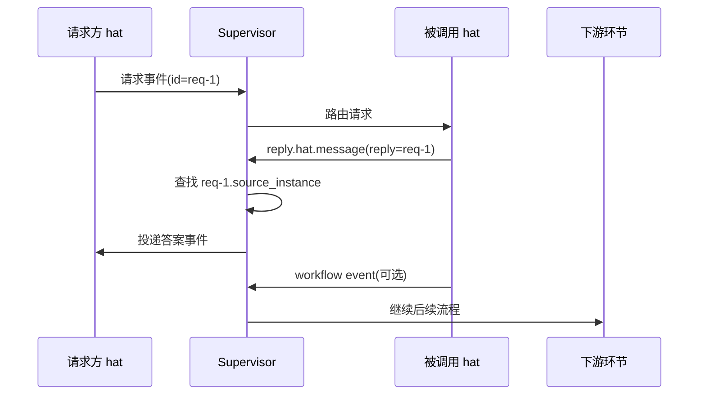

## Context

当前并行运行时已经具备几块相关基础:

- `Event.id`: 每条事件都有可引用 id。
- `Event.reply`: 可以表达“这条事件是在回复哪条旧事件”。
- `source_instance` / `target_instance`: 运行时可以识别事件来自哪个实例,以及应该投递到哪个实例。
- `reply.human.message`: 已经存在一条专门的“回复给 human”通道,但它是 UI/log-only,不会继续参与 hat workflow 路由。

真正缺的不是“事件之间能不能关联”,而是“被调用 hat 的答案能不能可靠回到请求方实例”。这在 explorer / researcher / lookup 类 hat 上特别明显:

- 请求方只想拿答案。
- 它不想为了一个子查询,额外发明一套 workflow topic。
- 它也不应该被迫手抄 `target_instance` 或依赖 prompt 里的人肉约定。

这里还存在一个边界条件:

- Ralph 当前的 `<event ...>` 是异步协作模型。
- hat 发布事件后,要等 job 结束,Supervisor 才会解析并路由。
- 所以这次设计解决的是“异步 request-reply”。
- 它不试图把 hat-to-hat 问答升级成“同一轮推理内同步 RPC”。

### Flow

```mermaid
flowchart LR
    A["请求方 hat"] -->|发布请求 event| B["被调用 hat"]
    B -->|发布 reply.hat.message + reply=request_id| C["运行时按 reply 查原请求"]
    C -->|回送到 request.source_instance| A
    B -->|普通 workflow event(可选)| D["下游环节"]
```

### Sequence



## Goals / Non-Goals

**Goals:**

- 为 hat-to-hat 协作定义一条显式、可选的答案回流通道。
- 让运行时根据原始请求自动解析回送目标,而不是依赖 LLM 手动填写 `target_instance`。
- 保持答案回流与 workflow 推进分离,允许两条通道并存。
- 让 requester 收到的答案仍然可关联、可回放、可诊断。

**Non-Goals:**

- 不把所有 hat 的 final answer 默认回传给 creator / requester。
- 不把现有 `reply` 的关联语义直接升级为“所有 reply 都自动回送”。
- 不试图提供同一轮推理内的同步 RPC / subcall 阻塞等待。
- 不替代 `reply.human.message` 这条 hat-to-human 的专用回复通道。

## Decisions

### 1) 协议表面: 使用专门 topic `reply.hat.message`

**选择:**

- 定义 `reply.hat.message` 作为 hat-to-hat 的答案回流 topic。
- 只有显式发布该 topic 的事件,才会进入 requester-return 语义。
- 该事件 MUST 携带 `reply="<request_event_id>"`。

**理由:**

- 这让“普通 workflow event”和“答案回流 event”在语义上彻底分开。
- 继续复用现有 `reply` 作为关联锚点,不用再引入第二套关系字段。
- 名称与既有 `reply.human.message` 平行,更容易理解。

**替代方案:**

- 让所有带 `reply` 的事件都自动回送:
  - 缺点: 语义过重,会把普通关联误判成 requester-return。
- 新增 `creator` / `return_to` 字段:
  - 缺点: 协议变重,而且还是会遇到“谁来填、何时填、和 `target_instance` 如何并存”的问题。

### 2) 回送目标解析: 运行时按 `reply` 查原请求的 `source_instance`

**选择:**

- 路由 `reply.hat.message` 时,运行时查找被 `reply` 引用的原始请求事件。
- 若找到该请求,并且请求事件拥有 `source_instance`,则将答案定向投递给该实例。

**理由:**

- 请求方实例是谁,运行时已经知道,不需要 callee 再抄一遍。
- 这能避免 prompt 漂移时把 `target_instance` 填错。
- 也不需要把 `source_instance` 暴露到 prompt 里让 LLM 自己拼路由。

**替代方案:**

- 在 incoming events prompt 暴露 `source_instance`,要求 callee 手动填 `target_instance`:
  - 缺点: 易错,而且每个 hat 都会自己发明不同的回传 topic。

### 3) 失败策略: requester 无法解析时 fail-closed

**选择:**

- 如果 `reply.hat.message` 指向的事件不存在,或存在但没有可回送的 `source_instance`,运行时不得把它广播/扇出给其他 hats。
- 运行时只记录一条未解析的 requester-return 诊断信息,并让该事件停止在此。

**理由:**

- 回传答案是“定向交付”,不是“尽量送给谁都行”。
- 广播一个未解析的答案最容易制造噪音和错误副作用。

**替代方案:**

- 回退成普通 topic 路由:
  - 缺点: 会让一个本该定向返回的答案意外进入 workflow。
- 自动升级成人工 gate:
  - 缺点: 太重,不适合作为默认 V1 行为。

### 4) 双通道并存: 同一 hat 可以同时回答案,也继续推进 workflow

**选择:**

- 被调用 hat 可以在同一轮输出里,或者相邻轮次里:
  - 向 requester 发布 `reply.hat.message`
  - 同时发布一个或多个普通 workflow event

**理由:**

- 这正是用户提出的真实场景:
  - 请求方只想拿答案
  - 但系统整体流程有时也需要继续推进
- 若强迫二选一,就会重新把不同职责耦合到一个 topic 上。

**替代方案:**

- 默认把 workflow terminal event 当作 final answer:
  - 缺点: 哪个算 terminal/final 并不稳定,容易被不同 hat 理解成不同东西。

### 5) 可观测性: 保留 reply 关联,并记录派生的 requester target

**选择:**

- 被成功回送的 `reply.hat.message` 必须保留原始 `reply="<request_event_id>"`。
- 运行时诊断日志应记录:
  - 原请求 id
  - 解析出的 requester instance
  - 未解析时的失败原因

**理由:**

- requester 需要知道“这个答案是在回复哪次请求”。
- 诊断链路需要能解释“为什么回到了这个实例”或“为什么没有回去”。

**替代方案:**

- 只做最终投递,不记录解析过程:
  - 缺点: 出问题时很难排查是 reply 错了、查找失败了,还是 target 计算错了。

## Risks / Trade-offs

- [Risk] `reply.hat.message` 与 `reply.human.message` 名称相近,新接入者可能混淆。
  - Mitigation: 在 all-hat prompt、spec 与示例里明确说明一个是 hat-to-human,一个是 hat-to-hat。
- [Risk] 某些现有 workflow 可能会把“回给请求方”误理解成“默认回给 coordinator”。
  - Mitigation: 明确写入规范: 默认不回传,只有显式 `reply.hat.message` 才回传。
- [Risk] reply 查找需要事件索引,实现时若只依赖临时内存,可能影响 replay/diagnostics。
  - Mitigation: 复用当前事件日志/总线中的稳定 event id,并在路由层集中解析。
- [Risk] V1 只支持异步 answer-return,不能满足“同轮等待子答案”的诉求。
  - Mitigation: 在文档里明确这是异步协议; 同轮同步调用如果未来需要,应单独设计成 RPC/subagent 能力。

## Migration Plan

1. 在 OpenSpec 中新增 `hat-request-reply-channel` capability,明确协议边界。
2. 在运行时为 `reply.hat.message` 增加专门的 requester-return 路由分支。
3. 在并行 prompt / 文档中补充该 topic 的使用方式和禁止事项。
4. 增加单元测试、集成测试和 E2E 场景,覆盖:
   - requester-return 成功
   - unresolved fail-closed
   - answer 与 workflow 双通道并存
5. 若实现后发现 topic 命名不合适,可在未发布前调整; 回滚时只需移除该 special-case 路由,不会破坏现有 workflow event。

## Open Questions

- topic 名称是否最终保持 `reply.hat.message`,还是改成更偏结果语义的 `reply.hat.answer`?
- unresolved requester-return 在 V2 是否需要升级成显式告警事件,而不只是诊断日志?
- CLI 层是否需要提供一个更顺手的 emit sugar,减少手写 `reply.hat.message` 的概率?
