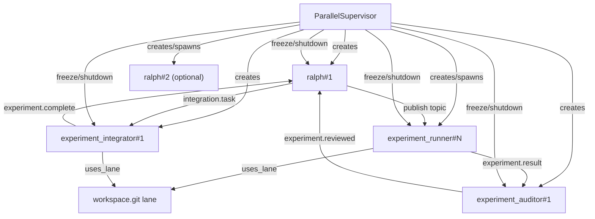
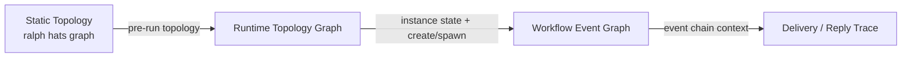
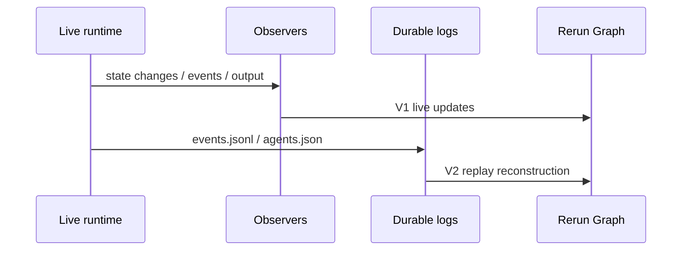

## Context

Ralph 当前已经有一套静态图能力:

- `crates/ralph-cli/src/hats.rs` 可以在启动前输出逻辑/物理拓扑图
- 输出格式包括 Mermaid / Unicode / ASCII

这套能力解决的是“配置层 topology 是否可理解”。
它不解决 run 中的实例关系问题。

而用户现在要的是另一类图:

- `ParallelSupervisor` 何时创建了哪些 instances
- 哪些 instances 是静态实例,哪些是动态扩容实例
- 消息如何在 instances 之间传递
- `reply` 链如何回流
- completion freeze / shutdown / cancel 如何影响实例生命周期
- workflow topic 链与实例关系图如何互相映射

因此这次 change 的本质不是“把 Mermaid 改成 Rerun”。
而是为 Ralph 增加一套 **运行时关系图观测模型**。

另外,当前代码和证据边界说明:

- live 观察面已经有:
  - `output_observer`
  - `instance_state_observer`
  - `event_observer`
- durable 观察面已经有:
  - `.ralph/events.jsonl`
  - `.ralph/agents.json`
- 但 `events.jsonl` 目前稳定持久化的只有:
  - `source_instance`
  - `reply`
  - `topic`
  - `triggered`
- 它没有完整持久化:
  - `target_instance`
  - fanout recipients
  - creator relationship

所以我们必须把方案拆成 V1 / V2。

## Goals / Non-Goals

**Goals**

- 为 Ralph 定义一套清晰的 runtime graph 数据模型
- 用 Rerun 表达并行 runtime 的:
  - topology
  - lifecycle
  - workflow
  - delivery / reply
- 明确静态图与动态图的边界
- 正式记录 V1 / V2 路线,避免后续失联

**Non-Goals**

- 不替换现有 `ralph hats graph`
- 不把 Rerun 布局结果当成协议真相源
- 不在 V1 追求完整离线 replay 精度
- 不在本 change 中实现新的 orchestration 语义
- 不在本 change 中把所有 TUI 图形化

## Decisions

### 1) 保留双图体系: 静态 topology 图 和 运行时动态图 分工明确

**选择**

- `ralph hats graph` 保留:
  - 配置前 / 启动前静态 topology 图
  - 帮用户理解 triggers / publishes / logical / physical topology
- Rerun runtime graph 新增:
  - run 中的 instances / lifecycle / routing / workflow 关系

**理由**

- 现有 Mermaid 图已经很好地覆盖“静态 topology”这块
- 新需求真正缺的是“运行时关系图”
- 如果不分开,最后只会得到两套语义重叠、名字相近、输出不同的图

### 2) 图模型至少拆成三层,不要试图用一张图表达所有关系

**选择**

定义三类视图:

1. Runtime Topology Graph
   - `supervisor`
   - `hat instance`
   - `workspace lane`
   - lifecycle / create / shutdown / freeze
2. Workflow Event Graph
   - topic -> topic 的协议链
   - 或 topic <-> hat instance 的工作流关系
3. Delivery / Reply Trace
   - `source_instance -> target_instance`
   - `reply -> original_event`

**理由**

- “谁存在” 和 “谁给谁发消息” 是两类不同认知任务
- 全塞进一张图,边会很快打架
- Rerun 很适合做多个 GraphView,分别看不同层

### 3) Rerun 不是新真相源,已有日志才是协议真相源

**选择**

- Rerun 只负责展示与时间维组织
- 真相源仍然是:
  - runtime observers
  - `.ralph/events.jsonl`
  - `.ralph/agents.json`
  - 以及后续新增的 delivery-level durable artifacts

**理由**

- Rerun graph 使用 force-based layout
- 布局会变化,但协议事实不能变化
- 如果把展示层当真相源,排障会倒果为因

### 4) V1 先做 live graph,不要一开始追求完整 replay

**选择**

V1 先基于 live observers 和已有日志做图:

- instance create / state change
- workflow topic 出现
- `reply` 关系
- 已知 queue decision
- `.agents.json` 补充当前 instance 状态摘要

**理由**

- 当前代码已经有足够多的 live hooks
- 先把“看得见”这件事做出来,价值就很高
- 如果一开始追求全量 durable replay,很容易把 change 做成“观测协议大改造”

### 5) V2 必须补 delivery 级 durable 记录,否则 replay graph 永远不完整

**选择**

V2 明确要求补齐至少以下 durable 关系:

- 最终 `target_instance`
- fanout recipients
- dynamic instance creator
- lifecycle control edges:
  - freeze
  - cancel
  - shutdown

并把这些证据接入 replay graph。

**理由**

- 当前 `events.jsonl` 能告诉我们“谁发出了事件”
- 但不能总是告诉我们“事件最终交给了谁”
- 没有这层 durable 关系,离线重建出来的图只能是近似图

### 6) runtime graph 的节点和边必须先规范化,再讨论渲染细节

**选择**

节点类型:

- `supervisor`
- `instance::<hat_id>#<n>`
- `lane::<name>`
- `topic::<topic>`
- 可选: `workflow::<run_id>`

边类型:

- `creates`
- `spawns`
- `delivers`
- `replies_to`
- `publishes`
- `freezes`
- `cancels`
- `shuts_down`
- `uses_lane`

节点属性:

- `hat_id`
- `instance_id`
- `is_dynamic`
- `state`
- `job_id`
- `last_input_topic`

边属性:

- `topic`
- `event_id`
- `reply_to`
- `delivery_mode`
- `queue_selection`
- `timestamp`

**理由**

- 先规范化数据模型,后面不管接 Rerun / JSON / TUI,都更稳
- 否则会很快变成“看到什么就临时画什么”

### 7) V1 / V2 都必须写进 proposal / design / tasks,不只写在聊天里

**选择**

- proposal 明确写 V1/V2 路线
- design 明确写 V1/V2 边界和原因
- tasks 明确把 V1/V2 拆开

**理由**

- 用户已经明确担心“只做了 V1,以后找不到 V2”
- 这个担心是合理的
- 所以 V1/V2 必须成为正式 artifact,不是聊天临时结论

## Architecture

### Current Runtime Relationship Model

### View Separation

### Replay Boundary

## V1 Plan

### Scope

- 做 live runtime graph
- 不承诺完整 replay
- 先覆盖最值钱的观测对象:
  - instance existence
  - instance state
  - dynamic spawn
  - reply chain
  - queue decisions
  - workflow topic chain

### Data Sources

- `instance_state_observer`
- `event_observer`
- `delivery_observer`
- `.ralph/agents.json`
- `.ralph/events.jsonl`

说明:

- V1 当前实现没有只靠 durable 日志“猜” recipient。
- 为了拿到 `source_instance -> recipient` 的 live 关系,并行 supervisor 新增了一个最小 `delivery_observer`:
  - direct
  - queue
  - fanout
  - reply
- instance create 边则来自显式的 `Created` 状态通知:
  - 初始 `spawn_instances()`
  - 动态 `spawn_instance()`

### User Entry And Artifact

- `ralph run --runtime-graph-rrd <FILE>`
- `ralph run --continue --runtime-graph-rrd <FILE>`
- 仅在 `parallel.enabled=true` 时允许
- 当前 artifact 是 Rerun `.rrd` 文件
- 当前 V1 只承诺“录制出来并可被 `rerun <FILE>` 打开”,不承诺 viewer / TUI 内嵌

### Expected User Value

- live 调试时可以直接看到:
  - `ralph#1` 是否忙
  - 有没有新实例被动态创建
  - 某条 workflow 卡在哪个 topic
  - 回复链是否回到了正确实例

## V2 Plan

### Scope

- 做 durable replay graph
- 强化 post-mortem / CI / report artifact
- 明确重建:
  - create/spawn lineage
  - delivery lineage
  - lifecycle control lineage

### Required Instrumentation

- 持久化 `target_instance`
- 持久化 fanout recipients
- 持久化 dynamic instance creator / cause
- 持久化 freeze / cancel / shutdown control edges

### Implemented Durable Record Shape

- `runtime.delivery`
  - observer-only topic,不会参与业务路由。
  - payload 为 `RuntimeDeliveryRecord` JSON。
  - 一条真实投递写一条记录。
  - fanout 会按 recipient 拆成多条记录。
  - 字段覆盖 `event_id`、`reply`、`topic`、`source_instance`、`recipient`、`mode`。
- `runtime.lifecycle`
  - observer-only topic,不会参与业务路由。
  - payload 为 `RuntimeLifecycleRecord` JSON。
  - 字段覆盖 `instance_id`、`kind`、`state`、`dynamic`、`source_event_id`、`reason`。
  - `kind` 覆盖 create、spawn、state、freeze、cancel、shutdown。
- 这两个 topic 和 `dispatch.decision` 一样, payload 不允许截断。

### Replay Reconstruction

- CLI 入口: `ralph runtime-graph replay --events <events.jsonl> --output <runtime.rrd>`。
- 重建顺序: 按 events JSONL 行顺序推进 `runtime_step`。
- workflow event:
  - 普通 topic 重建 `source_instance -> topic` publish edge。
  - observer-only topics 不作为 workflow event 展示。
- delivery event:
  - 从 `runtime.delivery` 重建 direct / queue / fanout / reply delivery edge。
- lifecycle event:
  - 从 `runtime.lifecycle` 重建 create / spawn / freeze / cancel / shutdown control edge。
- filtering:
  - `--topic` 只过滤 workflow / delivery topic。
  - lifecycle record 没有 topic,默认保留; 若传 `--instance`,则只保留对应 instance 的 lifecycle record。
  - `--instance` 对 delivery 同时匹配 source instance 与 recipient。
- fidelity:
  - 同时存在 delivery records、lifecycle records 和 lifecycle control records 时标记 full-fidelity。
  - 缺少任一类 V2 durable evidence 时标记 approximate,不能宣传成完整 replay。

### Expected User Value

- 一次 run 结束后仍能重建主要关系图
- 自动化报告不再只是一堆 JSONL 和 stdout grep
- 复杂 flaky 场景更容易比较不同 run 的结构差异

## Risks / Trade-offs

- [Risk] V1 图看起来很完整,但其实缺少部分 delivery 边
  - Mitigation: 在文档和 UI 上显式标注 `live-only / approximate`

- [Risk] Rerun 图与 `ralph hats graph` 被用户混为一谈
  - Mitigation: 文档和命名都要把 static / runtime 分开

- [Risk] 过早把 delivery durable 化,导致 change 范围爆炸
  - Mitigation: 明确 V1 先不追求这个,把它推到 V2

- [Risk] force-based layout 在复杂场景下不稳定
  - Mitigation: 优先固定核心节点位置或分视图展示,不要把布局结果当协议事实

- [Risk] 事件量大时图噪音过高
  - Mitigation: 默认按层分视图,必要时支持 topic / instance / run_id 过滤
