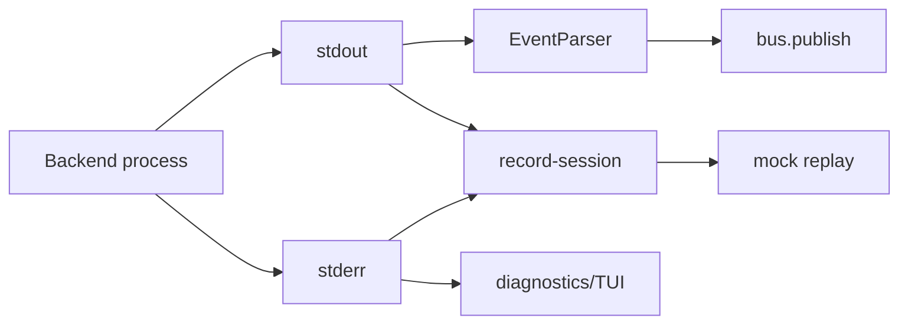

## 1. 背景与边界

本 change 只处理 adapter contract tests。
它不是 runtime evidence 的完整重构,也不是 capability invocation 的实现。

目标是先把最容易漂移的边界变成测试:

- 哪条 stream 可以被 event parser 消费。
- prompt 如何传给 backend。
- replay/cassette 如何保留归因字段。
- 中断和 termination 证据如何落盘。

## 2. 设计目标

1. **stdout-only event parsing**: stderr 可以记录和展示,但默认不驱动 event parser。
2. **prompt transport 明确化**: `stdin` / `arg` / future modes 的差异必须可测。
3. **event envelope 归因稳定**: `id`、`reply`、`source_instance`、`instance_id` 不能在 logger / cassette / replay 中丢失。
4. **termination flush 可验证**: 关键 JSONL 行必须能在中断/退出路径后 strict parse。

## 3. 非目标

- 不把 stderr 永久隐藏; stderr 仍可进入 TUI / cassette 作为诊断证据。
- 不做完整 SIGINT/SIGTERM E2E 矩阵;本 change 只补最小 contract tests。
- 不新增 runtime graph 功能。
- 不改变 backend CLI 的用户可见命令形态。

## 4. 契约细节

### 4.1 Stream contract

```text
stdout = semantic agent output, default event parser input
stderr = diagnostics stream, recorded/displayed, not default event parser input
```

测试重点:

- stderr 中的 `<event ...>` 不应产生业务事件。
- stdout 中的 `<event ...>` 仍应正常解析。
- cassette 可以同时保留 stdout/stderr,但 replay/event parsing 默认只消费 stdout。

### 4.2 Prompt transport contract

```text
prompt_mode=arg   -> prompt 作为 argv 参数传入
prompt_mode=stdin -> prompt 写入 child stdin,不追加到 argv 尾部
```

测试重点:

- custom backend 选择 `stdin` 时,spawn command 的 argv 不包含 prompt 尾参。
- mock replay backend 使用 stdin 模式时,不会因为额外 prompt argv 被 clap 拒绝。

### 4.3 Event envelope contract

测试重点:

- `EventRecord` 保留 `Event.id` 与 `Event.reply`。
- parallel terminal write 保留 `instance_id`,用于 mock-cli 分流。
- runtime delivery / lifecycle 这类 replay-critical payload 不被普通 payload 截断规则破坏。

### 4.4 Termination / flush contract

测试重点:

- record-session JSONL 必须 strict parse。
- `_meta.session_start`、`_meta.loop_start`、`ux.terminal.write`、`bus.publish`、`_meta.termination` 这些关键记录写出后可被 summary/watch 读取。

## 5. 流程图



## 6. 风险与缓解

- 风险: 过度约束 adapter,导致特殊 backend 无法接入。
  - 缓解: v1 只固定默认 contract;特殊 backend 必须显式声明例外并加测试。
- 风险: termination 测试不稳定。
  - 缓解: 先做文件级/record-session writer contract,后续再补真实 signal E2E。
- 风险: 测试只覆盖 parser 而不覆盖 adapter。
  - 缓解: 同时覆盖 `ralph-core`、`ralph-cli`、`ralph-e2e mock-cli` 的边界。
