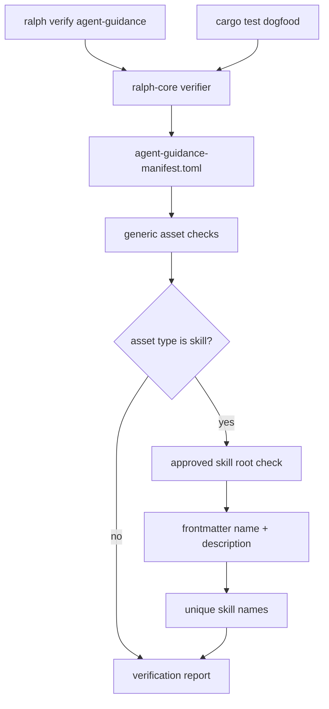
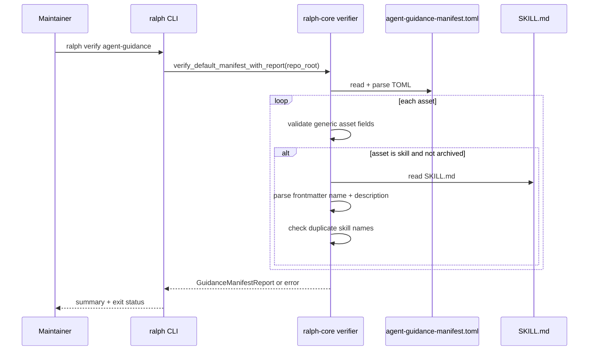

## 1. 背景

`agent-guidance-contracts` 已经建立第一阶段治理闭环:

- `docs/agent-guidance-schema.md` 说明 guidance asset 类型。
- `docs/prompt-contract.md` 固定 prompt-like 资产的行为边界。
- `agent-guidance-manifest.toml` 作为核心 guidance 资产清单。
- `crates/ralph-core/src/agent_guidance_manifest.rs` 提供 verifier,并通过 `cargo test` dogfood。

第二阶段补的是“日常可用性”和“skill catalog 完整度”。维护者应该能直接运行一个 CLI 命令检查 guidance drift,不用只依赖完整测试。

## 2. 设计目标

1. **manifest 覆盖项目自有 skills**: 先覆盖仓库里的 `.agents/skills` 和 `.codex/skills`,不纳入用户全局 skills。
2. **skill metadata 可验证**: `SKILL.md` 必须提供最小 frontmatter,否则它不是稳定 guidance asset。
3. **独立 CLI 入口**: `ralph verify agent-guidance` 作为显式 verifier 命令。
4. **测试门禁不分裂**: CLI 和 `cargo test` 调同一套 core verifier。

## 3. 非目标

- 不实现 OMX runtime workflow。
- 不管理 `~/.codex/skills` 或其他用户全局 skill。
- 不做完整 YAML 语义 lint。只解析 frontmatter 的必需字段。
- 不把所有 docs 放进 manifest。
- 不引入新依赖。现有 `serde_yaml` 已可解析 skill frontmatter。

## 4. CLI 形态

建议新增命令:

```bash
ralph verify agent-guidance
```

可选参数:

```bash
ralph verify agent-guidance --manifest agent-guidance-manifest.toml
```

输出示例:

```text
Agent guidance manifest verified: agent-guidance-manifest.toml
Assets checked: 42
Skills checked: 36
```

失败时:

```text
Agent guidance manifest verification failed: asset `foo` has missing skill frontmatter field `description`
```

## 5. Verifier 数据结构

第一阶段 verifier 只返回 `Result<(), GuidanceManifestError>`。第二阶段建议保留兼容入口,新增报告入口:

```rust
pub struct GuidanceManifestReport {
    pub manifest_path: String,
    pub asset_count: usize,
    pub skill_count: usize,
}

pub fn verify_default_manifest_with_report(repo_root: &Path) -> Result<GuidanceManifestReport, GuidanceManifestError>;
pub fn verify_manifest_at_with_report(repo_root: &Path, manifest_path: &str) -> Result<GuidanceManifestReport, GuidanceManifestError>;
```

旧函数可以调用新函数后丢弃 report,保持测试和调用方简单。

## 6. Skill root 规则

允许的 repository skill roots:

- `.agents/skills/<skill-id>/SKILL.md`
- `.codex/skills/<skill-id>/SKILL.md`

规则含义:

- `path` 必须是仓库相对路径。
- `skill` asset 必须精确指向 `SKILL.md`。
- 不能指向 root 外部、普通 docs、或全局用户目录。

## 7. Frontmatter 规则

最小解析策略:

1. 文件必须以 `---` 开头。
2. 第二个 `---` 之前的内容视为 YAML frontmatter。
3. 用 `serde_yaml` 解析为结构体。
4. `name` 和 `description` trim 后必须非空。
5. active/draft skill 参与 duplicate skill name 检查。
6. archived skill 可保留路径和历史条目,但不强制文件存在或 frontmatter 完整。

## 8. 流程图



## 9. 时序图



## 10. 风险与缓解

- 风险: manifest 一次性纳入所有 skill 后维护成本上升。
  - 缓解: 只纳入项目自有 skill,不管全局用户 skill。
- 风险: 解析 frontmatter 过度复杂。
  - 缓解: 只检查 `name` 和 `description`,不 lint 其他字段。
- 风险: CLI 和测试使用两套逻辑导致漂移。
  - 缓解: CLI 只调用 `ralph-core` verifier report 入口。
