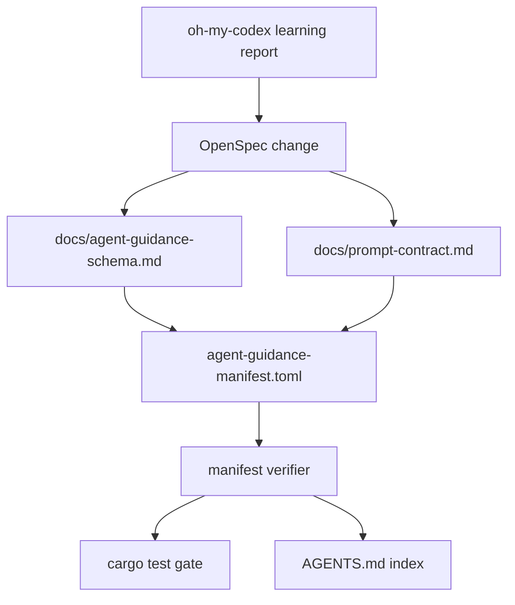

## 1. 背景与边界

本 change 是 `specs/oh-my-codex-learning-analysis.md` 第 4 节的第一阶段落地。

选择“契约治理最小闭环”,而不是直接复制 OMX runtime。原因是 Ralph 当前最需要先降低 guidance drift:

- 文件存在但没有被索引。
- prompt 行为要求写在不同地方。
- skill / spec / AGENTS / EXPERIENCE 之间没有机器可查的资产清单。
- 文档漂移通常只有运行失败后才暴露。

本 change 只管 guidance 资产治理,不改 active runtime topology。

## 2. 设计目标

1. **把指导资产分层**: 顶层契约、长期经验、prompt contract、skills、OpenSpec、implementation docs 分开定义。
2. **把 prompt 行为变成 contract**: final response、evidence、scope boundary、ask-before-branch 等要求集中说明。
3. **让资产路径可验证**: manifest 是单一真相源,verifier 检查路径和必填字段。
4. **把治理接入 test gate**: 最小实现接入 `cargo test`,不依赖人工记忆。

## 3. 非目标

- 不新增运行时调度能力。
- 不实现 agent marketplace。
- 不实现 native hooks。
- 不强行重写所有历史文档。
- 不把现有所有 docs 都纳入 manifest。第一阶段只覆盖核心 guidance 资产。

## 4. Manifest 设计

推荐文件:

```text
agent-guidance-manifest.toml
```

第一阶段字段:

```toml
schema_version = 1

[[assets]]
id = "agents-root-contract"
type = "root_contract"
path = "AGENTS.md"
status = "active"
summary = "Root operating contract for repository agents."
required_in_agents_index = false

[[assets]]
id = "project-experience"
type = "experience"
path = "EXPERIENCE.md"
status = "active"
summary = "Project-level reusable lessons for agents."
required_in_agents_index = true
```

字段含义:

- `id`: 稳定 kebab-case 标识。
- `type`: 枚举类型。第一阶段允许 `root_contract`, `experience`, `schema_doc`, `prompt_contract`, `openspec_change`, `skill`, `report`, `runbook`。
- `path`: 仓库相对路径。
- `status`: `active`, `draft`, `archived`。
- `summary`: 一句话说明用途。
- `required_in_agents_index`: 若为 true,verifier 要求 `AGENTS.md` 包含该 path。

## 5. Verifier 设计

最小 verifier 做静态检查:

1. manifest 文件存在且能解析。
2. `schema_version == 1`。
3. 每个 asset 的 `id` 非空且不重复。
4. `type` / `status` 在允许值内。
5. `path` 是仓库相对路径,不能逃出仓库。
6. `status != archived` 的 asset 文件必须存在。
7. `required_in_agents_index = true` 的 asset path 必须出现在 `AGENTS.md`。
8. `summary` 必须非空。

失败时输出具体 asset id 和原因。

## 6. 接入方式

第一阶段优先放在 `crates/ralph-core` 的测试中,原因:

- 不需要新增 crate 或 xtask。
- `cargo test` 已经是项目完成门禁。
- verifier 只是静态文件检查,适合单元测试或 integration-style test。

如果后续 manifest 变大,再抽成 `cargo xtask verify-agent-assets`。

## 7. Mermaid 流程图



## 8. 风险与缓解

- 风险: manifest 过度膨胀,把所有 docs 都列进去。
  - 缓解: 第一阶段只纳入核心 guidance 资产。
- 风险: verifier 变成复杂文档 linter。
  - 缓解: 只查路径、枚举、索引和必填字段。
- 风险: 与 startup resource catalog 重叠。
  - 缓解: 本 change 管 agent-facing guidance,不管 runtime resource selection。
