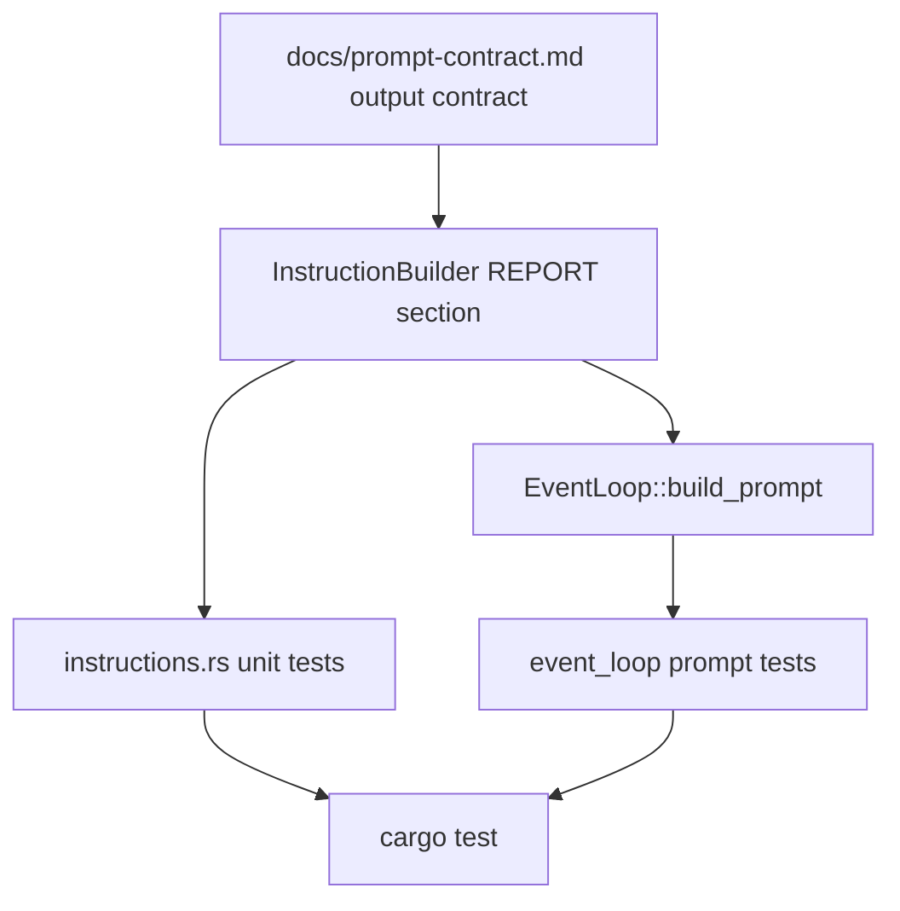
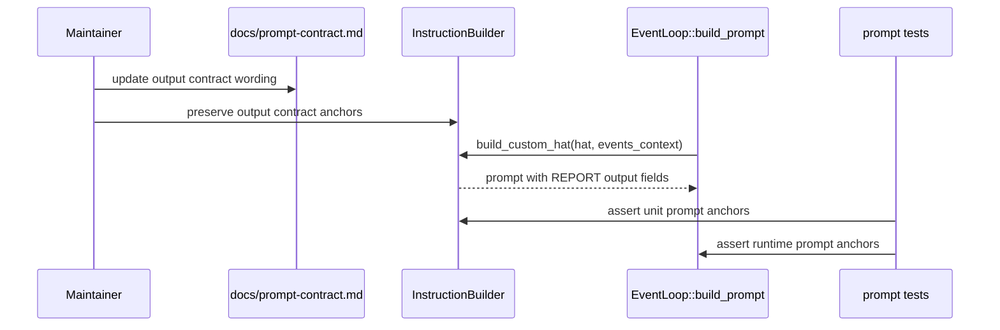

## 1. 背景

`docs/prompt-contract.md` 已经写明最终输出应该包含:

- outcome
- evidence
- changed files
- known gaps
- next suggestions

但 `InstructionBuilder::build_custom_hat` 当前 REPORT 阶段只写了:

```text
You MUST publish a result event with evidence.
```

这说明文档契约和 runtime prompt 之间还没有测试门禁。第二阶段 guidance catalog 已解决“资产是否存在和可验证”,这一阶段要解决“契约是否真的进入 prompt”。

## 2. 设计目标

1. **把 output contract 放进 runtime prompt**: custom hat 的 REPORT 阶段明确列出五个字段。
2. **把文档字段变成测试锚点**: 测试断言字段名,防止未来 prompt 改写时悄悄丢掉契约。
3. **不弱化已有门禁**: evidence、tests、build、must-publish 原规则必须继续存在。
4. **不混入 runtime state**: state operation layer 是后续独立 change。

## 3. 非目标

- 不修改事件协议。
- 不要求 result event payload 立刻结构化成 JSON。
- 不改变 `LOOP_COMPLETE` 检测。
- 不改变 supervisor routing。
- 不实现 state operation layer 或 question obligation。

## 4. 实现方案

### 4.1 InstructionBuilder

在 `build_custom_hat` 的 `### 3. REPORT` 段落加入稳定锚点:

```text
Your report MUST include:
- outcome: what changed or what decision was made
- evidence: command output, tests, logs, or artifact paths
- changed files: key paths changed, if any
- known gaps: skipped checks, uncertain boundaries, or remaining risks
- next suggestions: useful follow-up after this task
```

保留原有:

- `You MUST publish a result event with evidence.`
- publish topics 展示。
- must-publish 规则。

### 4.2 EventLoop integration tests

在现有 `test_custom_hat_with_instructions_uses_build_custom_hat` 或相邻测试中增加断言:

- `outcome:`
- `evidence:`
- `changed files:`
- `known gaps:`
- `next suggestions:`

这样可以证明 `EventLoop::build_prompt` 走到的不是一个只在单元测试里存在的 helper。

### 4.3 InstructionBuilder unit tests

在 `test_custom_hat_with_rfc2119_patterns` 中加入同样断言,并保留现有 evidence / verification / publish 断言。

### 4.4 文档同步

在 `docs/prompt-contract.md` 的输出契约部分增加说明:

- 这些字段是 runtime prompt tests 的锚点。
- 改 prompt 时可以优化自然语言,但不能静默删除字段名。

## 5. 流程图



## 6. 时序图



## 7. 风险与缓解

- 风险: prompt 变长。
  - 缓解: 只加五行字段锚点,不引入大段解释。
- 风险: 字段名变成过硬格式,影响自然语言输出。
  - 缓解: 这是“报告应包含”的锚点,不是强制 JSON schema。
- 风险: 后续 state operation layer 被混进来。
  - 缓解: 在 proposal/spec/tasks 中明确非目标。
