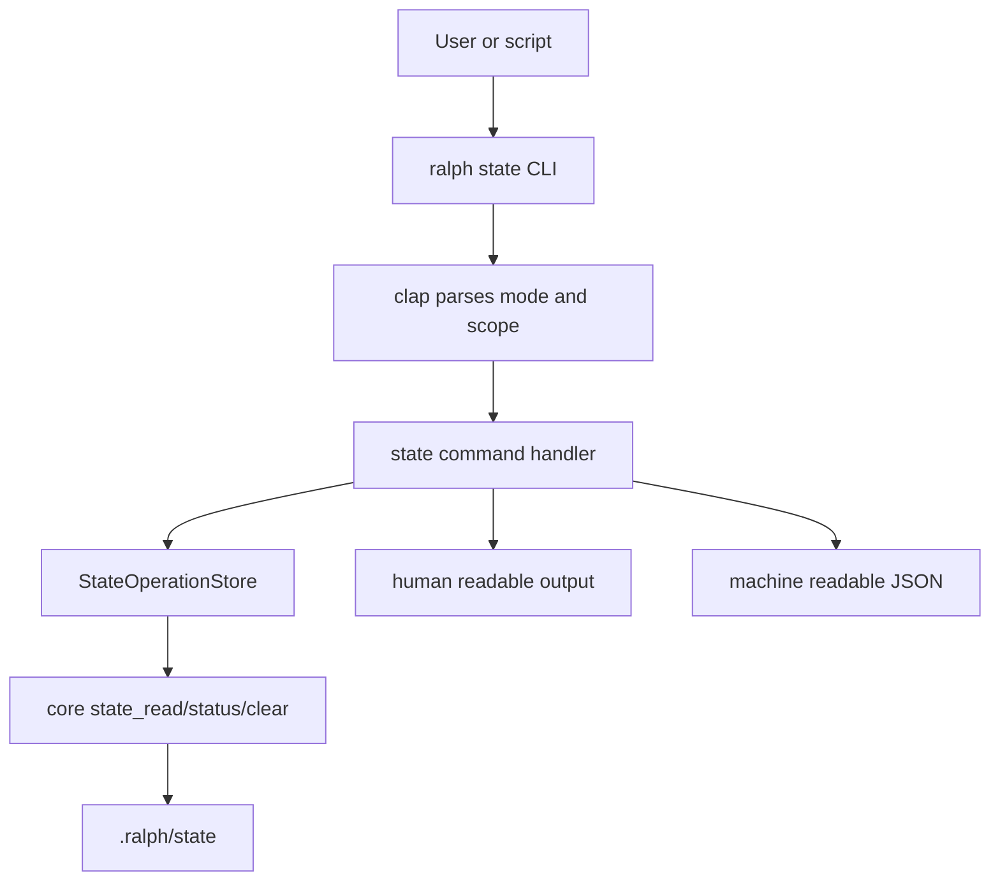
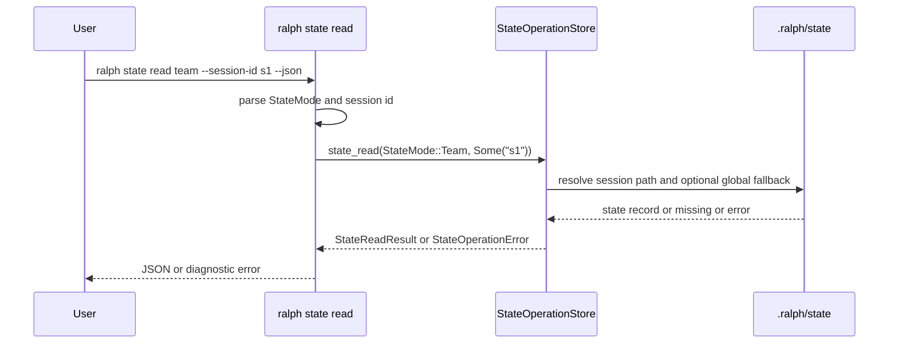

## 1. 背景

`state-operation-layer` 已完成 core-only 实现。它把 workflow lifecycle state 的读、写、清理、活跃列表和状态摘要统一收束到 `StateOperationStore`。

下一步不是直接接 runtime,也不是先做 MCP。更小、更可验证的入口是 CLI adapter。CLI 能让维护者快速确认当前 `.ralph/state` 的状态,也能在调试后清理 mode state,同时不会改变 orchestrator runtime 行为。

## 2. 设计目标

1. **只做 adapter**: CLI 只把用户参数转换为 core request,不复制 state operation 逻辑。
2. **先读和清理,不写**: v1 暴露 `status`、`read`、`clear`,不暴露 `write`。
3. **默认人类可读**: 无 `--json` 时输出简洁文本,适合终端排查。
4. **可脚本化**: `--json` 输出稳定 JSON,便于测试和未来脚本集成。
5. **scope 明确**: global、session、all sessions 的语义和 core 保持一致。
6. **失败可诊断**: malformed JSON、invalid mode、invalid session id 等错误必须返回非零退出码并显示上下文。

## 3. 命令形态

```text
ralph state status [--mode <mode>] [--session-id <id>] [--json]
ralph state read <mode> [--session-id <id>] [--json]
ralph state clear <mode> [--session-id <id>] [--all-sessions]
```

### 3.1 `status`

- 不传 `--mode`: 调用 `state_get_status(None, session_id)`。
- 传 `--mode`: 调用 `state_get_status(Some(mode), session_id)`。
- 文本输出至少包含:
  - mode
  - active
  - current_phase
  - run_outcome
  - lifecycle_outcome
  - path
  - error,如果有

### 3.2 `read`

- 调用 `state_read(mode, session_id)`。
- 如果不存在:
  - 文本输出说明 state missing。
  - `--json` 输出 `exists: false`。
  - 退出码仍为 0,因为 missing state 是合法状态。
- 如果 malformed:
  - core 返回 structured error。
  - CLI 返回非零退出码。

### 3.3 `clear`

- 默认只清 global scope 或指定 session scope。
- `--all-sessions` 调用 `StateClearRequest::with_all_sessions(true)`。
- `--session-id` 和 `--all-sessions` 不应同时使用。原因是一个表示精准 session,另一个表示全量 scope。
- 输出实际 deleted paths 数量和路径列表。

## 4. 架构图



## 5. 时序图



## 6. 数据输出策略

文本输出用于人类调试,允许以后轻微调整措辞。JSON 输出用于测试和脚本,字段必须稳定。

建议 `status --json` 输出数组或对象时保持 core 字段名:

```json
{
  "statuses": [
    {
      "mode": "team",
      "active": true,
      "current_phase": "running",
      "run_outcome": null,
      "lifecycle_outcome": null,
      "path": ".ralph/state/team-state.json",
      "error": null
    }
  ]
}
```

建议 `read --json` 输出:

```json
{
  "mode": "team",
  "exists": true,
  "record": {
    "mode": "team",
    "active": true,
    "state": {}
  }
}
```

建议 `clear` 输出:

```text
Cleared 1 state file
- .ralph/state/team-state.json
```

## 7. 非目标

- 不新增 `state write`。
- 不新增 MCP adapter。
- 不让 CLI 直接读写 JSON 文件。
- 不接入 runtime lifecycle 写入点。
- 不改 state operation core 的文件格式。

## 8. 测试策略

- CLI focused integration tests:
  1. `state status --json` 能读取预置 state 并输出 core 字段。
  2. `state read <mode> --json` 对 missing state 返回 `exists=false` 且退出 0。
  3. `state clear <mode>` 删除由 core 写出的 state 文件。
  4. invalid mode 返回非零退出码。
  5. malformed JSON 由 core error 冒泡到 CLI,返回非零退出码。
- 复用已有 core 单测,不在 CLI 测试里重新验证 atomic write 和 merge 细节。
