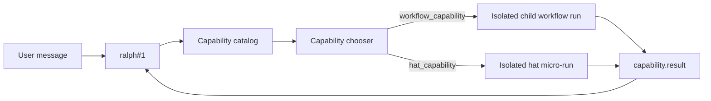
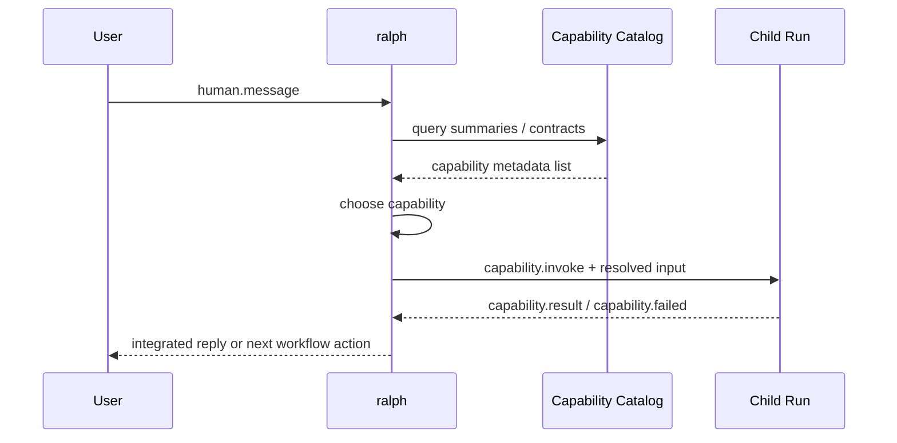

## Context

用户现在想要的是一层“运行时能力目录”:

- 启动时先让 `ralph#1` 知道有哪些 workflow / hat capability 可以用
- 当用户消息进来后,由 `ralph#1` 决定:
  - 沿用当前 base workflow
  - 调一个 workflow capability
  - 或直接调一个 hat capability

当前代码的静态边界说明,这不能简单理解成“运行时加载一个新 `ralph.yml` 就完了”:

- `HatRegistry::from_config()` 只从启动时那份 `RalphConfig.hats` 构建 registry
- 串行 `EventLoop::next_hat()` 在 multi-hat mode 下依然总是回到 `ralph` 执行
- 并行 `spawn_dynamic_instance()` 只会给已存在的 hat 模板扩容实例,不会动态引入一种新的 hat 定义

所以这里真正要设计的是:

- 如何把 workflow / hat 抽成 capability catalog
- 如何把 capability metadata 轻量注入给 `ralph#1`
- 如何在不热改 live topology 的前提下做 runtime invocation

## Goals / Non-Goals

**Goals**

- 让 `ralph#1` 在运行时知道有哪些 workflow / hat capability 可以用
- 让 workflow / hat 都有轻量、结构化、可机读的能力摘要
- 让 runtime invocation 保持隔离执行,不要直接热改当前 live topology
- 记录清楚 v1 / v2 路线,避免未来只记得“先做了个 v1”

**Non-Goals**

- 不在本 change 中实现“运行中替换当前 active `EventLoop` / `Supervisor` 拓扑”
- 不依赖 YAML 注释头作为 runtime metadata 的主来源
- 不在 v1 中开放无约束的多 workflow / 多 hat 任意混拼

## Decisions

### 1) Capability metadata 必须结构化,注释只能做人类说明

**选择**

每个 capability 都要有结构化 metadata,至少包括:

- `id`
- `kind`
- `summary`
- `goal`
- `when_to_use`
- `input_contract`
- `output_contract`
- `invocation_mode`

允许 workflow 文件保留注释头,也允许 examples / presets 保留 README 风格说明。
但 runtime selector / invoker 读取的是结构化 metadata,不是 YAML 注释。

**理由**

- YAML 注释不会进入 `RalphConfig`
- 现有 preset description 也是编译期手工常量,不是运行时从注释提取
- runtime invocation 要求 metadata 稳定、可审计、可落盘,注释不适合承担这个职责

### 2) `ralph#1` 启动时只看轻量 capability 摘要,不预载整份 workflow

**选择**

启动时只把 capability list 的摘要注入给 `ralph#1`:

- summary
- goal
- when_to_use
- input/output contract

真正的 workflow config / hat instructions 只有在选中 capability 后才解析和执行。

**理由**

- 这样不会把所有 workflow / hat 的完整 prompt 都塞进启动上下文
- `ralph#1` 只需要知道“什么时候该调谁”,不需要一开始就背下所有细节

### 3) Workflow capability 必须通过隔离 child run 执行

**选择**

当 `ralph#1` 选择某个 workflow capability 时:

1. 运行时生成该 capability 的 resolved config
2. 启动一个隔离 child run / nested run
3. child run 完成后返回结构化 `capability.result`
4. 父会话继续运行并消费结果

当前 active topology 不被替换。

**理由**

- 启动前 validation、topic contract、completion 语义都依赖“当前拓扑已经定型”
- 如果运行中直接换整套 workflow,等于把这些护栏都改成动态重建问题
- 子运行更接近用户要的“像 sub-agent 一样调用”

### 4) Hat capability 在 v1 也走隔离 micro-run,不直接热改 registry

**选择**

当 `ralph#1` 选择某个 hat capability 时,v1 不直接把新 hat 注入当前 `HatRegistry`。

而是:

1. 从 hat template / capability metadata 生成一个最小 micro-run config
2. 用隔离 child run 执行这次 hat capability
3. 把结果回收成 `capability.result`

**理由**

- 当前系统没有一条正式链路能在 live `EventLoop` / `ParallelSupervisor` 中安全注册新 hat
- 用统一的隔离执行模型,workflow capability 和 hat capability 的观测、审计、权限边界都更一致

### 5) Runtime invocation 要有明确的控制面协议与证据产物

**选择**

定义明确的 capability invocation artifact:

- `capability.invoke`
- `capability.result`
- `capability.failed`

并为每次调用记录:

- 选择了哪个 capability
- 输入 contract 是什么
- 使用了哪份 resolved config / template
- 返回了什么结果摘要

**理由**

- 这是运行时新能力,不能只靠 stdout 文本判断“有没有真的调用”
- 后续 debug / replay / doctor 都需要审计证据

### 6) v1 / v2 路线必须现在就记清楚

**选择**

- v1:
  - capability chooser 先走规则
  - 运行时一次调用一个 capability
  - workflow / hat 都走隔离 child run
- v2:
  - 规则优先 + LLM fallback chooser
  - 允许 `ralph#1` 在 catalog 边界内生成多 capability 组合计划
  - 但组合结果仍然不能热切换当前 live topology

**理由**

- 用户已经明确要求 v1 / v2 都要被正式记录
- 如果只写 v1,后续很容易把“运行时 capability 的更完整形态”忘掉

## Architecture

### Capability View

### Invocation Sequence

## Risks / Trade-offs

- [Risk] capability metadata 太松,`ralph#1` 看了也不知道什么时候该调
  - Mitigation: metadata 至少要有 summary / goal / when_to_use / input/output contract
- [Risk] child run 过多,导致时延和成本上升
  - Mitigation: v1 先限制一次只调一个 capability,并保留显式预算/权限边界
- [Risk] 用户把 capability invocation 误解成“当前拓扑会立即切换”
  - Mitigation: 文档和协议都明确“隔离 child run,不热改 live topology”
- [Risk] hat capability 和 workflow capability 分别走两套执行模型
  - Mitigation: v1 统一用 child run / micro-run 隔离模型,先稳住边界

## Migration Plan

1. 定义 capability metadata schema,并和 startup resource catalog 接线
2. 给 `ralph#1` 增加 capability summary 注入
3. 定义 invocation protocol 与 artifact
4. 先实现 v1 的 isolated workflow capability run
5. 再实现 v1 的 isolated hat capability micro-run
6. 最后补 capability listing、doctor/debug 和文档
