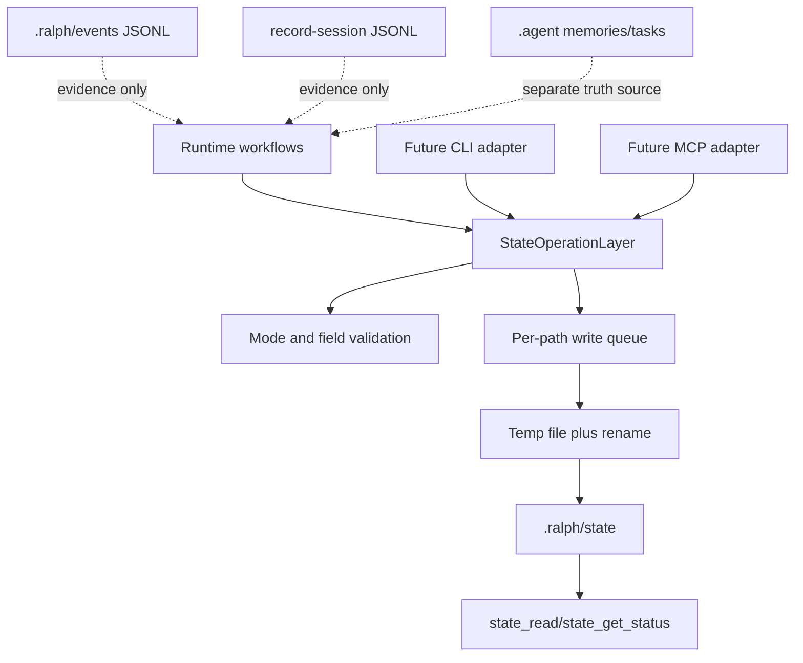
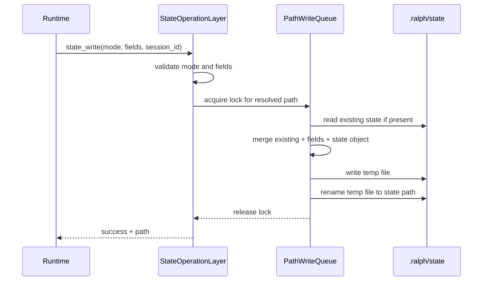

## 1. 背景

前几轮 guidance governance 已经完成三件事:

1. `agent-guidance-contracts`: 建立 guidance schema、prompt contract 和 manifest verifier。
2. `agent-guidance-catalog-cli`: 把 skill catalog 和 `ralph verify agent-guidance` 做成独立门禁。
3. `prompt-contract-runtime-alignment`: 把 output contract 放进 `InstructionBuilder` 和 prompt tests。

这些都属于 guidance / prompt / catalog 治理。它们不应该承载 runtime state。

`specs/oh-my-codex-learning-analysis.md` 中明确提到 `.omx/state` 状态操作层的价值: 它把状态读写收束到统一 operation,用原子写和 per-path queue 避免并发写同一文件。Ralph 可以借鉴这个“操作层契约”,但不能直接复制 `.omx/state` 命名和全套 MCP runtime。

## 2. 现有状态面

Ralph 当前至少有这些状态或证据面:

| 状态面 | 当前用途 | 是否被 v1 state operation 替代 |
| --- | --- | --- |
| `.agent/memories.md` | 跨 session 长期经验 | 否 |
| `.agent/tasks.jsonl` | runtime work tracking | 否 |
| `.agent/scratchpad.md` | legacy scratchpad | 否 |
| `.ralph/events*.jsonl` | event bus evidence / replay | 否 |
| `.ralph/current-events` | 当前 events 文件指针 | 否 |
| `.ralph/record-session.latest` | record-session 指针 | 否 |
| `--record-session` JSONL | debug/evidence cassette | 否 |
| `.ralph/diagnostics/*` | opt-in diagnostics | 否 |
| future workflow state | workflow/mode lifecycle state | 是 |

v1 state operation layer 只治理最后一类: workflow/mode lifecycle state。

## 3. 设计目标

1. **单一状态操作入口**: runtime workflow state 的读、写、清理、活跃列表和状态摘要走同一套 operation。
2. **原子写**: 任何完整 state 文件写入必须采用 temp file + rename。
3. **同路径串行化**: 同一个 state path 的并发写必须排队,不能交错写半份 JSON。
4. **证据流不被替代**: event JSONL 和 record-session 仍然是审计证据,不是 state operation 的副产物。
5. **模式白名单**: v1 只允许明确 mode,避免任意字符串污染 state 目录。
6. **session scope 明确**: 支持全局 scope 和 session scope,但读取优先级必须固定。
7. **实现前先有测试门禁**: 未来实现必须先写 core 单测,再接 CLI/MCP/runtime。

## 4. 非目标

- 不新增 `ralph state` CLI。
- 不新增 MCP tools。
- 不替换 memories/tasks/scratchpad/events/record-session。
- 不改变 `EventLoop` completion 规则。
- 不改变 `ParallelSupervisor` topology 或 instance state reducer。
- 不实现 question obligation runtime state。它应该在本层实现后另开 change 接入。
- 不实现 runtime capability invocation state。它应该复用本层,但属于另一个 change。

## 5. 状态路径建议

v1 推荐使用 `.ralph/state/`,而不是 `.omx/state/`。

原因:

- `.omx/state` 是 oh-my-codex 的运行目录。
- Ralph 已经用 `.ralph/` 存放 orchestrator metadata 和 event evidence。
- `.agent/` 当前是 agent-facing memories/tasks/context 文件区,不适合放 runtime workflow lifecycle state。

建议路径:

```text
.ralph/state/<mode>-state.json
.ralph/state/sessions/<session_id>/<mode>-state.json
```

读取优先级:

1. 如果调用显式传入 `session_id`,优先读 session scope。
2. 如果 session scope 不存在,可回退到 global scope。
3. `state_list_active` 默认以 authoritative active decision 为目标,同一个 mode 只返回一个最终判断。

## 6. 操作契约

### 6.1 `state_read`

输入:

- `mode`
- optional `session_id`
- optional `working_directory`

输出:

- 如果存在: state JSON。
- 如果不存在: `{ "exists": false, "mode": "..." }`。
- 如果 JSON malformed: 返回 structured error,不能静默当空状态。

### 6.2 `state_write`

输入:

- `mode`
- standard fields
- optional `state` object
- optional `session_id`
- optional `working_directory`

行为:

- 创建 state 目录。
- 读取现有 JSON。
- 合并标准字段和 `state` object。
- 校验 mode、outcome、phase 基本合法性。
- 注入 `updated_at`。
- 使用 temp file + rename 写入。
- 同一个 path 写入排队。

### 6.3 `state_clear`

输入:

- `mode`
- optional `session_id`
- optional `all_sessions`

行为:

- session-scoped clear 只清当前 session scope。
- `all_sessions=true` 才能清 global + all sessions。
- clear 的返回必须列出实际删除或标记 cleared 的 path。

### 6.4 `state_list_active`

输出当前 active modes。

要求:

- 忽略 malformed 文件时必须在 status 中报告错误。
- 同一个 mode 多个 scope 有冲突时,必须按固定优先级决策,不能依赖目录遍历顺序。

### 6.5 `state_get_status`

输出一个 mode 或所有 mode 的摘要:

- `active`
- `current_phase`
- `run_outcome`
- `lifecycle_outcome`
- `path`
- optional `error`

## 7. 状态字段

最小稳定字段:

```json
{
  "mode": "ralph",
  "active": true,
  "current_phase": "running",
  "updated_at": "2026-05-11T14:00:00Z",
  "run_outcome": "continue",
  "lifecycle_outcome": "finished",
  "session_id": "optional-session-id",
  "state": {}
}
```

`run_outcome` 建议枚举:

- `continue`
- `finish`
- `blocked_on_user`
- `failed`
- `cancelled`

`lifecycle_outcome` 建议枚举:

- `finished`
- `blocked`
- `failed`
- `userinterlude`
- `askuser_question`

说明: `askuser_question` 采用 snake_case,避免 TS 版本 `askuserQuestion` 这种大小写混合进入 Rust contract。

## 8. 架构图



## 9. 时序图



## 10. 测试策略

本实现必须至少覆盖:

1. valid write/read roundtrip。
2. unsupported mode rejected。
3. malformed JSON read returns structured error。
4. state_write merge preserves existing custom state unless overwritten。
5. run_outcome / lifecycle_outcome invalid values rejected。
6. state_clear session scope does not delete other sessions。
7. state_clear all_sessions returns removed paths。
8. state_list_active deterministic scope precedence。
9. concurrent writes to same path produce valid JSON and last complete write wins。
10. atomic write cleanup handles rename failure without leaving corrupted target。

## 11. 风险与缓解

- 风险: 新状态层和 `.agent/tasks.jsonl` 抢真相源。
  - 缓解: spec 明确 v1 不治理 tasks/memories。
- 风险: `.ralph/events*.jsonl` 被误认为可替代 state。
  - 缓解: events 是 append-only evidence stream,state 是 current lifecycle view。
- 风险: 后续 MCP/CLI 直接绕过 core operation。
  - 缓解: adapter 只能调用 core operation,不能自己读写 JSON。
- 风险: session/global scope 冲突。
  - 缓解: 读取优先级写入 spec,测试固定。
