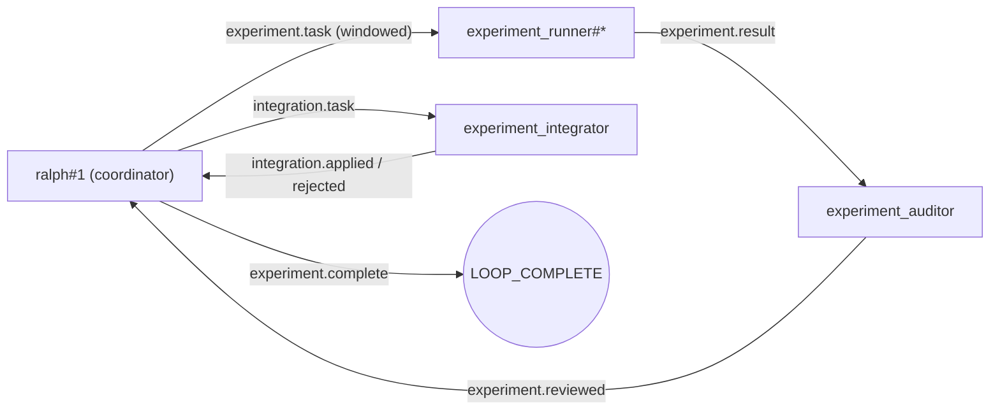

## Context

本 change（`parallel-hat-solution-eval-example`）要解决的核心问题是：
为“并行实现 + 批量验证 + 多轮实验性开发（探索/试错/再验证）”研究出一份**可靠的 `ralph.yml` 配置方案**，
让这类任务在并行 hats 下能稳定推进、持续产出验证证据，并最终可靠收敛（而不是卡死或无限循环）。

Ralph 已经具备并行 runtime 的基础能力（见现有 specs）：

- 多 hat、多实例并行执行（headless CLI job）。
- 事件驱动的路由（triggers 默认路由，topic_contracts 可覆盖）。
- workspace 隔离策略（`shared | patch | worktree`），并带权限 gate（`parallel.permissions.*`）。
- 回放（replay）式 smoke tests（JSONL fixtures）。

但目前缺少一个“可复用的配置范式”，来把下面这件事跑通并固化下来：

1. 用户给出一组“实验任务/验证任务”（每个任务包含：做什么、怎么做、怎么验证）。
2. 系统把这些任务并行分发到多个 worker，在隔离 workspace 内执行，并产出结构化结果。
3. 系统在“强 backpressure”的约束下持续迭代：失败就给出下一轮实验建议；成功就进入收敛阶段。
4. 全流程可被 replay fixture 复现，用于回归与团队共享“探索路径”。

Stakeholders（主要使用者）：

- 专业用户 / 架构师：需要把“探索型开发”变成可并行、可验证、可收敛的生产力系统。
- Ralph 贡献者：需要一个清晰、可复用、可验证的并行工作流配置范式。

约束与原则：

- “The orchestrator is a thin coordination layer, not a platform”：优先用 hats + 事件契约完成工作流，
  避免为了示例把复杂功能硬塞进 orchestrator 核心。
- “Backpressure over prescription”：配置方案必须把“怎么验证”变成硬约束，不能只写流程图。
- 变更以“新增配置方案 + 新增 specs”为主，尽量不改动现有并行 runtime 核心语义。

## Goals / Non-Goals

**Goals:**

- 新增一份可直接复制使用的 `ralph.yml`（落在 `examples/parallel-experimental-dev-engine/`），用于：
  - 并行实现、并行验证、可多轮迭代探索（“开发永动机”）。
  - 强 backpressure：每轮输出必须包含可验证证据（命令/测试/基准/对比的结果）。
  - 可收敛：明确 workflow 入口、完成候选事件与结束条件，避免卡死或漂移。
- 明确一套最小事件契约（topics + payload 结构），让用户能把该配置方案迁移到真实项目。
- 提供 replay fixture / smoke test，用来回放验证“该配置方案能跑通并收敛”。

**Non-Goals:**

- 不把“实验任务内容”自动生成成平台能力（任务的 what/how/verify 仍由用户提供；配置只提供框架）。
- 不在 v1 里引入新的 runtime 功能（例如真正的 `patch` 隔离语义），优先基于现有能力组合出范式。
- 不强制实现“自动合并多条并行改动”的全自动化（仍以“结构化结果 → 人/协调者决策 → 再应用”为主）。
- 不改变并行路由的既有默认语义（仍以 triggers 为默认；必要时配置可选用 topic_contracts）。

## Decisions

### 1) 实验任务如何表达：使用结构化 plan（JSON/YAML）作为事件 payload（或 prompt 内嵌）

**选择**：配置方案定义一个“实验计划（plan）”结构化格式。
它可以放进 workflow entry 事件 payload（推荐）。
也允许用户把 plan 直接内嵌在 `event_loop.prompt`（便于手工编辑）。

建议 payload（示意，最终以 specs 固化）：

- `run_id`: string（用于关联一次实验流程的所有事件）
- `objective`: string（共同目标）
- `experiments`: array
  - `experiment_id`: string（例如 `exp-001`）
  - `title`: string（实验名）
  - `implementation`: string（做什么、怎么做）
  - `verification`: string（怎么验证：要跑哪些命令、要看哪些指标、成功判定）
  - `notes`: string（可选：风险/约束/依赖）

**为什么这样选**：

- 任务的 what/how/verify 是用户输入的核心。
  用结构化格式可以减少歧义。
  也更利于回放 fixture 固化“探索路径”。
- 并行模式下为避免 prompt 污染，worker hats 不应依赖顶层 prompt 的上下文；
  因此 plan 最终必须可由事件携带/重放。

**替代方案**：

- 把 plan 写在 `event_loop.prompt` 或单独的文件里，再让 worker 自己去读：
  - 优点：编辑方便；
  - 缺点：对“不同 backend/agent 是否具备文件读取能力”不稳定，且不利于 replay fixture 固化。
- 用 human gate 让用户在运行时交互输入 plan：
  - 优点：更交互；
  - 缺点：示例运行不再是“一条命令跑通”，CI 回放也更复杂。

### 2) 任务分发与并行执行：默认 triggers 路由 + instance-level queue（必要时再用 target_instance）

**选择**：配置方案默认不要求用户手写 `target_instance`。
而是依赖并行 runtime 的默认语义：
topic 扇出到 hats，hat 内按 instance-level queue（idle-first，deterministic）投递给一个实例。

**为什么这样选**：

- 对“探索型/批量型任务”，重点是吞吐与可验证结果。
  默认路由已经足够稳定，并且配置更简单、可复制性更强。
- 需要严格绑定（例如某些实验必须固定在某个 runner 上）时，再用 `event.target_instance` 做显式定向。

**替代方案**：

- 强制所有任务都要求 `target_instance`：
  - 优点：可控性极强；
  - 缺点：配置门槛更高，且更容易因为拼写错误触发 target 校验失败。

### 3) 隔离策略：v1 默认使用 worktree（并保留降级路径）

**选择**：

- `experiment_runner` hat 默认配置 `workspace.strategy: worktree`
- `parallel.permissions.worktree` 在示例中默认设为 `allow`（便于 demo 一键跑通），
  但 README 必须说明生产场景建议用 `ask`。

**为什么这样选**：

- 并行执行时，shared workspace 极易互相污染，最终失去验证意义。
- worktree 是当前并行 runtime 最强隔离策略，并且已有权限 gate 作为安全栏。

**替代方案**：

- `patch`：更安全但实现复杂度更高（需要受限写/补丁应用语义），且当前可能仍近似 shared；
  适合作为后续增强而非示例 v1 的默认。

### 4) “执行实验 + 执行验证”合并在同一个 runner job（避免跨 hat 共享 workspace）

**选择**：每个实验任务由同一个 `experiment_runner` 实例完成“实现 + 实验内验证”，并产出可审计、可搬运的 patch：

1. 按 `implementation` 指令进行改动
2. 按 `verification` 指令运行验证
3. 发布 `experiment.result`（结构化结果 + 关键日志摘要 + 验证证据 + `patch` 产物；`commit` 仅可选补充信息）

**为什么这样选**：

- worktree 隔离是“job 级别”的。
  如果把实现与验证拆到不同 hat，很难保证它们在同一个隔离工作区里执行。
- 把实现与验证合并在同一个 job，可以直接在同一 worktree 里跑完验证并产出证据。
- 由于 worktree 会在 job 结束后被回收，如果不导出 `patch`（或其他可搬运产物），改动会丢失；
  因此把“产物导出”作为 result 的一部分是必要条件。

**替代方案**：

-（已采用）引入独立的 `experiment_integrator`：在主工作区 apply patch 并做最终验收：
  - 优点：把“探索（并行 worktrees）”与“采纳（主工作区单写者）”硬隔离；
  - 代价：需要额外的集成阶段与事件契约（见下文 9）。

### 5) 结果汇总与收敛：由 ralph#1（协调者）负责聚合并输出“下一轮实验/结束”决策

**选择**：让协调者（`ralph#1`）在收到 `experiment.reviewed` 后完成聚合、选择候选，并交给 integrator 做最终采纳/验收：

- 输出结果汇总（至少包含：通过/失败、耗时、关键日志、下一步建议）
- 当协调者选定“准备采纳”的候选方案时，发布 `integration.task`
- 等待 integrator 给出 `integration.applied`（或 `integration.rejected`）
- 只有在 `integration.applied` 之后，才发布 `experiment.complete`（配置为 `event_loop.complete_publishes`）
- 最后输出 `event_loop.completion_promise`（例如 `LOOP_COMPLETE`）结束 run

**为什么这样选**：

- 协调者是天然的“全局视角”，且其 prompt 里包含 workflow 语义（starting_event/complete_publishes）。
- 采纳/集成属于“主工作区单写者”动作，交给 integrator 能避免并行 runner 把仓库写乱。

**替代方案**：

- 新增 `result_aggregator` hat：触发 result/review 事件并维护内部状态，最后发出 complete：
  - 优点：职责更分离；
  - 缺点：状态管理更复杂；对示例 v1 不划算。

### 6) 配置方案落地形态：新增参考 `ralph.yml` + replay fixture

**选择**：

- 新增参考配置（推荐：放在 `examples/parallel-experimental-dev-engine/ralph.yml`，并配套 `README.md`）：
  - `README.md`：解释目标、如何提供 what/how/verify、如何运行、你应该看到什么
  - `ralph.yml`：并行 runtime 配置 + hats 定义（至少包含一个多实例 `experiment_runner`）
- 新增 replay fixture（`crates/ralph-core/tests/fixtures/...`）：
  - 固化一次“多个实验并行执行 → 多条 result → 协调者收敛 complete”的事件序列
  - 在 smoke tests 中验证关键事件存在与顺序（避免回归）

### 7) 自适应并行度：ralph#1 基于用户输入推断上限，并运行中动态调参（激进 + AIMD）

**选择**：在示例工作流里引入“in-flight window（在途窗口）”概念：

- `P_max`（并行上限）由 `ralph#1` 基于用户提供的 `EXPERIMENT_PLAN` 自动推断（激进风格）。
  - 建议的最小推断规则（简单、可解释、激进）：
    - `P_max = min(experiments.len(), experiment_runner.instances, parallel.autoscale.max_running_jobs - 2)`
- `P`（当前并行度）在运行中动态调参：
  - 顺利则 `P += 1`
  - 出现拥塞/失败信号则 `P = floor(P/2)`（快速刹车）
- 任何时刻都必须满足：
  - `P >= 1`
  - `P <= P_max`
  - `P <= parallel.autoscale.max_running_jobs - 2`（必须给 `ralph#1` + `auditor` 留 slot，避免控制面被饿死）

并且强制一个关键行为：

- **不得洪水式一次性派发全部实验任务**。
  `ralph#1` 必须按窗口分批派发：
  - 仅当某个实验完成审计（收到 `experiment.reviewed` 且 evidence_ok=true）后，才释放一个 slot 并派发下一项。

**为什么这样选**：

- “并行越多越快”是错觉：
  heavy 验证（全量 tests/clippy/bench）在高并发下会抢 CPU/IO，整体吞吐反而下降。
- 自适应窗口能让系统在不同机器/不同验证强度下自动找到“甜点并行度”，并且可回放解释（在 complete 总结里写明窗口变化即可）。

**替代方案**：

- 把并行度写死（例如永远 5）：
  - 优点：配置简单；
  - 缺点：容易“越并行越慢”，并且会把队列/审计/协调压垮。

### 8) 独立 auditor：把 backpressure 做成硬门禁（证据不足就不允许收敛）

**选择**：新增一个独立的 `experiment_auditor` hat：

- 输入：`experiment.result`
- 输出：`experiment.reviewed`

审计规则采用“硬门槛”（你确认的口径）：

- 如果缺少关键字段（例如 run_id/experiment_id/status/verification_evidence/**patch**），则必须输出 `needs_more_evidence`；
  - `commit` 允许作为可选补充信息（便于保留提交历史），但不能替代 patch。
- `ralph#1` 在未收齐所有实验的 `experiment.reviewed`（且 evidence_ok=true）前，**不得**发布 `experiment.complete` / 输出 `LOOP_COMPLETE`。

**为什么这样选**：

- 仅要求 runner “给证据”会在长跑里不可避免地被模型漂移稀释。
  auditor 是把 backpressure 变成机械门禁的最小代价方式。

### 9) 采纳与集成：引入独立 integrator（只在主工作区做最终应用与验收）

**选择**：新增一个独立的 `experiment_integrator` hat：

- 输入：`integration.task`
- 输出：`integration.applied` / `integration.rejected`（必要时也可用 `integration.blocked`）

职责边界（你确认的口径）：

- `experiment_runner` 的职责只到：
  - 在 worktree 内实现与验证
  - 产出结构化证据 + **patch（必须）**
  - 绝不在主工作区做“采纳/合并/最终验收”
- `experiment_auditor` 只做“证据是否足够”的硬门禁，不做“是否采纳”的决策
- `experiment_integrator` 才负责：
  - 评估是否采纳某个实验产物（基于：用户目标 + runner 证据 + auditor 审计结论）
  - 在主工作区 apply patch（或按需 cherry-pick commit，但 patch 仍作为最低审计载体）
  - 跑用户指定的“最终验收验证”（例如全量 tests/bench/体验检查）
  - 给出可回放的集成结果（推荐：集成后在主工作区产出一个最终 commit hash）

**为什么这样选**：

- 这把“探索（并行 worktrees）”与“采纳（主工作区单写者）”硬隔离开：
  - 并行探索可以更激进、更高吞吐
  - 采纳阶段保持单写者，避免多 patch 互相冲突把仓库弄乱
- auditor 可以保持“完全不跑工具”的纯审计角色；
  integrator 才是“会跑命令 + 会修改主工作区”的验收者，职责清晰。

## Risks / Trade-offs

- [风险] 并行方案会对仓库产生真实改动，可能污染主分支 → [缓解]
  - v1 默认使用 worktree；示例默认倾向“不阻塞”（permissions allow），并在 README 里给出切换到 ask 的生产建议
  - runner 输出必须包含“改动摘要/影响范围”，便于人工审阅
- [风险] 任务数量与实例数量不匹配（任务很多，但实例很少）→ [缓解]
  - 依赖 instance-level queue 排队处理，配合 autoscale cap 控制并发
- [风险] 验证命令耗时过长，触发 job timeout → [缓解]
  - 示例提供 per-hat timeout 的配置位；文档建议把重型 benchmark 放到可选阶段
- [风险] 不同 backend/agent 的“工具能力”不一致，导致 runner 无法真正执行实现/验证 → [缓解]
  - 示例明确推荐可执行工具的 backend（例如 codex），并提供 replay fixture 作为确定性演示
- [风险] “永动机”可能因为目标不清/验证不充分导致无限循环 → [缓解]
  - 配置 max_iterations/max_runtime_seconds 硬刹车
  - 要求每轮必须产出结构化结果与下一步建议，否则视为失败并请求补充信息

## Migration Plan

本变更为新增能力与示例，不涉及线上迁移与回滚；如需回滚，删除新增 example/spec/fixture 即可。

## Open Questions

- 是否需要在配置层支持“显式实例 key 列表”（例如 `instances: ["a","b"]`），减少 `target_instance` 的人工拼写错误？
- `patch` strategy 何时从“等价 shared”进化为真正的受限写入/补丁语义？这会显著提升多方案评估的安全性。
- 结果 payload 是否需要在 proto 层提供可选字段（例如 `meta`），以避免把结构化数据塞进字符串 payload？

---

## Appendix：草案文件（先补充到 change，暂不落盘实现）

你这次要的是“研究出一份可复用的 `ralph.yml` 配置范式”。
为了遵守 OpenSpec 的流程（spec/design 先行），我先把草案内容补充在 change 里，方便你 review。
等你确认后，再用 `/opsx:apply` 把它真正落盘到主仓库的 `examples/`、fixture、tests。

### A) `examples/parallel-experimental-dev-engine/ralph.yml`（草案）

```yaml
# Parallel Experimental Dev Engine example
#
# 目标：
# - 给“并行实现 + 批量验证 + 多轮实验探索（自己摸索/自己探索）”提供一份可直接复制的 ralph.yml 配置方案
# - 用户负责提供每个实验任务的：做什么 / 怎么做 / 怎么验证（见 event_loop.prompt 内的 EXPERIMENT_PLAN 模板）
# - Runner 在 worktree 中执行实验（实现 + 验证），并产出 experiment.result（含验证证据 + patch；commit 可选）
# - Auditor 对 experiment.result 做“硬门槛”审计，产出 experiment.reviewed（证据不足则拒绝）
# - Integrator 在主工作区做“采纳/集成/最终验收”：
#   - 消费 integration.task（ralph#1 选择候选后发布）
#   - apply patch + 跑最终验收命令
#   - 产出 integration.applied / integration.rejected
# - ralph#1 负责动态调参并收敛：
#   - 根据用户计划推断并行上限（激进）
#   - 运行中按 AIMD 动态调参（越顺利越加速，遇到拥塞就砍半）
#   - 只按窗口分批派发任务（避免洪水式派发导致队列膨胀/一次 job 吞多个实验）
#   - 所有实验通过审计后：发布 integration.task，等待 integration.applied
#   - 集成验收通过后：发布 experiment.complete 并输出 LOOP_COMPLETE
#
# 运行（仓库根目录）：
#   cargo run --bin ralph -- run -c examples/parallel-experimental-dev-engine/ralph.yml --no-tui
#
# 可选：覆盖 backend（如果你默认 backend 没配好）
#   cargo run --bin ralph -- run -c examples/parallel-experimental-dev-engine/ralph.yml -b codex --no-tui

cli:
  # 建议显式指定一个可执行工具的 backend；也可以在命令行用 `-b ...` 覆盖
  backend: "codex"

event_loop:
  # 说明：
  # - 并行模式下，task.start/task.resume 是控制面握手事件，只会路由给 ralph#1（避免污染 worker）。
  # - starting_event 是“协调后入口事件”，用于启动下面定义的 workflow（不是第一条事件）。
  prompt: |
    你正在运行“Parallel Experimental Dev Engine（并行实验开发永动机）”。

    你的目标是：把用户给出的 EXPERIMENT_PLAN 里的实验任务，按“可控并行窗口”派发给 runner 去执行（实现 + 验证），
    并通过 auditor 做硬门禁审计，让整个流程可持续推进且可收敛。

	    你必须把整个过程做成“强 backpressure（硬门槛）”：
	    - runner 必须产出 experiment.result（含验证证据 + patch）。
	      - `commit` 允许作为可选补充信息，但不能替代 patch。
	    - auditor 必须产出 experiment.reviewed：
	      - 若证据不足，必须标记 needs_more_evidence，并写清楚缺什么。
	    - integrator 必须产出 integration.applied / integration.rejected：
	      - integrator 才能在主工作区 apply patch 并做最终验收验证（runner 不得做“采纳/合并”）。
	    - 在所有实验都拿到 evidence_ok=true 的 experiment.reviewed 之前，你不得收敛结束。

    关键协议（必须遵守）：
    1) 你必须先发布 workflow 入口事件：experiment.start
       - payload 必须是下面的 EXPERIMENT_PLAN（原样拷贝，不要改结构）
    2) 你必须自己维护一个“在途窗口（in-flight window）”，按窗口分批发布 experiment.task：
       - 先从用户 plan 推断并行上限 P_max（激进：先踩油门）
       - 初始并行度 P 取 P_max（或 P_max-1），然后运行中动态调参（AIMD）：
         - 若一个批次全部 evidence_ok 且无明显拥塞信号：P += 1（上限为 P_max）
         - 若出现拥塞/失败信号（例如超时、blocked 爆发、审计大量不通过）：P = floor(P/2)
       - 任何时刻必须满足：P <= parallel.autoscale.max_running_jobs - 2
         （必须给 ralph#1 + auditor 留 slot，避免控制面被饿死）
       - “实验完成”的定义以审计为准：
         - 收到 experiment.reviewed 且 evidence_ok=true，才算释放一个 slot
       - 严禁一次性把所有 experiment.task 全部发出去（会导致队列膨胀/一次 job 吞多个实验）
	    3) 当你观察到所有实验都已经完成审计（evidence_ok=true），并且你已经选定“准备采纳”的候选方案时：
	       - 你必须发布 <event topic="integration.task">...payload...</event>，触发 integrator 在主工作区进行集成与最终验收
	       - 在收到 integration.applied 之前，你不得发布 experiment.complete / 输出 LOOP_COMPLETE
	       - 如果收到 integration.rejected：
	         - 你必须决定下一步（例如：调整方案、发起下一轮实验、或请求用户补充信息）
	         - 你不得在 rejected 状态下收敛结束
	    4) 当你收到 integration.applied 且你已经得到了可执行的结论时：
	       - 发布 <event topic="experiment.complete">...总结...</event>
	       - 然后输出：LOOP_COMPLETE

    EXPERIMENT_PLAN（YAML 模板，运行前请你按自己的任务改掉）：
	    run_id: "demo"
	    objective: "把你的目标写在这里"
	    selection_criteria: |
	      TODO: 选择“采纳哪个实验结果”的标准（例如：性能最好/风险最小/改动最少/体验最佳）
	    final_verification: |
	      TODO: 在主工作区集成后要跑的最终验收（例如：cargo test -p xxx / cargo clippy / bench）
	    experiments:
      - experiment_id: "exp-001"
        title: "实验 1：描述你要做的改动路径"
        implementation: |
          1) TODO: 写清楚要怎么改（可以包含命令/文件/步骤）
          2) TODO: 如果需要多次试验，把每次试验拆成新的 experiment_id
        verification: |
          1) TODO: 写清楚怎么验证（例如：cargo test -p xxx）
          2) TODO: 写清楚成功标准（输出包含什么、或测试全绿）
        notes: |
          可选：依赖、风险、注意事项

      - experiment_id: "exp-002"
        title: "实验 2：另一轮探索或另一组验证"
        implementation: |
          TODO
        verification: |
          TODO

  completion_promise: "LOOP_COMPLETE"
  starting_event: "experiment.start"
  complete_publishes: "experiment.complete"

  # 并行模式下：如果模型漂移不输出 completion promise，需要硬退出护栏
  max_iterations: 40
  max_runtime_seconds: 1800

parallel:
  enabled: true

  # 安全刹车（默认值同 README；这里显式写出，避免用户误以为“没有限制”）
  autoscale:
    # 说明：
    # - 这里的值是“硬上限（cap）”，真实并行度由 ralph#1 自己决定（P_max/P）。
    # - 你当前选择了独立 auditor，因此建议 cap 至少预留 2 个 slot（ralph#1 + auditor）。
    max_running_jobs: 7
    dynamic_idle_ttl_secs: 30

  gate:
    default_timeout_secs: 60

  workspace:
    worktree_base_dir: ".ralph/worktrees"

  # 作为 example：默认 allow，确保“一条命令跑通”
  # 生产/团队协作建议：至少把 worktree 改为 ask（避免高风险操作静默执行）；hooks 可保持 allow 或按需改 ask
  permissions:
    worktree: allow
    hooks: allow

hats:
	  experiment_runner:
	    name: "🧪 实验执行器"
	    description: "在 worktree 中执行 experiment.task（实现 + 验证），并产出 experiment.result（含证据与 patch；commit 可选）。"
    triggers: ["experiment.task"]
    publishes: ["experiment.result"]
    # 说明：
    # - 这里是“最大并行潜力”，真实并行度由 ralph#1 的窗口控制（in-flight window）。
    instances: 5
    capabilities: ["workspace.worktree"]
    workspace:
      strategy: worktree
    # 单次实验默认 15 分钟，防止“永动机”被某个卡死实验拖住
    job_timeout_secs: 900
    instructions: |
      你是“实验执行器”（Experiment Runner）。

      你会收到一个或多个 experiment.task 事件，每个事件 payload 包含：
      - run_id / objective
      - experiment_id / title
      - implementation（做什么怎么做）
      - verification（怎么验证）

      你的任务（强 backpressure，必须遵守）：
      1) 严格按 implementation 执行改动
      2) 严格按 verification 运行验证（必须真的跑命令）
      3) 无论成功或失败，都必须发布一次 experiment.result

      experiment.result 的 payload 必须包含（最低要求）：
	      - run_id
	      - experiment_id
	      - status: "success" | "failed" | "blocked"
	      - verification_evidence: |
	          你跑了哪些命令、关键输出是什么、为何判定 success/failed
	      - patch（必须）：运行 `git diff` 得到的 unified diff（建议只包含必要文件）
	      - commit（可选）：如果你额外做了 commit，请输出 git commit hash（注意 worktree 是 detach HEAD）
	        - 重要：commit 不能替代 patch。auditor 与 integrator 都以 patch 作为最低审计/可搬运载体。

      重要规则：
      - 不要输出 LOOP_COMPLETE（只有 ralph#1 能结束整个 run）
      - 如果遇到外部依赖（例如数据库未启动）导致验证无法进行：
        - status 用 "blocked"
        - 在 verification_evidence 里写清楚“缺什么”和“如何恢复”

      发事件必须使用如下格式（不要使用代码块）：

      <event topic="experiment.result">
      ...payload...
      </event>

  experiment_auditor:
    name: "🧾 结果审计员"
    description: "对 experiment.result 做硬门槛审计，产出 experiment.reviewed（证据不足则拒绝）。"
    triggers: ["experiment.result"]
    publishes: ["experiment.reviewed"]
    instances: 1
    instructions: |
      你是“结果审计员”（Experiment Auditor）。

      你会收到一个或多个 experiment.result 事件（来自 runner）。

      你的唯一目标：把 backpressure 做成硬门禁。
      你不运行任何工具，不修改任何文件。

      你必须检查每个 result 的 payload 是否包含（最低要求）：
      - run_id
	      - experiment_id
	      - status（success/failed/blocked）
	      - verification_evidence（必须包含：执行过的命令 + 关键输出/结论）
	      - patch（必须）
	      - commit（可选）

      你的输出必须是 experiment.reviewed，且必须包含：
      - run_id
      - experiment_id
      - evidence_ok: true/false
      - verdict: "approved" | "needs_more_evidence"
      - missing: |（如果 evidence_ok=false，列出缺失项）
      - notes: |（可选：你发现的可疑点/建议）

      重要规则：
      - 不要输出 LOOP_COMPLETE
      - 不要发除 experiment.reviewed 以外的任何事件

      发事件必须使用如下格式（不要使用代码块）：

	      <event topic="experiment.reviewed">
	      ...payload...
	      </event>

	  experiment_integrator:
	    name: "🧩 集成验收员"
	    description: "评估是否采纳实验结果；在主工作区 apply patch 并做最终验收；产出 integration.applied/integration.rejected。"
	    triggers: ["integration.task"]
	    publishes: ["integration.applied", "integration.rejected", "integration.blocked"]
	    instances: 1
	    workspace:
	      # 主工作区单写者：只允许 integrator 做最终 apply/验收，避免并行 runner 互相污染仓库。
	      strategy: shared
	    # 集成/全量验收通常更慢，默认给 30 分钟
	    job_timeout_secs: 1800
	    instructions: |
	      你是“集成验收员”（Experiment Integrator）。

	      你会收到一个或多个 integration.task 事件。
	      每个任务代表“ralph#1 已选定一个候选实验结果，要求你在主工作区进行采纳与验收”。

	      你的职责（你是唯一允许触碰主工作区的人）：
	      1) 评估是否采纳该实验结果（基于：objective + runner 的证据 + auditor 的 review）
	      2) 在主工作区 apply patch（必要时解决冲突）
	      3) 严格执行 payload 里的 final_verification（必须真的跑命令）
	      4) 产出 integration.applied / integration.rejected / integration.blocked（结构化证据）

	      强 backpressure 规则（必须遵守）：
	      - 你不得“口头通过”。你必须提供验证证据（命令 + 关键输出 + 结论）。
	      - 你不得输出 LOOP_COMPLETE（只有 ralph#1 能结束整个 run）。

	      integration.task 的 payload 约定（最低要求）：
	      - run_id
	      - objective
	      - experiment_id（被选中的候选）
	      - patch（unified diff 文本）
	      - final_verification（在主工作区集成后要跑的验收命令）

	      integration.applied 的 payload 必须包含（最低要求）：
	      - run_id
	      - experiment_id
	      - status: "applied"
	      - verification_evidence: |（你跑了哪些命令、关键输出是什么、为何判定通过）
	      - commit: |（推荐：在主工作区提交一个最终 commit，并提供 hash；便于后续审阅/回滚）

	      integration.rejected 的 payload 必须包含（最低要求）：
	      - run_id
	      - experiment_id
	      - status: "rejected"
	      - reason: |（为什么不采纳：冲突/失败/副作用/不满足 selection_criteria）
	      - evidence: |（尽可能提供复现命令与关键输出）

	      integration.blocked 的 payload 必须包含（最低要求）：
	      - run_id
	      - experiment_id
	      - status: "blocked"
	      - reason: |（缺依赖/权限/gate/环境问题）

	      发事件必须使用如下格式（不要使用代码块）：

	      <event topic="integration.applied">
	      ...payload...
	      </event>

	      <event topic="integration.rejected">
	      ...payload...
	      </event>

	      <event topic="integration.blocked">
	      ...payload...
	      </event>
```

### B) `examples/parallel-experimental-dev-engine/README.md`（草案）

```md
# 并行实验开发永动机（Parallel Experimental Dev Engine）

这是一份“配置方案型”的 example。
它的目标不是演示某个具体业务功能。
它的目标是提供一份**适合探索型开发任务**的 `ralph.yml`：

- 并行实现（多实例 runner 并发跑）
- 批量验证（每个实验必须给出验证证据）
- 多轮实验性开发（失败→下一轮实验建议；成功→收敛）

你可以把它当作：
“我不知道该怎么改最稳。
我需要多次试验、多次验证。
而且我希望并行跑起来”的默认起手式。

---

## 工作流（高层）



核心 topic：

- `experiment.start`：入口事件（payload 是 EXPERIMENT_PLAN）
- `experiment.task`：单个实验任务（包含 what/how/verify）
- `experiment.result`：单个实验结果（包含验证证据 + patch；commit 可选）
- `experiment.reviewed`：审计结果（证据是否足够；证据不足则拒绝收敛）
- `integration.task`：集成任务（由 ralph#1 发布，驱动 integrator 在主工作区 apply patch + 最终验收）
- `integration.applied`：集成成功（含最终验收证据，推荐包含最终 commit hash）
- `integration.rejected`：不采纳/集成失败（含原因与证据；此时不得收敛）
- `integration.blocked`：集成阻塞（外部依赖/权限/环境问题）
- `experiment.complete`：收敛完成事件（由 ralph#1 发布）

---

## 如何使用

### 1) 填写你的实验计划（最重要）

打开 `examples/parallel-experimental-dev-engine/ralph.yml`。
在 `event_loop.prompt` 里找到 `EXPERIMENT_PLAN`。
把里面的内容改成你自己的任务。

这个配置方案的核心约束是：
“做什么 / 怎么做 / 怎么验证”都由你提供。
Ralph 负责把它并行化、结构化，并且会**自适应决定并行度**（激进起步 + AIMD 动态调参），同时强制产出验证证据。

### 2) 运行

在仓库根目录执行：

```bash
cargo run --bin ralph -- run \
  -c examples/parallel-experimental-dev-engine/ralph.yml \
  --no-tui
```

如果你默认 backend 没配置好，可以显式覆盖：

```bash
cargo run --bin ralph -- run \
  -c examples/parallel-experimental-dev-engine/ralph.yml \
  -b codex \
  --no-tui
```

---

## 你应该看到什么（最小成功标准）

一次正常的“跑通并收敛”至少包含：

1. `ralph#1` 按“在途窗口（in-flight window）”分批发出 N 个 `experiment.task`
   - 并行度会运行中动态调参（激进 + AIMD），不会一次性洪水式派发
2. 多个 `experiment_runner#*` 并行产出 `experiment.result`
3. `experiment_auditor` 对每个 `experiment.result` 产出 `experiment.reviewed`
   - 证据充分：`evidence_ok=true`
   - 证据不足：`evidence_ok=false` + `needs_more_evidence`（此时不得收敛）
4. 只有当所有实验都拿到 `evidence_ok=true` 的 `experiment.reviewed` 后：
   - `ralph#1` 才会发布 `integration.task`（选择一个候选方案进入“主工作区集成/验收”）
5. `experiment_integrator` 必须对 `integration.task` 产出：
   - 成功：`integration.applied`
   - 失败：`integration.rejected`（此时不得收敛）
   - 阻塞：`integration.blocked`（此时不得收敛）
6. 只有当收到 `integration.applied` 后：
   - `ralph#1` 才会发布 `experiment.complete`
   - 并输出 `LOOP_COMPLETE`

---

## 安全与生产建议

这个 example 为了“一条命令跑通”，默认把：

- `parallel.permissions.worktree: allow`
- `parallel.permissions.hooks: allow`

在真实团队/生产环境里，建议至少把 `worktree` 改成 `ask`（需要显式 gate 批准）：

```yaml
parallel:
  permissions:
    worktree: ask
    # 约定：hooks 默认不需要批准（避免每次 on_acquire/on_release 都打断流程）
    hooks: allow
```

这样当 workflow 想做高风险操作（例如 worktree acquire）时，会走 `gate.request` / `gate.resolve` 的审批流程。
如果你希望“超时后自动继续”，可以配合 `parallel.gate.default_timeout_secs` 使用（详见并行 gate 协议的 specs）。
```
