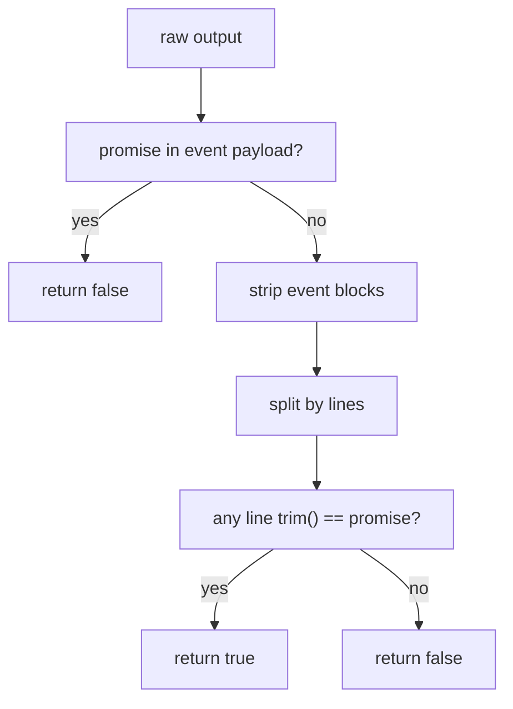

# Spec: completion promise runtime 护栏

## 背景

当前 `completion_promise` 已经有一层安全语义:

- 如果 promise 只出现在 `<event ...>...</event>` payload 内,不应触发 completion

但第二批真实并行 example 已经暴露出更深一层问题:

- 只要普通 prose 在 event 外提到 `LOOP_COMPLETE`
- runtime 就可能把它当成真正完成
- 并行 supervisor 会提前进入 completion drain
- 后续本该继续派发的 finalizer job 被截断

## 目标

把 completion promise 收紧为更机械、更不易误触发的协议:

- promise 必须出现在 event 外
- promise 必须独占某一行
- 这一行在 `trim()` 后必须严格等于 promise
- `ralph-e2e` 的 termination reason 检测必须与 runtime 使用同一口径

## 非目标

- 不引入新的 completion 事件协议
- 不改变 event tag 解析规则
- 不把 completion token 改成 JSON 或 YAML 结构

## 问题陈述

### 现象

- `parallel-migration-rehearsal-example` 首轮 live E2E 中,`ralph#1` 的普通解释文本包含 `LOOP_COMPLETE`
- `EventParser::contains_promise()` 旧实现使用 `contains(promise)`
- Supervisor 因此过早完成,后续 `migration_conductor` 没有真正跑起来

### 结论

`LOOP_COMPLETE` 在当前系统里不是普通词汇,而是控制面 sentinel。
它必须被当作“独立 token 行”处理,不能再接受句内子串命中。

## 目标语义

### MUST

- `EventParser::contains_promise(output, promise)` MUST 先排除 event payload 命中
- 在 event 之外,它 MUST 只接受“某一行 `trim() == promise`”
- `prefix LOOP_COMPLETE suffix` MUST 返回 `false`
- `All done! LOOP_COMPLETE` MUST 返回 `false`
- 多行文本里若存在一行单独为 `LOOP_COMPLETE`,MUST 返回 `true`
- `RalphExecutor::detect_termination_reason()` 检测 `LOOP_COMPLETE` 时 MUST 复用同一语义,避免口径分裂

### SHOULD

- 相关测试 SHOULD 显式覆盖:
  - 单行命中
  - 普通句中命中失败
  - event payload 命中失败
  - incomplete event tail 命中失败
  - 混合多行中单独一行命中成功

## 检测流程图



## 运行时与 E2E 对齐序列图

```mermaid
sequenceDiagram
  participant Agent as agent output
  participant Parser as EventParser
  participant Loop as EventLoop
  participant E2E as RalphExecutor

  Agent->>Parser: raw stdout
  Parser->>Parser: ignore event payload matches
  Parser->>Parser: strip events + exact line check
  Parser-->>Loop: completion? true/false
  Agent->>E2E: captured stdout
  E2E->>Parser: reuse contains_promise(..., LOOP_COMPLETE)
  Parser-->>E2E: completion? true/false
```

## 影响范围

- `crates/ralph-core/src/event_parser.rs`
- `crates/ralph-core/src/event_loop/tests.rs`
- `crates/ralph-e2e/src/executor.rs`
- 相关单测与 direct example 断言

## 验证要求

- `event_parser` 单测必须收敛到新语义
- `event_loop` 相关单测必须改成独立单行 `LOOP_COMPLETE`
- `ralph-e2e executor` 单测必须改成独立单行 `LOOP_COMPLETE`
- 真实 direct example live E2E 必须至少验证 1 个第三批场景在新语义下通过
