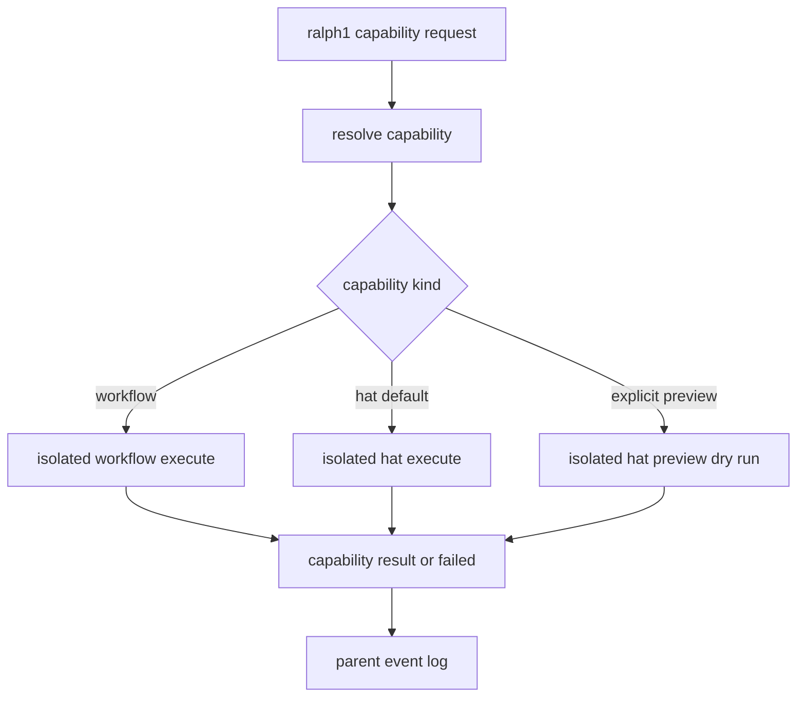
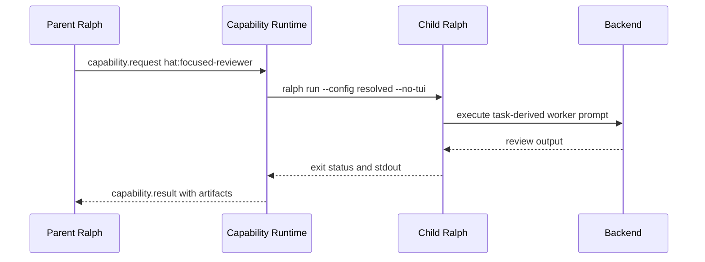

# Hat capability execute 与 preview 语义

## 目标

`hat:*` capability 默认必须执行真实 isolated hat run。旧的 dry-run 只作为显式 preview / debug 模式保留。

这份 spec 只约束 runtime capability invocation 的执行语义,不要求把临时 hat 注入 parent live topology。

## 契约

### 1. 默认执行

- `workflow:*` capability 默认走 isolated child execute。
- `hat:*` capability 默认走 isolated transient execute。
- 默认执行路径不得隐式追加 `--dry-run`。
- parent topology 必须保持不变。
- child config 必须关闭 runtime capability catalog / invoker,避免 child 再触发 capability recursion。

### 2. 显式 preview

- CLI inspect/debug 可以显式请求 preview。
- preview 路径可以继续使用 `ralph run --dry-run`,用于检查 resolved config 和 artifact wiring。
- preview 必须是显式参数,不能作为 `hat:*` 的默认行为。

### 3. 父运行返回

- child run 完成后,父运行只能收到 `capability.result` 或 `capability.failed`。
- result / failed artifact 仍然以 `.ralph/capability-invocations/<id>/` 为真相源。
- parent `ralph.yml` 和 active `HatRegistry` 不得被热修改。

## 流程图

## 时序图

## 验收

- 单元测试断言 `hat:*` 默认 child args 不包含 `--dry-run`。
- 单元测试断言显式 preview child args 包含 `--dry-run`。
- CLI integration 测试使用 preview 保留旧的快速检查路径。
- live capability integration 测试断言 parent-triggered `hat:*` invocation 的 resolved config 不再使用 `command: true` stub,且 child config 禁用 runtime capabilities。
