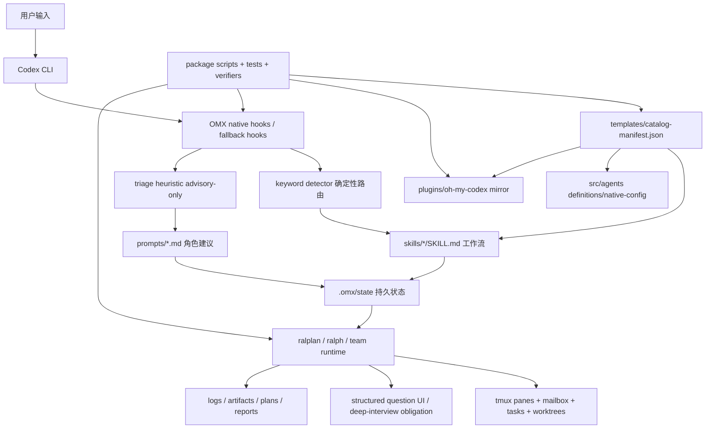

# oh-my-codex 学习分析报告

> 分析对象: `/Users/cuiluming/local_doc/l_dev/my/rust/oh-my-codex`
>
> 分析时间: 2026-05-11
>
> 分析目标: 先综合全面分析,再逐个深挖有用、值得借鉴、值得参考、值得照搬的价值点。
>
> 边界声明: 本报告基于只读分析。没有修改目标仓库业务代码。

## 0. 结论先行

`oh-my-codex` 最值得学习的地方,不是它把多少命令塞进了一个 CLI。

它真正有价值的地方是: 它把“智能体应该怎么工作”拆成了几层可治理的契约,并用状态文件、hook、skill、prompt、测试和发布校验把这些契约串起来。

如果只照搬命令,价值很低。  
如果照搬它的“契约化治理方式”,价值很高。

最优先学习的 8 个价值点:

1. **AGENTS.md 作为顶层操作契约**,而不是普通说明文档。
2. **guidance schema**,用统一章节约束 AGENTS、worker overlay、prompt 和 skill。
3. **prompt-guidance contract**,把 prompt 行为也当成可测试产品契约。
4. **keyword 确定性激活 + triage advisory-only**,把“强路由”和“弱建议”分开。
5. **`.omx/state` 状态操作层**,通过原子写、path-level queue、读写/清理/status API 管理 runtime 状态。
6. **deep-interview question obligation**,把“必须问用户”从 prompt 建议变成 runtime 状态。
7. **team pipeline + worktree 干净门禁**,把并行执行变成有阶段、有归属、有回收的系统。
8. **plugin mirror / native agent / catalog manifest 的 SSOT 校验**,避免安装面和源码面漂移。

可借鉴程度分层如下:

| 类别 | 价值判断 | 适合怎么用 |
| --- | --- | --- |
| 可直接照搬 | 文档结构、契约命名、manifest 治理、验证脚本形态、状态 JSON operation | 直接迁移思想和文件结构,按本项目命名改造 |
| 改造后借鉴 | team/tmux runtime、question obligation、native hooks、explore/sparkshell、plugin/setup 双模式 | 先抽薄契约,不要一次性搬完整 runtime |
| 只参考理念 | 全量 workflow surface、复杂自动路由、多平台 team runtime、跨工具兼容层 | 保留设计原则,不要照搬复杂度 |

---

## 1. 第一部分: 综合全面分析

### 1.1 项目定位

`oh-my-codex` 自己的 README 把定位说得很清楚: 它是 Codex CLI 的 workflow layer。

证据:

- `README.md:20`: `OMX is a workflow layer for OpenAI Codex CLI`。
- `README.md:28-33`: 它保留 Codex 作为执行引擎,增强启动、工作流、canonical skills 和 `.omx/` 状态。
- `README.md:171-179`: 它再次说明 `OMX does not replace Codex`,增加的是 task routing、workflow、runtime。

所以它不是一个“更大的 Codex”。  
它更像一个在 Codex 外围建立的运行纪律层。

### 1.2 总体架构图



这张图的关键点是: 它把“运行行为”和“资产治理”放在同一套体系里。

- 用户输入先进入 hook/keyword/triage。
- workflow 和 prompt 不是孤立 Markdown,它们和 `.omx/state`、runtime、验证脚本有连接。
- catalog manifest 和 plugin mirror 负责防止安装面漂移。
- 验证链路不只测源码,还测 prompt、skill、plugin、native agent、coverage。

### 1.3 推荐工作流

`README.md:57-82` 给出推荐默认路径:

1. `omx --madmax --high` 启动。
2. 在 Codex 内用 `$deep-interview` 澄清需求。
3. 用 `$ralplan` 批准计划和权衡。
4. 用 `$ralph` 持续推进到完成,或 `$team` 做协调并行执行。

`README.md:192-197` 把这条路径再次压缩成三步:

1. `$deep-interview`: 澄清范围。
2. `$ralplan`: 形成并批准架构/实现计划。
3. `$team` 或 `$ralph`: 并行执行或单 owner 持续完成。

这和本项目 Ralph 的很多理念是同构的: 先钉语义边界,再执行,最后用证据验收。

不过 OMX 更强调“用户可直接调用的 workflow surface”。  
Ralph 当前更像是运行时 orchestrator。  
这两者可以互相借鉴,但不能混成一个大而全的命令集。

### 1.4 顶层 AGENTS.md 是核心契约

`templates/AGENTS.md` 不是普通模板。它承担了 workspace 主宪法的角色。

证据:

- `templates/AGENTS.md:1-6`: autonomy directive,要求 agent 自动执行明确、低风险、可逆任务,不要反复问 “should I proceed”。
- `templates/AGENTS.md:15-29`: 声明 canonical guidance schema 和 runtime/team marker contract。
- `templates/AGENTS.md:31-57`: operating principles,包括 outcome-first、自动推进、停止条件、证据优先。
- `templates/AGENTS.md:97-112`: mode selection,包括 `$deep-interview`, `$ralplan`, `$team`, `$ralph`, solo execute。
- `templates/AGENTS.md:179-211`: keyword detection、runtime availability gate、triage advisory-only 和 Ralph/Ralplan gate。
- `templates/AGENTS.md:255` 之后: verification contract。

这说明 OMX 的“智能体行为”不是散落在每个 skill 里。  
顶层 AGENTS 是单一总契约。  
skill 和 prompt 是局部执行面,不能推翻它。

### 1.5 guidance schema 把所有指导面统一成一种形状

`docs/guidance-schema.md:7-13` 说明它覆盖:

- static AGENTS template surfaces。
- runtime AGENTS overlays。
- team worker overlays。
- worker protocol skill/inbox guidance。

`docs/guidance-schema.md:17-30` 给出必需章节:

1. Role & Intent。
2. Operating Principles。
3. Execution Protocol。
4. Constraints & Safety。
5. Verification & Completion。
6. Recovery & Lifecycle。

`docs/guidance-schema.md:39-50` 固定了 marker 和 worker task/mailbox contract。

这很有价值。  
它解决的问题是: 当项目有 AGENTS、prompt、skill、worker overlay、runtime injection 时,这些说明容易变成多个互相打架的说明书。  
OMX 的办法是先规定“说明书应该长什么样”,再让每个面各自填内容。

### 1.6 prompt 也被当成产品契约

`docs/prompt-guidance-contract.md` 的价值很高。  
它不是泛泛说“prompt 要写好”。它把 prompt 行为定义成 contributor-facing contract。

证据:

- `docs/prompt-guidance-contract.md:17-29`: 定义当前 prompt 源头: `prompts/*.md`, `skills/*/SKILL.md`, AGENTS 模板、fragments、config generator、回归测试。
- `docs/prompt-guidance-contract.md:64-129`: 定义 5 个核心 GPT-5.5 行为模式: outcome-first、短进度、低风险自动推进、局部覆盖、证据和停止规则。
- `docs/prompt-guidance-contract.md:130-133`: 限制绝对语言的使用范围。
- `docs/prompt-guidance-contract.md:134-145`: 规定 active workflow 的终端回复必须明确 outcome,不能用“如果你想我可以继续”这类软 handoff。
- `docs/prompt-guidance-contract.md:185-195`: 给出 prompt change checklist。
- `docs/prompt-guidance-contract.md:196-226`: 给出验证命令。

这套做法值得直接借鉴到任何“prompt 是长期资产”的项目里。  
重点不是具体措辞,而是: prompt 变更也要有 checklist 和测试。

### 1.7 keyword 和 triage 分层很清楚

`src/hooks/keyword-registry.ts` 是确定性路由表。  
比如 `$ralph`、`$deep-interview`、`$ralplan`、`$team`、`$cancel` 等都在这个表里有明确 skill、priority 和 guidance。

`src/hooks/triage-heuristic.ts:1-11` 明确说: triage 是 pure、synchronous、advisory-only,不会激活 workflow,不会触碰 state 或 fs。

这个边界非常好。  
它避免了一个常见坑: 自动分类器一旦拥有“直接切模式”的权力,用户一句普通话就可能误触复杂 runtime。

OMX 的设计是:

- keyword 是强控制面。
- triage 只是弱建议。
- keyword 优先级高于 triage。
- 用户可以用 `no workflow`, `plain answer`, `just chat` 之类 opt-out 抑制 triage。

### 1.8 状态层是 `.omx/state`,不是 prompt 记忆

`src/state/operations.ts` 的设计很值得看。

证据:

- `src/state/operations.ts:31-41`: 列出支持的 mode: autopilot、team、ralph、ultrawork、ultraqa、ralplan、deep-interview、skill-active 等。
- `src/state/operations.ts:44-49`: 统一 state operation 名称: `state_read`, `state_write`, `state_clear`, `state_list_active`, `state_get_status`。
- `src/state/operations.ts:56-76`: 使用 per-path write queue,避免并发写同一个状态文件。
- `src/state/operations.ts:78-87`: 用临时文件 + rename 做原子写。
- `src/state/operations.ts:193-357`: 把状态读写、校验、merge、runtime context、Ralph artifact ensure 和 skill-active 同步放在统一入口。

`src/mcp/state-server.ts` 又把这套 operation 包成 MCP 工具,但 `src/mcp/state-server.ts:171-188` 明确把旧 team MCP mutation hard-deprecated,提示 team mutation 走 CLI interop。

这说明它不是“哪里都能改状态”。  
它把状态读写收束到一个操作层。  
MCP 只是外壳,不是新的真相源。

### 1.9 deep-interview 把“问用户”状态化

`skills/deep-interview/SKILL.md:42-76` 是很强的执行策略。
它要求:

- 每轮只问一个问题。
- 先问 intent 和 boundary,再问实现细节。
- 对答案做压力测试。
- 可发现的代码事实先用 explore 查,不要问用户。
- 在 tmux 内每轮用结构化 question UI。
- 问题答案以 `answers[]` 作为主成功契约。
- ambiguity 达不到阈值不能交给执行。
- non-goals 和 decision boundaries 是 mandatory readiness gates。

源码侧 `src/question/deep-interview.ts` 进一步把这件事 runtime 化:

- `src/question/deep-interview.ts:19-29`: 定义 `DeepInterviewQuestionEnforcementState`,状态包含 obligation_id、status、lifecycle_outcome、question_id 等。
- `src/question/deep-interview.ts:75-85`: 创建 pending question obligation。
- `src/question/deep-interview.ts:189-228`: 当 obligation pending 时,写入 `lifecycle_outcome: askuserQuestion`, `run_outcome: blocked_on_user`,并把 active 置 false。
- `src/question/deep-interview.ts:263-299`: `runDeepInterviewQuestion` 先写 obligation,再运行结构化 question UI,成功后满足 obligation。

这比“prompt 里说要问用户”可靠得多。  
它把“需要人类回答”变成状态机里的一等状态。

### 1.10 ralplan 是小型共识状态机

`src/ralplan/runtime.ts` 不是一个巨大系统,反而挺清楚。

证据:

- `src/ralplan/runtime.ts:4-12`: 定义 active phase: draft、architect-review、critic-review、complete。
- `src/ralplan/runtime.ts:111-129`: 启动前检查已有 active ralplan,避免重入。
- `src/ralplan/runtime.ts:142-180`: 每轮按 draft -> architect-review -> critic-review 更新状态。
- `src/ralplan/runtime.ts:191-216`: critic approve 后读取 planning artifacts,检查 PRD 和 test spec 是否都存在。
- `src/ralplan/runtime.ts:219-245`: 超过迭代数则 failed,并写 status_message。
- `src/ralplan/runtime.ts:250-274`: 异常也写 failed 状态。

这类“小状态机 + artifact gate”很值得借鉴。  
它的价值不是 planner、architect、critic 这几个名字,而是把“计划是否完成”落到了可验证 artifact 上。

### 1.11 team runtime 很强,但复杂度也很高

`src/team/orchestrator.ts:1-6` 说明 team 提供 staged pipeline: plan -> prd -> exec -> verify -> fix。

`src/team/orchestrator.ts:8-34` 把 phase 写成类型和 transition table:

- `team-plan -> team-prd`
- `team-prd -> team-exec`
- `team-exec -> team-verify`
- `team-verify -> team-fix | complete | failed`
- `team-fix -> team-exec | team-verify | complete | failed`

`src/team/orchestrator.ts:88-104` 还有 fix loop 上限,超过就 failed。

`src/team/worktree.ts:152-159` 尤其值得借鉴: worker worktree 前要求 leader workspace 干净,否则报 `leader_workspace_dirty_for_worktrees`。

这条很实用。  
并行 agent 最大风险之一就是把用户未提交改动复制到多个 worker 分支里,最后变成冲突和责任不清。  
OMX 直接在入口处挡住。

不过 team runtime 本身很复杂。  
它涉及 tmux pane、mailbox、heartbeat、task claim、worktree、shutdown diff、integration event、cross-worker rebase 等。  
这不适合原样照搬。  
适合先借鉴它的阶段模型和安全门禁。

### 1.12 explore / sparkshell 是两种不同的只读辅助面

`crates/omx-explore/src/main.rs` 的定位是 low-cost read-only repository exploration harness。

证据:

- `crates/omx-explore/src/main.rs:38-39`: 内置 allowlist runtime 依赖 POSIX sh/bash,Windows 不是默认 ready。
- `crates/omx-explore/src/main.rs:41-43`: 允许的 direct commands 只有 `rg`, `grep`, `ls`, `find`, `wc`, `cat`, `head`, `tail`, `pwd`, `printf`。
- `crates/omx-explore/src/main.rs:136-155`: 先用 spark model,失败后 fallback。
- `crates/omx-explore/src/main.rs:199-222`: fallback 会在 stderr/stdout 里标明成本和行为边界变化。
- `crates/omx-explore/src/main.rs:959-966`: 组合 prompt,明确要求 strictly read-only,只用 repository-inspection shell commands,不能写删改文件,不能运行改变 git 状态的命令。
- `crates/omx-explore/src/main.rs:976` 之后: 构造 allowlist PATH。

`crates/omx-sparkshell/src/main.rs` 是另一条路径。

- `crates/omx-sparkshell/src/main.rs:42-80`: 执行命令后,如果输出行数不超过阈值就原样输出,超过才调用 summarizer。
- `crates/omx-sparkshell/src/main.rs:93-105`: direct command mode 不解析 shell metacharacter,tmux pane mode 可捕获 pane tail。

这两个工具的分工值得借鉴:

- `explore`: 安全、窄、只读、适合仓库事实查询。
- `sparkshell`: 面对噪声输出,小输出保真,大输出摘要。

### 1.13 plugin / native agent / prompt 的 SSOT 治理

`docs/plugin-bundle-ssot.md:1-12` 说得很明确: 仓库保留 canonical authoring surface,`plugins/oh-my-codex` 是 generated-or-verified plugin output。

关键契约:

- root `skills/<name>/SKILL.md` 是 plugin skill canonical source。
- `templates/catalog-manifest.json` 控制可安装 skill membership。
- `src/config/omx-first-party-mcp.ts` 是 plugin MCP metadata canonical source。
- `package.json` 是 plugin version canonical source。
- root `prompts/` 和 `src/agents/definitions.ts` 是 legacy setup mode 的 native agents/prompts canonical source。
- official plugin 不 ship plugin-scoped agents/prompts/hooks。

`package.json:53-56` 提供脚本:

- `sync:plugin`
- `sync:plugin:check`
- `verify:plugin-bundle`
- `verify:native-agents`

这套机制是高价值资产治理方案。  
尤其适合任何“源码一套、安装输出一套、插件镜像一套”的项目。

### 1.14 验证链路覆盖的不只是代码

`package.json` 的 scripts 很能说明项目工程风格:

- `package.json:19`: `prepack` 会 build、verify native agents、sync plugin、verify plugin bundle、clean native package assets。
- `package.json:25`: `test:explore` 同时跑 Rust harness test 和 JS routing test。
- `package.json:31`: `test:recent-bug-regressions` 包含 keyword detector、native hook、launch fallback、team runtime、hardening e2e。
- `package.json:35`: `test` 包含 build、native agents verify、plugin bundle verify、node tests、catalog docs check。
- `package.json:37-41`: team/state 有 coverage gate,TS full 也有 coverage 输出。
- `package.json:43-44`: Ralph persistence 和 explicit terminal contract 有独立 compiled test suite。

这说明它的验证不是“跑一下 npm test”。  
它把每类契约都变成脚本入口。

---

## 2. 第二部分: 价值点清单与优先级

| 优先级 | 价值点 | 建议动作 | 可照搬程度 | 主要来源 |
| --- | --- | --- | --- | --- |
| P0 | guidance schema | 建立本项目统一 agent 指导面结构 | 高 | `docs/guidance-schema.md` |
| P0 | prompt-guidance contract | 把 prompt/skill 变更纳入 checklist 和 tests | 高 | `docs/prompt-guidance-contract.md` |
| P0 | marker-bounded AGENTS overlay | 对 runtime 注入文本使用稳定 marker | 高 | `templates/AGENTS.md` |
| P0 | state operation contract | 建统一状态读写/清理/status 层 | 高 | `src/state/operations.ts` |
| P0 | plugin/asset SSOT verifier | 防止插件、prompt、skill、agent 镜像漂移 | 高 | `docs/plugin-bundle-ssot.md`, `package.json` |
| P1 | keyword vs triage 分层 | 强激活和弱建议分开 | 高 | `src/hooks/keyword-registry.ts`, `src/hooks/triage-heuristic.ts` |
| P1 | deep-interview question obligation | 把 ask-user 变成 pending/satisfied/cleared 状态 | 中高 | `src/question/deep-interview.ts` |
| P1 | ralplan artifact gate | 计划完成必须有 PRD + test spec artifact | 中高 | `src/ralplan/runtime.ts` |
| P1 | team phase table | 并行执行用显式状态机和 fix loop 上限 | 中 | `src/team/orchestrator.ts` |
| P1 | leader clean worktree gate | 并行前拒绝 dirty leader workspace | 高 | `src/team/worktree.ts` |
| P2 | explore allowlisted read-only harness | 为 agent 提供窄只读查询面 | 中 | `crates/omx-explore` |
| P2 | sparkshell raw-vs-summary | 大输出摘要,小输出保真 | 中 | `crates/omx-sparkshell` |
| P2 | Lore commit protocol | commit message 作为简短决策记录 | 中 | `templates/AGENTS.md` |
| P3 | 全量 team/tmux runtime | 仅在需要 durable 多 worker 时参考 | 低 | `src/team/runtime.ts` |
| P3 | native hook 全矩阵 | 本项目若没有对应 hook 能力,只参考边界说明 | 低中 | `docs/codex-native-hooks.md` |

---

## 3. 第三部分: 逐个价值点深度挖掘

### 3.1 guidance schema

#### 它解决什么问题

当项目有多种 agent 指导面时,最容易出的问题是:

- AGENTS.md 说一套。
- prompt 说一套。
- skill 说一套。
- worker overlay 又说一套。
- 最后 agent 不知道谁优先。

OMX 用 `docs/guidance-schema.md` 定义统一章节,相当于给所有指导面套上同一骨架。

#### 值得照搬的部分

建议直接照搬这个结构,改成本项目命名:

```text
1. Role & Intent
2. Operating Principles
3. Execution Protocol
4. Constraints & Safety
5. Verification & Completion
6. Recovery & Lifecycle
```

再加一张 mapping matrix,列出根 AGENTS、局部 AGENTS、role prompt、workflow skill、runtime overlay、worker inbox / task guidance。

#### 对 Ralph 的迁移建议

新增 `docs/agent-guidance-schema.md`。  
它不需要长,但要固定:

- 哪些文件是“顶层契约”。
- 哪些文件是“角色执行面”。
- 哪些文件是“工作流执行面”。
- 哪些 runtime 注入只能 append marker block。
- 冲突时谁优先。

#### 风险

不要把 schema 写成又一份超长规则。  
它应该是“结构约束”,不是又一个 AGENTS 副本。

### 3.2 prompt-guidance contract

#### 它解决什么问题

很多项目把 prompt 当成文本素材。  
OMX 把 prompt 当成行为契约。

它明确了 prompt 源头、必须保留的行为、绝对语言边界、active workflow 最终回复规则、prompt 变更后的测试。

#### 值得照搬的部分

可以直接照搬这几个章节模式:

1. Scope and current source of truth。
2. What this contract is and is not。
3. Core prompt behavior patterns。
4. Absolute-language rule。
5. Terminal handoff contract。
6. Contributor checklist。
7. Validation workflow。

#### 对 Ralph 的迁移建议

建立 `docs/prompt-contract.md`。  
先覆盖最关键表面:

- AGENTS.md。
- Ralph hats / prompts。
- specs / tasks 生成 prompt。
- TUI / record-session final handoff 文案。

尤其值得借鉴:

- 终端回复必须明确 outcome 和 evidence。
- 不要以 permission-seeking softener 结束 active workflow。
- 更多工具调用不等于更好,要有 stop condition。

#### 风险

不要把 GPT 版本号写死到长期契约里。  
Ralph 可以写成“当前模型 prompt 行为契约”,避免未来模型更新时文档命名过期。

### 3.3 marker-bounded runtime overlay

#### 它解决什么问题

运行时经常需要往 AGENTS.md 或上下文里注入 session 信息。  
如果没有 marker,注入内容会越积越乱。

#### 值得照搬的部分

Ralph 可以统一自己的 runtime marker 命名,例如:

```text
<!-- RALPH:RUNTIME:START --> ... <!-- RALPH:RUNTIME:END -->
<!-- RALPH:WORKER:START --> ... <!-- RALPH:WORKER:END -->
```

关键是规定:

- marker 名字稳定。
- runtime 只能更新 marker 内内容。
- 不允许工具删除用户手写内容。
- marker block 内要写 schema version、session id、生成时间。

#### 风险

marker block 不应该成为第二个状态数据库。  
真正状态仍应在 `.ralph/` 或 `.agent/` 里。

### 3.4 state operation contract

#### 它解决什么问题

一旦多个 hook、MCP、CLI、runtime 都能写状态,状态文件很快会损坏或语义漂移。  
OMX 用统一 `executeStateOperation` 收口。

值得注意的细节:

- 支持 mode 白名单。
- 每个 path 有 write queue。
- 写入用 temp file + rename。
- 写入前做 mode-specific validation。
- active workflow 需要 reconcile transition。
- MCP server 只包这套 operation。

#### 值得照搬的部分

Ralph 可以抽一个很小的状态操作层:

```text
state_read(mode, scope)
state_write(mode, patch, scope)
state_clear(mode, scope)
state_list_active(scope)
state_get_status(mode?, scope)
```

配套规则:

- 所有写入都走原子写。
- 同一路径写入串行化。
- mode 名称通过白名单校验。
- 关键状态有 schema/version。
- CLI 和 MCP 共用同一个 operation,不能各写一套。

#### 风险

不要先引入完整 MCP server。  
先把 Rust 内部状态读写统一。  
MCP 只是外壳,不是第一步。

### 3.5 keyword 强路由 + triage 弱建议

#### 它解决什么问题

智能路由很诱人,但误触发代价很高。  
OMX 的分层很清楚:

- keyword registry 是确定性激活。
- triage heuristic 是 advisory-only。
- triage 不碰状态和文件系统。
- 用户可 opt-out。

#### 值得照搬的部分

Ralph 如果引入自然语言 routing,建议也采用这条红线:

```text
keyword 可以激活 workflow。
triage 只能建议 prompt/context,不能切状态。
```

同时给每个 keyword 设定 keyword、target workflow、priority、guidance、activation gate。

#### 风险

不要把 `parallel`、`team`、`continue` 这类普通词直接变成强激活。  
这类词非常容易误触。

### 3.6 deep-interview question obligation

#### 它解决什么问题

“需要问用户”如果只停留在文本上,Stop hook 或自动继续逻辑可能把它绕过去。  
OMX 的做法是创建 obligation:

```text
pending -> satisfied / cleared
lifecycle_outcome = askuserQuestion
run_outcome = blocked_on_user
```

这样 runtime 知道现在不是失败,也不是完成,而是正在等用户。

#### 值得照搬的部分

Ralph 可以参考这种状态:

```json
{
  "question_obligation": {
    "id": "...",
    "source": "deep-interview",
    "status": "pending",
    "requested_at": "...",
    "question_id": null
  },
  "lifecycle_outcome": "askuserQuestion",
  "run_outcome": "blocked_on_user"
}
```

这个结构尤其适合需求澄清、权限/破坏性操作确认、不可自动决定的产品 tradeoff。

#### 风险

不要把所有提问都 obligation 化。  
只有“阻塞执行的必要问题”才需要。

### 3.7 ralplan artifact gate

#### 它解决什么问题

计划流程最容易出现“口头批准了,但没有可交付计划文件”的假完成。  
OMX 在 critic approve 后仍检查 PRD 和 test spec 是否存在。

#### 值得照搬的部分

把“计划完成”定义为 artifact gate,例如:

```text
planning_complete = prd exists && test_spec exists && acceptance criteria exists
```

对应到 Ralph,可以是 specs、tasks、OpenSpec change 目录、测试计划。

#### 风险

artifact gate 要轻,不要为了一个很小任务强制生成三份文档。

### 3.8 team phase table 和 fix loop 上限

#### 它解决什么问题

多 agent 并行最怕“大家都在忙,但没人知道现在在哪个阶段”。  
OMX 用显式 phase table 和 transition rules 解决。

值得借鉴的是 phase model 和 fix loop 上限,不是 tmux 细节。

#### 对 Ralph 的迁移建议

如果 Ralph 后续要增强并行 hats,可以先引入一个小 phase table:

```text
plan -> decompose -> execute -> verify -> fix -> complete/failed
```

每次转移记录 from、to、at、reason。

#### 风险

不要照搬完整 `src/team/runtime.ts`。  
完整 runtime 包含大量进程、tmux、worktree、mailbox、integration 复杂度。

### 3.9 leader workspace clean gate

#### 它解决什么问题

如果 leader workspace 已经 dirty,再创建 worker worktree,就会发生三类风险:

1. 用户未提交改动被复制或遗漏。
2. worker 改动和用户改动混在一起。
3. 集成时无法判断谁引入了什么。

OMX 在 `assertCleanLeaderWorkspaceForWorkerWorktrees` 里直接拒绝。

#### 值得照搬的部分

这个可以非常直接照搬到任何并行 agent 工具:

```text
创建 worker worktree 前,必须确认 leader workspace clean。
如果 dirty,报错并列出最多 8 条 status preview。
```

#### 风险

要允许用户显式选择非 worktree 模式。  
如果只是单 agent 或只读分析,不需要这个 gate。

### 3.10 plugin mirror / catalog manifest / native agent verifier

#### 它解决什么问题

当项目有多个发布面时,最容易出的问题是:

- root skill 改了,plugin mirror 没同步。
- catalog 里有,目录里没有。
- plugin manifest 版本和 package 版本不一致。
- native agent TOML 还是旧 prompt。

OMX 用 catalog manifest 和 verifier 解决。

#### 值得照搬的部分

如果 Ralph 有多个安装面,建议建立类似结构:

```text
templates/catalog-manifest.json
scripts/sync-xxx-mirror
scripts/verify-xxx-bundle
```

manifest 里至少包含 name、category、status、source path、install/mirror policy。

#### 风险

不要在只有一个发布面的阶段引入 mirror。  
有 mirror 才需要 verifier。

### 3.11 explore allowlisted read-only harness

#### 它解决什么问题

直接让 agent 在 shell 里“只读探索”其实很难保证。  
OMX explore 用 allowlist PATH 和 prompt contract 双层约束。

值得学习的点:

- 只允许少量查询命令。
- 提示明确 read-only。
- spark 模型失败会 fallback,且输出里标明成本/行为边界变化。
- 有 timeout、进程数限制、输出大小限制。

#### 对 Ralph 的迁移建议

如果 Ralph 要支持类似只读探索,可以先做薄版本:

- 只允许 `rg`, `sed -n`, `find`, `ls`, `cat`, `head`, `tail`, `wc`。
- 默认不写文件。
- 输出必须带“只读证据摘要”。
- 超时和输出限制必须硬编码或配置化。

#### 风险

OMX explore 当前内置 harness 对 Windows 有明确不支持提示。  
如果 Ralph 要跨平台,不能直接照搬 POSIX wrapper。

### 3.12 sparkshell raw-vs-summary

#### 它解决什么问题

长输出会污染上下文,但完全摘要又会丢错误细节。  
OMX sparkshell 的策略很实用:

- 小输出原样返回。
- 大输出摘要。
- tmux pane 可以按 tail lines 捕获。

#### 对 Ralph 的迁移建议

对 record-session、diagnostics、TUI capture、cargo test 长输出,可以做类似策略:

```text
if visible_lines <= threshold:
    原样保存/返回
else:
    保存原始文件路径 + 生成摘要 + 保留 error/warning snippets
```

#### 风险

摘要不能替代原始证据。  
必须保留原始日志路径。

---

## 4. 对 Ralph / 本项目最值得落地的建议

### 4.1 最佳方案: 契约治理先行

如果不惜代价做最佳方案,建议按这个顺序落地:

1. 建 `docs/agent-guidance-schema.md`。
2. 建 `docs/prompt-contract.md`。
3. 为 prompt/skill/hat 资产建立 manifest。
4. 把 manifest 校验接入 `cargo test` 或专门 `cargo xtask verify-agent-assets`。
5. 抽一个 Rust state operation 层,统一 runtime state 写入。
6. 为 ask-user 阻塞状态设计 `question_obligation`。
7. 如果未来要并行 hats,先做 phase table 和 clean worktree gate,不要先做 tmux runtime。

这条路更稳,但要投入工程时间。

### 4.2 先能用方案: 先搬最小闭环

如果希望先能用、后面再优雅,建议只做四件事:

1. 把 guidance schema 写成一页文档。
2. 给现有 AGENTS / skills / hats 做一个 manifest。
3. 写一个校验脚本,检查 manifest 指向的文件都存在,状态值合法。
4. 把“active workflow 最终回复必须带 outcome + evidence”写进 prompt contract。

这四件事成本低,但能马上降低 drift。

### 4.3 不建议直接照搬的内容

不建议一上来照搬这些:

- 完整 team/tmux runtime。
- plugin/setup 双模式全套。
- native hooks 全矩阵。
- 多语言/多平台兼容层。
- 所有 workflow keyword。

原因很简单: 这些东西解决的是 OMX 自己的复杂分发和运行时问题。  
Ralph 如果没有相同复杂度,直接搬会变成新屎山。

---

## 5. 推荐后续深挖顺序

如果后续要继续学习,建议按下面顺序逐个开专题:

1. **prompt contract 专题**
   - 输入: `docs/prompt-guidance-contract.md`, `prompts/*.md`, `src/hooks/__tests__/prompt-guidance-*.test.ts`。
   - 输出: Ralph prompt contract 草案。

2. **state operation 专题**
   - 输入: `src/state/operations.ts`, `src/mcp/state-server.ts`, `src/runtime/run-outcome.ts`。
   - 输出: Ralph runtime state operation 设计。

3. **question obligation 专题**
   - 输入: `skills/deep-interview/SKILL.md`, `src/question/deep-interview.ts`, `src/question/renderer.ts`。
   - 输出: Ralph ask-user blocking contract。

4. **team phase + worktree gate 专题**
   - 输入: `src/team/orchestrator.ts`, `src/team/worktree.ts`, `src/team/contracts.ts`。
   - 输出: Ralph parallel hats phase table。

5. **asset manifest / verifier 专题**
   - 输入: `templates/catalog-manifest.json`, `docs/plugin-bundle-ssot.md`, `src/scripts/sync-plugin-mirror.ts`, `src/scripts/verify-native-agents.ts`。
   - 输出: Ralph hats/skills/prompt manifest verifier。

---

## 6. 证据索引

### 6.1 入口和定位

- `README.md:20`: 项目定位是 Codex CLI workflow layer。
- `README.md:28-33`: 保留 Codex 执行引擎,增强 workflow、skills、`.omx/` 状态。
- `README.md:57-82`: 推荐默认 flow。
- `README.md:169-179`: 简单 mental model。
- `README.md:192-197`: recommended workflow 三步。

### 6.2 顶层契约和 guidance

- `templates/AGENTS.md:1-6`: autonomy directive。
- `templates/AGENTS.md:15-29`: guidance schema 和 marker contract。
- `templates/AGENTS.md:97-112`: mode selection。
- `templates/AGENTS.md:179-211`: keyword detection、runtime gate、triage、ralplan-first。
- `docs/guidance-schema.md:7-13`: schema 覆盖面。
- `docs/guidance-schema.md:17-30`: required sections。
- `docs/guidance-schema.md:39-50`: marker 和 worker path/id contract。

### 6.3 prompt 契约

- `docs/prompt-guidance-contract.md:17-29`: prompt source of truth。
- `docs/prompt-guidance-contract.md:64-129`: 5 个核心行为。
- `docs/prompt-guidance-contract.md:130-145`: absolute language 和 terminal handoff。
- `docs/prompt-guidance-contract.md:185-226`: checklist 和验证命令。

### 6.4 路由和状态

- `src/hooks/keyword-registry.ts:8-60`: keyword registry。
- `src/hooks/triage-heuristic.ts:1-11`: advisory-only triage。
- `src/state/operations.ts:31-49`: supported modes 和 operation 名称。
- `src/state/operations.ts:56-87`: write queue 和 atomic write。
- `src/state/operations.ts:193-357`: state operation 主入口。
- `src/mcp/state-server.ts:45-159`: MCP state tools。
- `src/mcp/state-server.ts:171-188`: legacy team MCP mutation hard-deprecated。

### 6.5 planning / question / team

- `skills/deep-interview/SKILL.md:42-76`: deep-interview 执行策略。
- `src/question/deep-interview.ts:19-29`: question enforcement state。
- `src/question/deep-interview.ts:75-85`: 创建 obligation。
- `src/question/deep-interview.ts:189-228`: pending obligation 写入 askuserQuestion / blocked_on_user。
- `src/ralplan/runtime.ts:4-12`: ralplan phase。
- `src/ralplan/runtime.ts:142-180`: draft -> architect-review -> critic-review。
- `src/ralplan/runtime.ts:191-216`: approve 后检查 planning artifacts。
- `src/team/orchestrator.ts:8-34`: team phase 和 transition table。
- `src/team/orchestrator.ts:88-104`: fix loop 上限。
- `src/team/worktree.ts:152-159`: leader workspace dirty gate。

### 6.6 发布和验证

- `docs/plugin-bundle-ssot.md:1-12`: plugin/setup/native prompt SSOT。
- `docs/plugin-bundle-ssot.md:13-29`: sync/verify 命令和 adding skill 流程。
- `package.json:19`: prepack verification chain。
- `package.json:25-35`: test scripts。
- `package.json:37-44`: coverage 和 persistence/terminal contract tests。
- `package.json:53-57`: plugin/native agent verifier scripts。

---

## 7. 最终判断

`oh-my-codex` 值得学,但要学它的“治理骨架”,不要照搬它的“表面复杂度”。

最值得搬的是:

- 契约文档的结构。
- prompt/skill/agent 资产的 manifest 和 verifier。
- runtime 状态的统一 operation。
- 强 keyword 和弱 triage 的边界。
- question obligation 这种阻塞状态。
- team phase table 和 worktree 安全门禁。

最需要谨慎的是:

- team/tmux 全运行时。
- plugin/setup 双轨。
- native hook 全矩阵。
- 全量 workflow keyword。

如果 Ralph 要吸收这些经验,我建议从“文档契约 + manifest 校验 + 状态 operation”这三个低风险部分开始。  
它们收益高,侵入性低,也符合“改良胜过新增”。
