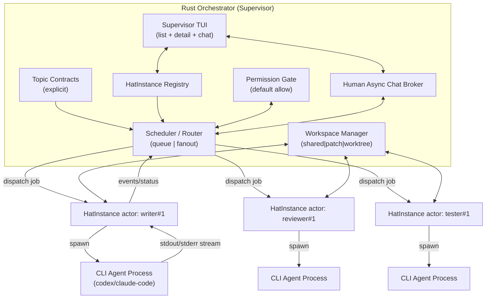
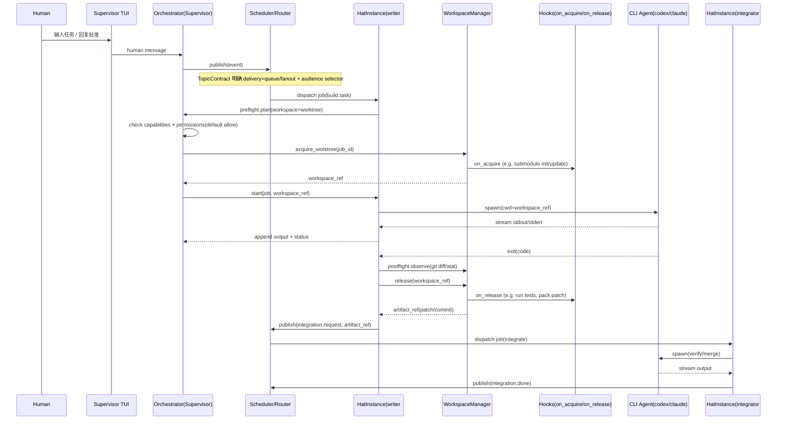

# Spec: 并行 HatInstance（Supervisor + Human Async Loop）

> 状态：DRAFT（待你确认后再进入实现）
>
> 更新时间：2026-01-26

## 0. 背景与动机

现有 Hatless Ralph 设计在 KISS 约束里明确写过：

- "Sequential hats"
- "No parallel delegation"
- "Single executor"

并且当前实现里，`EventLoop::next_hat()` 在 multi-hat 模式下也倾向于“总是返回 ralph”，把自定义 hats 当作拓扑/指令注入，而不是独立执行器。

本 spec 的目标是**反向推进**：在仍然坚持“可观测、可回放、用 backpressure 兜底”的前提下，实现：

- **不同 hat 真并行**
- **同一 hat 多实例并行**
- **Supervisor 上层界面 + human in async loop**

> 重要边界：并行 hats 全部是 **headless**。
> 也就是说：并发的本质是“多个外部 CLI agent 子进程并行跑”（codex/claude code/...），而不是多 PTY/TUI 并行。

---

## 1. 目标（Goals）

1. 并行能力
   - 不同 hat 可并行（writer/reviewer/tester 同时运行）
   - 同一 hat 可多实例并行（writer#1 / writer#2 探索不同路线）
2. 执行模型
   - 每个 job = 一次 headless CLI invocation（你选择的 A）
   - HatInstance 是 tokio actor：负责调度/状态机，不是 LLM 本体
3. 事件语义
   - 默认按 `hats.*.triggers` 路由（并行模式下对齐顺序模式 `EventBus` 的直觉）：
     - `topic -> hats`：fanout 给所有订阅该 topic 的 hats
     - `hat -> instance`：对每个 hat 只选择 **1 个实例**执行（idle-first）
   - `parallel.topic_contracts` 是**可选覆盖层**：匹配时可显式声明 `queue | fanout`、audience、queue_selection 等
   - `fanout`/`queue` 仍支持**实例级（HatInstanceId）受众限制**（例如 `event.target_instance` / audience_override）
4. UI 与交互
   - Supervisor TUI：实例列表 + 实例详情 + human async chat
   - human chat 不阻塞任何 hat（异步 gate）
5. Workspace 与权限
   - 允许通过 hat 配置授予能力（capabilities 字符串白名单）
   - 权限条目 1/2/3/4/5 全部存在，但初期默认 `allow`
   - 每个 job 可选择临时 worktree（你选择的 B），但只有具备能力的 hat 才能请求
   - worktree 支持 hooks：`on_acquire` / `on_release`（你选择的 A），脚本由 hat 设计者配置（包含 submodules 初始化等“避不开的坑”）

---

## 2. 非目标（Non-goals）

- 并行 PTY/TUI（多路交互式输入复用暂不做）
- 强制向后兼容旧配置/旧事件结构（允许大胆重构）
- 分布式/多机调度（单机内并发即可）

---

## 3. 术语（Terms）

- **HatDefinition**：配置层“帽子类型”（静态）。例如 `writer`、`reviewer`。
- **HatInstance**：运行时实例（动态）。例如 `writer#1`、`writer#explore-a`。
- **HatJob**：一次执行单元（一次 CLI invocation）。
- **Supervisor**：Rust orchestrator 的并发调度能力 + 上层 TUI（不是固定 hat）。
- **Capability**：hat 设计者授予“可做什么”（静态 allowlist）。
- **Permission**：运行时“是否允许做”（动态策略，默认 allow，可切 ask/deny）。
- **TopicContract**：topic 的显式投递合约（queue/fanout + 受众 selector），作为**可选覆盖层**（未配置/未命中时走 triggers 默认路由）。

### 3.1 并行路由默认语义（parallel.enabled=true）

当开启并行运行时（`parallel.enabled=true`）时，当前实现的默认行为是：

- **默认路由（triggers）**
  - `topic -> hats`：fanout 给所有订阅该 topic 的 hats（对齐顺序模式 `EventBus`）
  - `hat -> instance`：对每个 hat 只选择 **1 个实例**执行（idle-first + 稳定排序）
- **自动扩缩容（autoscale）**
  - 触发条件：该 hat 的实例全部处于忙（Running），且全局并发未达上限
  - 动作：动态创建新实例并投递（实例 key 单调递增且不复用）
  - 默认值：`max_running_jobs=4`，`dynamic_idle_ttl_secs=30`（dynamic 实例空闲 30 秒自动回收）
- **workspace override（Event 字段）**
  - Event 可显式声明 `workspace_strategy=shared|patch|worktree`
  - 合并规则（同一 job 合并多个事件时）：`worktree > patch > shared`
- **严格 target 校验**
  - `event.target` / `event.target_instance` 必须是订阅者（并且 target_instance 必须存在）
  - 校验失败：拒绝投递并发出 `routing.escalate`（可观测信号）
  - 控制面 topic（默认 `gate.*`）允许特例绕过（避免控制信号被拓扑阻断）

### 3.2 Completion Promise（`LOOP_COMPLETE`）在 TUI 下的“暂停语义”

并行模式下的 completion promise（默认字符串为 `LOOP_COMPLETE`）需要区分两种 UX：

1) **parallel-cli / CI / E2E（无 TUI）**
- `LOOP_COMPLETE` MUST 作为“自然结束信号”：
  - Supervisor 进入收敛态（不再派生新 job）
  - 做短暂 drain（让同轮输出解析出的事件能落盘/完成）
  - 最终 shutdown 并退出进程

2) **parallel-tui（有 TUI）**
- `LOOP_COMPLETE` MUST 作为“暂停/停歇信号”，而不是退出信号：
  - Supervisor 进入“暂停态”：不再因为内部延迟事件继续派生新 job（保留收敛护栏）
  - Supervisor 仍 MUST 持续消费外部事件（human.message / gate.resolve 等）
  - 一旦收到外部事件，Supervisor MUST 退出暂停态并恢复正常路由（用于继续对话/继续工作）
- 并行 TUI 的 `max_runtime_seconds` MUST 采用“活跃运行窗口”的计时语义：
  - 当进入暂停态时，`event_loop.max_runtime_seconds` 的计时 MUST 重置并暂停。
  - 在暂停态期间 MUST 不计时（允许会话长时间等待 human 输入）。
  - 直到任意 HatInstance 进入 `Running`（新的 job 启动）时，MUST 才重新开始计时。

> 直觉解释：`LOOP_COMPLETE` 表示“此刻无事可做”，而不是“程序生命周期结束”。
> 退出由 human（`q`/Ctrl+C）触发，避免交互式会话被强行切断。

### 3.3 并行 TUI 下禁用动态实例 idle 回收（避免 `done` 断对话）

并行 autoscale 的 dynamic instance 默认会在 idle TTL 后回收，这在交互式对话场景会带来负面体验：

- instance 被回收后会进入 `done`（并可能从 registry 移除）
- human message 默认定向到“选中实例”时，容易出现“消息发出但无人接收”的断对话

因此在 **parallel-tui** 下：

- 动态实例 idle 回收 MUST 被禁用（不因为 TTL 自动进入 `done`）。
- 实例生命周期由 human 退出会话时统一 shutdown（`q`/Ctrl+C）来收尾。

---

## 4. 核心架构（推荐：HatInstance Actor 模型）

### 4.1 组件图（flowchart）



### 4.2 时序图（一次 worktree job：on_acquire → CLI → on_release）



---

## 5. 关键数据结构（草案）

> 下面是“需要在代码里落成类型”的最小集合。允许后续调整字段名，但语义要固定。

### 5.1 HatInstanceId

- 格式建议：`{hat_id}#{instance_key}`
  - `instance_key` 可是数字（`1`）或语义化字符串（`explore-a`）
- 例：
  - `writer#1`
  - `writer#explore-a`
  - `tester#ci-smoke`

### 5.2 TopicContract（显式语义）

每个 topic 必须声明：

- `delivery`: `queue | fanout`
- `audience`: `AudienceSelector`
- （可选）`fanout_scope`: `per_instance | per_hat`
  - 默认建议 `per_instance`（更贴合“实例级限制”和并行）
- （可选）`queue_selection`: `llm | deterministic`
  - 默认建议 `llm`（你选择的 B：由 LLM 决定具体实例）
  - `deterministic` 作为兜底：用于 LLM 不可用/超时/成本受限时的可解释算法（round-robin/least-busy）

### 5.3 AudienceSelector（实例级）

需要至少支持：

- `instances`: `["writer#1", "reviewer#2"]`
- `instance_prefixes`: `["writer#"]`（可选，用于“所有 writer 实例”）
- `hats`: `["reviewer", "tester"]`（可选，便于配置层表达）

路由时的基本规则：

- 最终 recipients = `TopicContract.audience ∩ Event.audience_override(如果有)`
  - **已决定（你选 A）**：`Event.audience_override.instances=[...]` 默认采用 **best-effort**
    - 指定实例存在：按指定实例投递
    - 指定实例不存在：不视为失败，按 `missing_instance_policy` 处理（spawn/queue/escalate/drop）
    - 如果某次确实需要“必须送达”，则事件可显式声明 `audience_override.require_delivery=true`
      - `require_delivery=true` 且实例不存在：视为投递失败，并 `escalate`（通常发 gate 给 human 或请求 spawn）
- queue：从 recipients 里选一个（你选择：由 LLM 决定）
  - 如果 `Event.audience_override.instances` 已经把候选集缩到**恰好 1 个实例**，则认为选择已完成，直接投递
  - 否则按 `TopicContract.queue_selection` 执行：
    - `llm`：由 LLM 做“派发决策”（选择哪个实例接这条消息）
    - `deterministic`：用可解释算法（round-robin/least-busy）选择
  - 无论哪种方式，都必须把**候选集 + 选择结果 +（可选）原因摘要**写入事件日志（replay 时不再重新决策）
- fanout：向 recipients 全部投递

### 5.4 Capability vs Permission

- Capability：hat 配置里的字符串白名单（你确认用 1）
- Permission：Supervisor 运行时策略（默认 allow，可切 ask/deny）

> 你要求的权限条目 1-5 都要存在，但默认 allow：
>
> 1) 创建/升级 worktree
> 2) 高成本测试/基准
> 3) 对 shared 工作区直接写入
> 4) 破坏性操作（删除/清理/大范围重写）
> 5) 其他（预留扩展位）

#### 5.4.1 Human Gate（普通 gate / 超时 gate）

你希望 human in async loop 不阻塞 hat，并且：

- LLM 可以发起 human gate 寻求决策
- gate 支持超时：60s 没回复则由 LLM 自行决策
- LLM 可以按情况选择：
  - **普通 gate**（等待 human）
  - **超时 gate**（等待最多 60s，超时后继续）

我建议把它落成一个统一的“Gate”事件协议（用于咨询/审批两类场景）：

- `gate.request`
  - `gate_id`: 唯一 ID（用于 UI 列表与回复匹配）
  - `thread_id`: 可选（推荐用 ThreadId 做长期路由，见 5.5）
  - `requested_by`: `HatInstanceId`
  - `kind`: `consult | approval`
    - `consult`：讨论/建议/路线选择（不必是权限相关）
    - `approval`：权限 gate（和 Permission 条目绑定）
  - `timeout_seconds`: `null | 60 | ...`
    - `null` = 普通 gate
    - `60` = 超时 gate（你当前希望默认 60s）
  - `prompt`: 给 human 的问题（尽量短，但要包含上下文）
  - `proposed_default`: 可选（LLM 的默认倾向，用于 human 快速判断）

- `gate.resolve`
  - `gate_id`
  - `resolved_by`: `human | llm_timeout`
  - `decision`: 对 `consult` 可以是文本/枚举；对 `approval` 可以是 `approve | deny`

- `gate.timeout`
  - `gate_id`
  - 表示 human 未在 `timeout_seconds` 内回复
  - 后续由 LLM 发起一次 “resolve” job 来生成 `gate.resolve(resolved_by=llm_timeout)`

> 关键点：无论 human resolve 还是 timeout 后 LLM resolve，都必须写入事件日志。
> replay 时只回放 `gate.resolve` 的结果，不重新等待、不重新询问。

**你已确认的默认策略（宽松模式 / 方案 B）：**

- `kind=approval` 也允许使用超时 gate
- `timeout_seconds=60` 时，超时后由 LLM 自行决策 `approve|deny` 并继续
- 但仍保留“严格模式”的能力：
  - 把 `timeout_seconds=null` 当作“必须等 human”
  - 允许在某些权限条目上强制使用普通 gate（例如极高风险的破坏性操作）

> 直观理解：
> - “普通 gate”是硬阻塞（只是不阻塞其他 hats）
> - “超时 gate”是软阻塞（给 human 一个窗口；窗口过后继续）

#### 5.4.2 Human 异步调整需求（不中断、尽快送达）

你希望 human 可以随时异步发送“调整需求/新约束/新信息”，并且：

- 不阻断任何 hat 的当前进程
- LLM 能尽快读到（你倾向用文件系统事件/日志）

我建议把这件事做成两层机制（一个解决“正确性”，一个解决“速度”）：

1) **正确性层：一切都写入 `events.jsonl`（唯一真相，可回放）**
   - human 的输入统一表示为事件（例如 `human.directive`）
   - 事件写入 `.agent/events.jsonl`
   - orchestrator 按 TopicContract 路由到对应 HatInstance / ThreadId
   - replay 时，按同一份 `events.jsonl` 回放，保证 determinism

2) **速度层：给每个 HatInstance 一个“轻量 inbox 文件”（便于高频读取）**
   - 路径建议：`.agent/inbox/{hat_instance_id}.jsonl`
   - 内容只包含该实例“应该看到的 human.directive / gate.resolve”等少量事件
   - 这样 CLI agent（codex/claude code/…）可以在 job 期间**频繁读取**这个小文件，而不必每次扫描大而杂的 `events.jsonl`

`human.directive`（建议事件形态）：

- `topic: "human.directive"`
- 字段：
  - `thread_id: Option<ThreadId>`（推荐，用于长期对话/需求演进）
  - `audience: AudienceSelector`（可以 broadcast，也可以定向某实例）
  - `priority: normal | urgent`
    - `normal`：默认不打断当前 job，只在“下一次安全点”应用
    - `urgent`：允许在“下一次安全点”取消当前 job，并带新信息重启
  - `text: String`（调整内容）

Hat 在 job 期间“经常读取 inbox”的建议规则：

- **在每次关键动作之前**读取一次（例如跑大测试、合并、删除、重构大块代码）
- 默认（`priority=normal`）不打断：
  - 读取到新 directive 后，把它加入“本次 job 的上下文”，并在下一个安全点应用
- 如果 `priority=urgent`，允许触发“取消当前 job → 重新发起新 job”的路径（不影响其他 hats）
- 每次读取后，将“已消费到哪一行/哪一个 event_id”写入本地 cursor（避免重复处理）

> 关键工程点（保证 JSONL 不损坏）：
> - 强烈建议由 orchestrator 作为事件文件的主要写入者
> - `ralph emit`/外部写入需要做文件锁（flock）或改为写入 spool 目录再由 orchestrator 汇总

### 5.5 “引用不存在实例”问题的最佳处理（推荐）

你之前问过：为什么会出现“事件指向当前不存在的实例（例如 `writer#2`）”。

结论是：**只要你支持实例级路由 + 实例可动态创建/结束 + human async loop**，这个情况就不是边界，而是常态。

因此不建议用一个全局的 A/B/C 选项把系统写死。
更好的方案是：把“目标引用”拆成**短生命周期的实例引用**和**长生命周期的对话/工单引用**，再给每类消息一个可回放的缺失策略。

#### 5.5.1 两类“可寻址目标”

1) **HatInstanceId（短生命周期）**
   - 适合：控制类/立即生效类消息（cancel、kill、pause、retry 等）
   - 特点：实例结束后，这个 ID 可能就不再可达

2) **ThreadId / WorkItemId（长生命周期，推荐用于 human async loop）**
   - 适合：人类异步回复、审批、以及跨多 job 的“持续性讨论/决策”
   - Supervisor 维护映射：
     - `thread_owner: Option<HatInstanceId>`（当前由哪个实例负责）
     - 当 owner 不存在时，消息不会丢，而是进入 thread inbox，等待重新分配

> 直觉类比：
> - 实例像“进程/actor”，会结束；
> - thread/work item 像“工单/会话”，需要跨时间存在。

**你已确认（选 A）：human async chat 的路由主键使用 `ThreadId`**

- human 消息默认发送到 `ThreadId`（长生命周期），不直接强绑定某个实例
- `@writer#2` 只作为 UI 层的“便捷别名”：
  - UI 会把 `@writer#2` 解析为“该实例当前 owner 的 thread”（或提示选择/创建 thread）
  - 当实例消亡或 owner 变更时，thread 仍继续存在，消息不会丢

#### 5.5.2 缺失实例的策略：按消息类型 + 显式可配置（可回放）

定义一个显式的缺失策略（可以出现在 TopicContract 里作为默认，也可以由事件覆盖）：

- `missing_instance_policy: spawn | queue | escalate | drop`

建议默认行为（可在 spec 实现时落成 hard rules，保证系统不靠约定）：

- **控制类消息**（目标通常是 `HatInstanceId`）：
  - 缺失 → `drop`（幂等）+ 记录 system event（便于诊断）
- **工作分发类消息**（queue/fanout 任务）：
  - 缺失 → `spawn`（前提：目标 hat 具备 capability，比如 `instance.spawn` 或等价能力）
  - 如果不具备 capability → `escalate`（发到 human chat / Ralph 决策）
- **human async reply**：
  - 永远优先投递到 `ThreadId`，不直接绑定实例
  - 缺失 owner → `queue` 到 thread inbox，后续由调度器分配给某个实例处理

关键点：无论选择 spawn/queue/escalate/drop，Supervisor 都要把“路由决策”写入事件日志，保证 replay 可复现。

---

## 6. 配置草案（YAML 示例）

> 这只是表达形态，字段名可在实现时对齐现有 `Config` 结构。

### 6.1 HatDefinition（capabilities + workspace hooks）

```yaml
hats:
  writer:
    name: "Writer"
    triggers: ["build.task"]
    capabilities:
      - "repo.write"
      - "workspace.worktree"     # 允许请求临时 worktree
      - "workspace.hooks"        # 允许执行 on_acquire/on_release
    workspace:
      default_mode: "patch"      # LLM 可在 preflight 覆盖为 worktree
      hooks:
        on_acquire:
          commands:
            # 典型用途：初始化子模块/准备依赖等
            - "git submodule update --init --recursive"
          repair_commands:
            # 仅用于“hook 失败后的自愈回路”，由设计者提供，orchestrator 不内置猜测
            - "git submodule sync --recursive"
            - "git submodule update --init --recursive"
          retry:
            max_attempts: 3
            backoff_seconds: [0, 2, 5]
        on_release:
          commands:
            - "cargo test"
          retry:
            max_attempts: 2
            backoff_seconds: [0, 2]
```

### 6.2 TopicContracts（可选覆盖层：显式 queue/fanout + 受众）

```yaml
parallel:
  enabled: true

  # Optional safety rails（默认值如下）
  autoscale:
    max_running_jobs: 4
    dynamic_idle_ttl_secs: 30

  # Optional override（匹配时优先生效；未命中则走 triggers 默认路由）
  topic_contracts:
    "build.task":
      delivery: queue
      queue_selection: llm
      audience:
        hats: ["writer"]

    "build.done":
      delivery: fanout
      audience:
        hats: ["reviewer", "tester"]
```

> 事件级“实例限制”可通过 `<event ... audience_instances="writer#1,writer#2" require_delivery="true">` 表达（并行模式会解析为 `audience_override`）。
>
> 并行模式当前还支持 per-event workspace override：
>
> ```text
> <event topic="build.task" workspace_strategy="worktree">...</event>
> ```

---

## 7. 执行与 Workspace 策略（与你的约束对齐）

### 7.1 为什么不默认总 worktree

你指出的现实问题成立：

- worktree 创建/初始化可能被 submodules + 网络拖慢
- 不能把这种成本强加给所有任务

因此本 spec 采用：

- **LLM preflight 预判**：本 job 需不需要 worktree（难度/改动范围/是否要反复测试）
- **capabilities 约束**：只有具备 `workspace.worktree` 的 hat 才能请求
- **hooks 负责 submodules**：由 `on_acquire/on_release` 定义，orchestrator 不做“要不要 init submodules”的内置判断

### 7.2 临时 worktree（每 job 一次）

当选择 worktree 时：

1. acquire_worktree → 运行 `on_acquire`
2. 在该 worktree cwd 下 spawn CLI agent
3. release_worktree → 运行 `on_release`
4. `on_release` 负责产出 artifact（patch/commit/ref）与可选校验

> 你提到“合并与校验可以定义 hat 来负责”，因此推荐引入 `integrator`/`verifier` 帽子类型：
>
> - `writer` 产出 `integration.request`
> - `integrator` 消费后执行合并与验证（受 capability/permission 控制）

### 7.3 可否由 LLM 决策？（推荐：LLM 提议 + Supervisor 执行）

你问“可否由 LLM 决策”。
我的结论是：**可以**，而且**应该让 LLM 参与决策**。

但在并行系统里，我更推荐一个清晰分工：

- LLM 负责“提议做什么”（策略/路线/是否升级成本）
- Supervisor（Rust orchestrator）负责“能不能做、怎么做”（能力/权限/机械执行/仲裁）

这样做有三个核心理由：

1. **可回放**：如果 LLM 的决策不落盘，replay 就会失真，调试也不可复现。
2. **可控性**：你希望成本/风险升级要 human 批准。
   - 让 LLM 直接执行，会天然绕开 gate。
3. **全局仲裁**：多实例并行时，可能同时发起“合并/跑大测试/改 shared 工作区”等动作。
   - 需要 Supervisor 做单写者仲裁，否则工作区会混乱。

因此建议把“LLM 决策”统一编码成**显式事件**（落入事件日志，保证 replay）：

1. HatInstance 发布 `decision.request`（或更具体：`workspace.plan` / `verify.request` / `instance.spawn_request`）。
2. Supervisor 校验：
   - hat `capabilities`（静态 allowlist）
   - `permissions`（动态策略，默认 allow，可切 ask/deny）
3. 若策略为 `ask`：Supervisor 发布 `gate.request(kind=approval)` 到 human async chat。
   - 注意：**不阻塞任何 hat**，只是把执行动作挂起等待批准。
4. Supervisor 机械执行（worktree/git/test/merge 等），并发布 `decision.result`（包含产物引用与观测结果）。

你选择 **queue 语义下“具体派发到哪个实例”也由 LLM 决策**。
这会让系统更灵活（更像人类在分配工作），但也带来一个硬要求：**派发决策必须可记录、可回放**。

因此我建议把“调度”拆成三段（职责清晰，也方便压测/替换）：

1) **Supervisor 计算候选集（机械、可解释）**
   - 用 `TopicContract.audience` + `Event.audience_override` 计算 recipients
   - 过滤掉不存在/已结束的实例（或按 5.5 缺失策略处理）
   - 采集可选的运行态信息：busy/idle、最近输出时间、workspace 模式

2) **LLM 做派发决策（选择一个实例）**
   - 输入：候选集 + 运行态摘要 + 事件上下文
   - 输出：`chosen_instance` +（可选）原因摘要
   - 如果 publisher 已经把 `Event.audience_override.instances` 缩到 1 个实例，则跳过这一步

3) **Supervisor 执行投递并落盘（可回放）**
   - 将 `candidates + chosen_instance + reason(optional)` 写入事件日志
   - replay 时直接使用这条“已记录的派发结果”，不再调用 LLM

> 兜底：如果 LLM 不可用/超时，按 `TopicContract.queue_selection=deterministic` 回退到 round-robin/least-busy（同样要写入事件日志）。

与权限条目 1-5 的关系：

- LLM 可以提议“触发权限条目 1/2/3/4/5”，但**不能绕过 Permission Gate**。
- 默认 allow 时体验像“LLM 直接做了”，但你随时可以把某一条切到 ask 来收回权力。

### 7.4 LLM 决策层怎么落地？（不在 Rust 内接 LLM SDK）

你提出了一个非常关键的现实点：
“Ralph Orchestrator 本身不调用 LLM 做评审/决策，那我说的 LLM 决策层怎么做？”

先解释你看到的“评审没发生”是为什么（现状）：

- 当前实现遵循 Hatless Ralph 的约束：**自定义 hats 只定义拓扑，执行器永远是 ralph**。
- 代码里写得很直白（见 `EventLoop::next_hat()` 的注释）：
  - “When custom hats are defined, Ralph is always the executor.”
  - “Multi-hat mode ... Always returns \\\"ralph\\\" if ANY hat has pending events”

所以今天你配置了 reviewer/tester，也不会真的触发“另一个 LLM 去评审/测试”。
这不是你理解错了，而是现有架构的明确限制。

本 spec 的方向 1（HatInstance Actor）就是要把这条限制推翻：

- **每个 HatInstance 都能真正执行**（= 触发一次 headless CLI invocation）
- reviewer/tester/decider 都会变成真实的并行执行者

接着回答“LLM 决策层怎么落地”（目标态）：

我不建议在 Rust orchestrator 里直接接 OpenAI/Anthropic 的 SDK。
理由很简单：你当前的系统已经把 LLM 当作“外部 CLI agent”，并且你还希望 replay fixture 可用。

因此推荐落地方式是：**LLM 决策 = 一类特殊的 HatJob**。
也就是说，依然通过 `CliExecutor` 去 spawn CLI 进程，只是 prompt 变成“做决策并输出事件”。

**你已确认的默认选择：用内置 `ralph` hat 承担决策层（control-plane）**

- 第一版不新增 `decider` 之类的新 hat 名字。
- 所有“决策类 HatJob”默认都以 `hat_id="ralph"` 的身份执行（仍然是一次 headless CLI invocation）。
- 但 prompt 需要按 job 类型做分流：
  - `ralph(work)`：原本的协调/规划 prompt（Hatless Ralph）
  - `ralph(decision)`：专用于派发/超时自决/策略选择的精简 prompt（只读、强结构化输出）

> 这样做的好处：
> - 你要的“改良胜过新增”：先不引入新概念，减少 config 复杂度
> - `ralph` 在现状就是常驻的 catch-all coordinator（内置注册），符合“控制平面”直觉
> - 未来如果你确实想把决策层拆出去，也只是把“决策类 job 的默认 executor”从 ralph 改到某个自定义 hat（协议不变）

#### 7.4.1 两类 HatJob（工作类 vs 决策类）

1) 工作类 HatJob（writer/reviewer/tester/integrator）
   - 目标：写代码 / 评审 / 跑测试 / 合并
   - 产物：workspace 改动 + `build.done` 等事件

2) 决策类 HatJob（decider/control-plane）
   - 目标：做“派发/是否升级成本/超时 gate 自决”等策略决策
   - 特点：
     - **默认只读**（不需要 repo.write）
     - 输出必须结构化（建议直接输出 `<event ...>`，复用现有 `EventParser`）

#### 7.4.2 queue 派发的实现形态（你选择 LLM）

当 `delivery=queue` 且候选集 `candidates.len() > 1` 时：

1. Supervisor 计算候选集 + 收集运行态摘要（机械、可解释）
2. 启动一个“决策类 HatJob”（通过 CLI 调 LLM）
3. 决策 HatJob 输出一个事件（示意）：
   - `<event topic=\"dispatch.decision\">{ event_id, candidates, chosen_instance, reason? }</event>`
4. Supervisor 把“选择结果”写入事件日志，并据此把原始事件投递给 `chosen_instance`

> 关键点：replay 时不再调用 LLM。
> replay 直接回放 `dispatch.decision`，因此并行调度的结果也是确定的。

#### 7.4.3 gate 超时自决（你选择 approval 也可超时）

当发生 `gate.timeout(gate_id)` 时：

1. Supervisor 发布 `gate.timeout`（落盘）
2. 启动一个“决策类 HatJob”（通过 CLI 调 LLM）
3. 决策 HatJob 输出：
   - `<event topic=\"gate.resolve\">{ gate_id, resolved_by: \"llm_timeout\", decision }</event>`
4. Supervisor 执行后续动作（approve/deny 的分支），并继续调度

对“人类晚到的回复”的处理建议（保持简单且不脆）：

- gate 一旦被 `gate.resolve` 关闭，后续同 `gate_id` 的 human 回复视为“补充信息”
- 需要改变已执行动作时，用新的 `human.directive(priority=urgent)` 或新的 gate 触发“撤销/停止/重跑”

#### 7.4.4 成本控制（避免每条 queue 都起一次 LLM）

你选择让 LLM 决定 queue 派发，我建议仍然给系统留两个“刹车”：

- **批处理（batch）**：一次性把多条待派发事件交给 LLM，返回一个 assignment map
- **兜底（fallback）**：当 LLM 不可用/超时/成本受限时，回退 deterministic（round-robin/least-busy），并把“回退原因”也写入决策事件

---

## 8. Supervisor TUI（已实现）

> 这里定义“你要看到什么”，并给出实现落点。

**实现状态：已落地（并行 Supervisor TUI + human async chat + gate 面板）。**

- 并行 runner 入口：`crates/ralph-cli/src/parallel_runner.rs`
- 并行 TUI 状态与 reducer：`crates/ralph-tui/src/state/parallel.rs`
- 并行 TUI 交互与键位：`crates/ralph-tui/src/app.rs`
- 外部事件落盘（human.message / gate.resolve）：`crates/ralph-tui/src/external_event_writer.rs`

布局建议：

- 左：HatInstance 列表（状态、最近事件、workspace 模式、最后输出时间）
- 右：选中实例的输出视图（复用现有迭代输出体验：滚动/搜索/跳转）
- 下：Human async chat
  - 显示待处理的 gates（consult/approval，支持超时倒计时）
  - 支持把 human 回复定向到某个 instance（例如 `@writer#2`）

键位（现状实现）：

- `Tab` / `Shift+Tab`：Instances / Output / Chat 三 pane 焦点循环
- Instances：
  - `j/k` 或 `↑/↓`：切换选中实例
  - `Enter` / `→` / `l`：进入 Output（查看选中实例输出）
- Output：
  - 滚动/跳转/搜索与串行模式一致（`j/k`、`g/G`、`/`）
  - `h/l` 或 `←/→`：切换该实例的 job 历史
- Chat：
  - `Enter`：提交输入并写外部事件（`human.message` / `gate.resolve`）
  - `Esc`：清空输入框
  - 支持 `@writer#2 hello`、`!approve <gate_id>`、`!deny <gate_id>`、`!resolve <gate_id> <text>`

> 说明：gate 面板在并行模式下默认常驻显示，不需要额外的 “打开 gate 面板” 键位。

### 8.1 “复用现有 TUI” 的具体落点

你说的“切换到具体 hat 的界面（就是现在的 TUI）”，我建议按“最少心智迁移”来实现：

- 现有 `ralph-tui` 的核心体验是：**一个 buffer → 滚动/搜索/跳转/查看历史**。
- 在并行模型里，“全局 iteration”不再是核心维度；更合理的维度是：
  - **每个 HatInstance** 有自己的输出流
  - 每次 HatJob（一次 CLI invocation）对应一个“job buffer”（类比现在的 iteration buffer）

因此 UI 的复用策略是：

- 把当前的 `IterationBuffer` 抽象为通用的 `TextBuffer`
- 把 “iterations: Vec<IterationBuffer>” 替换为：
  - `instances: HashMap<HatInstanceId, InstanceViewState>`
  - 每个 `InstanceViewState` 内部维护 `jobs: Vec<TextBuffer>`
- 这样你在实例详情页看到的体验会非常像现在：
  - `←/→` 或 `h/l` 切换“该实例的 job 历史”
  - `j/k` 滚动
  - `/` 搜索

> 这同时满足你要的“并行时列出当前运行的 hat，并能切换查看细节”，也不会被“全局 iteration 在并行时失去直觉意义”拖累。

---

### 8.2 Human async chat 与 Gate 展示（consult/approval）

需要在 UI 层把两类“人类输入”区分开：

1) **普通对话消息**（不影响系统安全性）
   - 例如 reviewer 询问“要不要尝试另一条优化路线？”
2) **审批型消息**（Permission Gate 相关）
   - 例如创建/升级 worktree、跑高成本基准、对 shared 工作区直接写、破坏性操作

建议在 UI 下方 chat 区域里：

- 支持 `@instance` 定向消息（例如 `@writer#2`）
  - 注意：这只是 UI alias，底层会解析/绑定到某个 `ThreadId`
  - 推荐的长期引用仍然是 `#thread:<id>`（或 UI 自动显示 thread id）
- 支持 `!approve <gate_id>` / `!deny <gate_id>`（用于 `kind=approval`）
- 支持 `!resolve <gate_id> <text>`（用于 `kind=consult`）
- 对 `timeout_seconds != null` 的 gate：
  - UI 显示倒计时（例如 `T-42s`）
  - 超时后显示 `timeout -> llm_timeout resolved`（并附最终决策摘要）
- 默认策略为 allow 时：
  - 仍然记录“本次触发了哪类权限条目”
  - 但不强制打断流程（保持你要求的“尽量少约束”）

---

## 9. 并行 headless 执行的现实要求（必须补齐的工程点）

> 这部分是“方向 1 真并行”想落地，必然要面对的工程事实。

### 9.1 每次 invocation 必须可指定 cwd

并行 + 临时 worktree 的前提是：

- writer/tester/integrator 的 CLI 子进程必须在各自 workspace 目录下执行

但当前 headless `CliExecutor` 默认使用 `std::env::current_dir()` 作为 `cwd`（写死在 executor 内部）。

因此需要改造为：

- `execute(...)` 支持传入 `cwd: PathBuf`（或在 executor 层引入 `ExecutionContext { cwd, env, ... }`）

### 9.2 headless “实时输出”必须是真实时

当前 headless executor 的实现虽然注释写“real-time streaming”，但实际上会先把 stdout/stderr 全读完再一次性写出。

Supervisor TUI 想要“像现在一样”实时看到 hat 的输出，必须：

- 逐行读取 stdout/stderr
- 每读取一行就立刻推送到该 HatInstance 的当前 job buffer

> 否则并行运行时，你只能看到“突然一下子输出一大坨”，交互体验会非常差。

---

## 10. worktree hooks（on_acquire / on_release）语义（你已确认 A）

你要求“submodules 的坑避不开，用脚本由设计人定”，因此 hooks 的语义必须足够明确：

- `on_acquire`：worktree 创建完成后、执行 CLI job 之前运行
  - 典型用途：`git submodule update --init --recursive`、生成本地配置、准备缓存
- `on_release`：CLI job 结束后、worktree 清理前运行
  - 典型用途：跑测试/基准、生成 patch/commit、收集产物、写报告

执行约定（建议）：

- hooks 以 `bash -lc` 执行（与现有 workspace verification 习惯一致）
- hooks 的 stdout/stderr 也进入该实例的输出 buffer（便于排查）
- 非 0 退出码（你希望：LLM 先判断，尽量自我修复）：
  - 第一步：发布 system event（例如 `workspace.hook_failed`），并把：
    - hook 阶段（`on_acquire | on_release`）
    - attempt 次数
    - 退出码
    - stdout/stderr（或 output_ref）
    一起落盘（保证可回放）
  - 第二步：进入“自愈回路”（bounded，不无限重试）
    - 默认策略：由 `ralph(decision)` 生成一个“恢复决策”，Supervisor 机械执行
    - 恢复动作候选（由 LLM 选择其一或组合）：
      1) `retry`：等待 backoff 后重跑同一个 hook
      2) `repair_then_retry`：先跑一组 **设计者提供的** repair 命令，再重跑 hook
         - 说明：orchestrator 不内置猜测 submodules/网络等坑，repair 命令必须由 hooks 配置提供（例如 `hooks.on_acquire.repair_commands`）
      3) `escalate`：发起 `gate.request(kind=consult|approval, timeout_seconds=60)`，让 human 有窗口介入；超时则按你已确认的规则由 LLM 自决继续
      4) `abort`：终止该 job（允许其他实例继续跑）
    - 默认重试上限建议：`max_attempts=3`（含首次），超过即 `abort`
    - 每一次“选择了什么动作、为什么、最终结果”都必须写入事件日志（replay 不重算）

> 重要边界：
> - 自愈回路只影响“当前 job”，不会阻断其他 hats/instances。
> - 对于危险/高成本 repair，仍然可以走 Permission Gate（默认 allow，但你可以切 ask）。

---

## 11. 合并与校验（由 hat 驱动、orchestrator 执行的建议分工）

你希望“worktree 任务完成后的合并和校验可以定义 hat 负责”。

我建议采用“LLM 决策 + orchestrator 机械执行”的分工：

- **Integrator/Verifier hat** 负责：
  - 判断是否要合并、合并策略（rebase/merge/apply patch）、要跑哪些验证
  - 需要 human gate 时发起 `gate.request(kind=approval)`（默认 allow 也记录）
- **orchestrator** 负责：
  - 真正执行 git 命令/应用 patch/跑验证命令
  - 以单写者方式保护主工作区（避免并行写导致状态不可复现）

这样可以同时满足：

- 你要的“LLM 驱动为主”
- 并行系统的“可控与可回放”

---

## 12. 测试策略（必须可回放）

- 单元测试：TopicContract 路由（queue/fanout + 实例 selector）
- 单元测试：capabilities/permissions 判定
- 单元测试：workspace hooks 失败行为（on_acquire/on_release）
- replay fixture：模拟多实例并行下的事件流（不依赖真实后端）

---

## 13. 实现前确认清单（已决定/待决定）

1. ✅ **已决定**：`audience_override.instances=[...]` 默认 **best-effort**（你选择 A）
   - 存在就投，不存在按 `missing_instance_policy` 处理
   - 需要强制送达时用 `audience_override.require_delivery=true`
2. ✅ **已决定**：`on_acquire/on_release` hook 失败策略（你选择“LLM 先判断，尽量自我修复”）
   - hook 失败先发 `workspace.hook_failed`（带阶段/attempt/退出码/输出）
   - 然后由 `ralph(decision)` 决策恢复动作（retry/repair_then_retry/escalate/abort），Supervisor 机械执行
   - bounded 重试：默认建议 `max_attempts=3`（含首次），超过即 `abort`
   - 所有恢复决策必须落盘，保证 replay 不重算
3. ✅ **已决定**：`human.directive` 默认不打断当前 job（你选择 A）
   - `priority=normal`：加入 inbox，下一次安全点应用
   - `priority=urgent`：允许在下一次安全点 cancel 并重启
