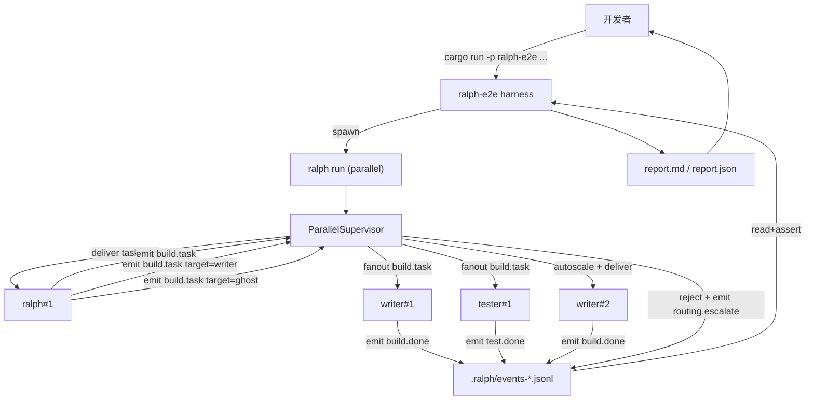
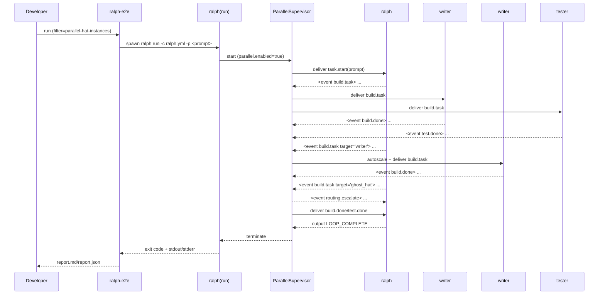

# E2E 测试流程：Parallel Hat Instances（experimental）

## 目标

用 **真实后端**（当前优先 Codex）跑一条端到端链路。
验证并行模式的关键承诺在真实环境里成立：

- `parallel.enabled=true` 时，Supervisor 能启动多个实例（含同一 hat 的多实例）。
- 不写 `parallel.topic_contracts` 时，默认按 `hats.*.triggers` 路由（topic → hats fanout）。
- 输出归因可观测（例如 `[writer#1:out] ...`）。
- `<event ...>` 能被解析并落盘到 `.ralph/events-*.jsonl`，便于回放与排障。
- 目标校验失败可观测：会生成 `routing.escalate` 事件。

> 备注：E2E 相比 replay smoke tests 更慢、更贵。
> 但它能覆盖真实认证/限流/网络/模型漂移等风险，是发布前的“硬门槛”。

## 两条路径（推荐先走 A）

### 路径 A（推荐）：自动化 E2E 场景 + 文档

- 新增 `ralph-e2e` 的一个场景：`parallel-hat-instances`
- 通过 `--filter parallel-hat-instances` 单独运行它
  - 也可以用 `--filter parallel-trigger-routing`（场景描述包含该关键词）
- 失败时可用 `--keep-workspace` 保留现场，结合 diagnostics/events.jsonl 排障

### 路径 B（降级）：手工 E2E 清单（不新增场景）

- 直接写一个 `ralph.yml`，手工运行 `ralph run`
- 人工观察 `[instance_id:out]`、events.jsonl 与最终状态

## 运行命令（路径 A）

```bash
# 1) 列出所有 E2E 场景（确认能看到 parallel-hat-instances）
cargo run -p ralph-e2e -- --list

# 2) 只跑并行实例场景（推荐保留 workspace 便于排障）
cargo run -p ralph-e2e -- codex --filter parallel-hat-instances --keep-workspace --verbose
```

## 预期信号（通过标准）

1. stdout 中能看到：
   - `[supervisor] instances ...`
   - 至少出现 `writer#1`、`writer#2`、`tester#1` 的输出/状态前缀（`writer#2` 由 autoscale 触发）
2. `.e2e-tests/<workspace>/.ralph/events-*.jsonl` 中能看到：
   - `build.task`（触发 fanout）
   - `build.done`（至少 2 次，用于证明同一 hat 多次任务可并行调度）
   - `test.done`（至少 1 次）
   - `routing.escalate`（非法 target 被拒绝）
   - `source_instance`（可选字段）：如 `writer#1` / `writer#2` / `tester#1`，用于精确归因与排障
3. 最终能观察到 `LOOP_COMPLETE`（E2E harness 会据此判断完成）

## 排障路径（最短闭环）

1. 先看 workspace：
   - `.e2e-tests/<scenario>/`（如果用了 `--keep-workspace`）
2. 再看 diagnostics：
   - `.e2e-tests/<scenario>/.ralph/diagnostics/<timestamp>/`
3. 再看事件日志：
   - `.e2e-tests/<scenario>/.ralph/events-*.jsonl`
4. 最后回到 stdout：
   - 检查是否缺少 `[writer#2:out]`（可能并发没真正跑起来）
   - 检查是否缺少 `<event ...>`（可能模型没按格式输出，导致事件解析失败）

## 流程图（graph）



## 时序图（sequenceDiagram）


