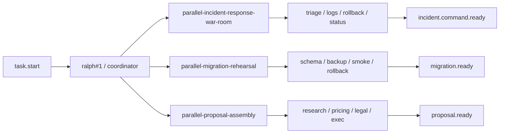
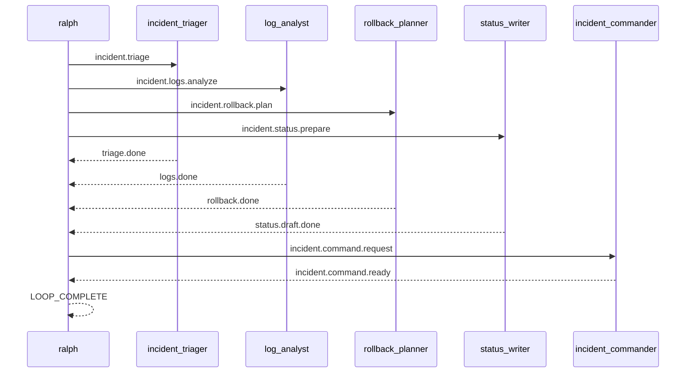

# Spec: 并行真实场景范例 - 第二批

## 背景

第一批真实并行 example 已经覆盖了:

- PR review
- release checklist
- human approval gate

它们已经证明了一条稳定路线:

- `ralph#1` 只承担 coordinator 协议
- 可变业务输入放在 `PROMPT.md`
- terminal topic 由明确的 synthesizer / finalizer hat 发布
- direct example E2E 直接跑 example 本身

现在继续补第二批更贴近团队日常协作的场景:

1. incident response war-room
2. migration rehearsal
3. proposal assembly

## 目标

新增 3 个 runnable example,并为每个 example 配套一个 direct example E2E scenario:

1. `examples/parallel-incident-response-war-room`
2. `examples/parallel-migration-rehearsal`
3. `examples/parallel-proposal-assembly`

每个 example 都要满足:

- 目录自包含,至少包含 `ralph.yml`、`PROMPT.md`、`README.md`
- worker hat 不输出 `LOOP_COMPLETE`
- completion candidate 由 hat 明确发布
- README 能说明真实使用价值、运行方法、预期 topic
- `ralph-e2e` 可直接运行 example 本身并做协议级断言

## 非目标

- 不引入新的 parallel runtime 机制
- 不要求真实工具调用或真实代码修改
- 不重复引入人工审批 gate,除非场景本质上离不开人类批准

## 设计原则

- 继续复用“coordinator fanout / fanin + finalizer terminal topic”模式
- packet 结构尽量固定,让 worker 只做单 lane 判断
- 断言优先锁结构化 topic / payload,不要依赖大段自然语言
- direct example scenario 默认继续限制在 `Codex`

## 总览图

## 场景一: parallel-incident-response-war-room

### 用户价值

演示事故处理中最常见的“多个工作面并行推进,最后再统一下指令”。
它适合展示:

- triage
- logs analysis
- rollback planning
- status drafting

如何在并行模式下同时推进。

### 目录结构

- `examples/parallel-incident-response-war-room/ralph.yml`
- `examples/parallel-incident-response-war-room/PROMPT.md`
- `examples/parallel-incident-response-war-room/README.md`
- `crates/ralph-e2e/src/scenarios/parallel_incident_response_war_room_example.rs`

### 角色与 topic

- `incident_triager`
  - triggers: `incident.triage`
  - publishes: `triage.done`
- `log_analyst`
  - triggers: `incident.logs.analyze`
  - publishes: `logs.done`
- `rollback_planner`
  - triggers: `incident.rollback.plan`
  - publishes: `rollback.done`
- `status_writer`
  - triggers: `incident.status.prepare`
  - publishes: `status.draft.done`
- `incident_commander`
  - triggers: `incident.command.request`
  - publishes: `incident.command.ready`

### 协调者语义

- `task.start` 后,`ralph#1` MUST 并行发布:
  - `incident.triage`
  - `incident.logs.analyze`
  - `incident.rollback.plan`
  - `incident.status.prepare`
- 当 4 条 lane 都完成后:
  - `ralph#1` MUST 只发布一次 `incident.command.request`
- 当收到 `incident.command.ready` 后:
  - `ralph#1` MUST 输出 incident command summary
  - 然后 MUST 输出 `LOOP_COMPLETE`

### E2E 重点

- 断言 4 条 lane topic 都出现
- 断言 `incident.command.request` 出现
- 断言 `incident.command.ready` 出现
- 断言 final payload 包含 `EXECUTE_ROLLBACK`
- 断言 `LOOP_COMPLETE` 后没有新 job

## 场景二: parallel-migration-rehearsal

### 用户价值

演示数据库或关键数据迁移前,多个 rehearsal 检查面如何并行收敛:

- schema diff
- backup verification
- smoke run
- rollback audit

### 目录结构

- `examples/parallel-migration-rehearsal/ralph.yml`
- `examples/parallel-migration-rehearsal/PROMPT.md`
- `examples/parallel-migration-rehearsal/README.md`
- `crates/ralph-e2e/src/scenarios/parallel_migration_rehearsal_example.rs`

### 角色与 topic

- `schema_reviewer`
  - triggers: `migration.schema.review`
  - publishes: `schema.ready`
- `backup_verifier`
  - triggers: `migration.backup.verify`
  - publishes: `backup.ready`
- `smoke_runner`
  - triggers: `migration.smoke.run`
  - publishes: `smoke.ready`
- `rollback_auditor`
  - triggers: `migration.rollback.audit`
  - publishes: `rollback.ready`
- `migration_conductor`
  - triggers: `migration.go_no_go.request`
  - publishes: `migration.ready`

### 协调者语义

- `task.start` 后,`ralph#1` MUST 并行发布 4 条 rehearsal 检查任务
- 当 `schema.ready`、`backup.ready`、`smoke.ready`、`rollback.ready` 全部出现时:
  - `ralph#1` MUST 只发布一次 `migration.go_no_go.request`
- `migration_conductor` MUST 发布 `migration.ready`
- 当收到 `migration.ready` 后:
  - `ralph#1` MUST 输出 go / no-go 摘要
  - 然后 MUST 输出 `LOOP_COMPLETE`

### E2E 重点

- 断言 4 条 lane topic 都出现
- 断言 `migration.go_no_go.request` 出现
- 断言 `migration.ready` 出现
- 断言 final payload 包含 `decision: GO`
- 断言没有审批类 gate topic

## 场景三: parallel-proposal-assembly

### 用户价值

演示方案/投标材料准备时,多条输入线如何并行收敛:

- research
- pricing
- legal
- executive summary

### 目录结构

- `examples/parallel-proposal-assembly/ralph.yml`
- `examples/parallel-proposal-assembly/PROMPT.md`
- `examples/parallel-proposal-assembly/README.md`
- `crates/ralph-e2e/src/scenarios/parallel_proposal_assembly_example.rs`

### 角色与 topic

- `research_analyst`
  - triggers: `proposal.research.task`
  - publishes: `research.done`
- `pricing_analyst`
  - triggers: `proposal.pricing.task`
  - publishes: `pricing.done`
- `legal_reviewer`
  - triggers: `proposal.legal.task`
  - publishes: `legal.done`
- `executive_writer`
  - triggers: `proposal.exec.task`
  - publishes: `exec.done`
- `proposal_editor`
  - triggers: `proposal.merge.request`
  - publishes: `proposal.ready`

### 协调者语义

- `task.start` 后,`ralph#1` MUST 并行发布 4 条 proposal lane 任务
- 当 4 条 lane 都完成后:
  - `ralph#1` MUST 只发布一次 `proposal.merge.request`
- `proposal_editor` MUST 发布 `proposal.ready`
- 当收到 `proposal.ready` 后:
  - `ralph#1` MUST 输出最终 proposal summary
  - 最后一行 MUST 是 `LOOP_COMPLETE`

### E2E 重点

- 断言 4 条 lane topic 都出现
- 断言 `proposal.merge.request` 和 `proposal.ready` 出现
- 断言 final payload 包含 `recommendation: SUBMIT`
- 断言 `LOOP_COMPLETE` 后没有新 job

## 事故指挥流程序列图

