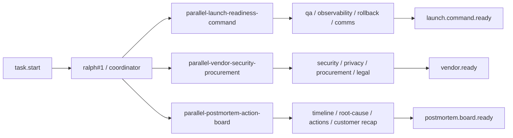
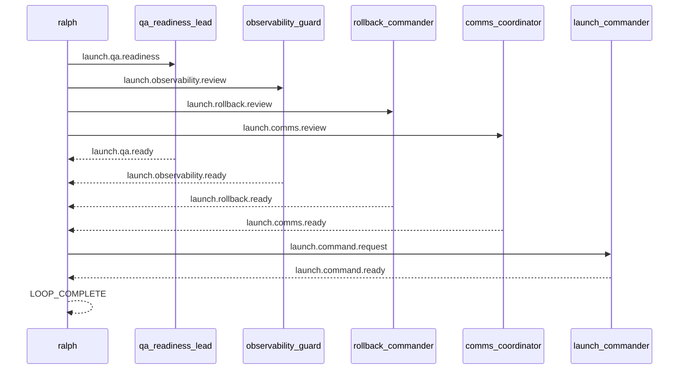

# Spec: 并行真实场景范例 - 第三批

## 背景

第二批真实并行 example 已经覆盖了:

- incident response war-room
- migration rehearsal
- proposal assembly

它们验证了三件事:

- direct prompt-file example 是可持续扩展的
- terminal topic 需要明确 owner
- `LOOP_COMPLETE` 在真实后端下必须被当成控制面 token,不能混进普通 prose

第三批继续补三个更贴近日常跨团队协作的场景:

1. launch readiness command
2. vendor security procurement
3. postmortem action board

## 目标

新增 3 个 runnable example,并为每个 example 配套一个 direct example E2E scenario:

1. `examples/parallel-launch-readiness-command`
2. `examples/parallel-vendor-security-procurement`
3. `examples/parallel-postmortem-action-board`

每个 example 都要满足:

- 目录自包含,至少包含 `ralph.yml`、`PROMPT.md`、`README.md`
- worker hat 不输出 `LOOP_COMPLETE`
- terminal topic 由明确的 finalizer hat 发布
- coordinator 在未满足收敛条件前保持静默
- README 能说明真实价值、运行方法、关键 topic 与预期结果
- `ralph-e2e` 可直接运行 example 本身并做协议级断言

## 非目标

- 不引入新的 parallel runtime 机制
- 不要求真实工具调用、真实仓库修改或网络访问
- 不把 example 做成产品级完整流程系统

## 设计原则

- 继续复用“coordinator fanout / fanin + finalizer terminal topic”模式
- payload 尽量结构化,让 E2E 优先断言 topic 与关键字段
- 所有 example 默认把 `LOOP_COMPLETE` 限制成最后一行的单独 token
- direct example scenario 继续默认限制在 `Codex`

## 总览图

## 场景一: parallel-launch-readiness-command

### 用户价值

演示一次正式发布前,多个 readiness 面并行推进,最后统一由 launch commander 给出 go command。

适合展示:

- QA 就绪
- observability 检查
- rollback 路径确认
- comms 准备

如何在一个 command room 中收敛。

### 目录结构

- `examples/parallel-launch-readiness-command/ralph.yml`
- `examples/parallel-launch-readiness-command/PROMPT.md`
- `examples/parallel-launch-readiness-command/README.md`
- `crates/ralph-e2e/src/scenarios/parallel_launch_readiness_command_example.rs`

### 角色与 topic

- `qa_readiness_lead`
  - triggers: `launch.qa.readiness`
  - publishes: `launch.qa.ready`
- `observability_guard`
  - triggers: `launch.observability.review`
  - publishes: `launch.observability.ready`
- `rollback_commander`
  - triggers: `launch.rollback.review`
  - publishes: `launch.rollback.ready`
- `comms_coordinator`
  - triggers: `launch.comms.review`
  - publishes: `launch.comms.ready`
- `launch_commander`
  - triggers: `launch.command.request`
  - publishes: `launch.command.ready`

### 协调者语义

- `task.start` 后,`ralph#1` MUST 并行发布:
  - `launch.qa.readiness`
  - `launch.observability.review`
  - `launch.rollback.review`
  - `launch.comms.review`
- 当 4 条 ready 都到齐后:
  - `ralph#1` MUST 只发布一次 `launch.command.request`
- 当收到 `launch.command.ready` 后:
  - `ralph#1` MUST 输出 launch summary
  - 最后一行 MUST 单独输出 `LOOP_COMPLETE`

### E2E 重点

- 断言 4 条 lane topic 都出现
- 断言 `launch.command.request` 与 `launch.command.ready` 都出现
- 断言 final payload 包含:
  - `decision: GO`
  - `command: PROCEED_LAUNCH`
  - `launch_window: 2026-05-01T09:00Z`
- 断言没有审批类 gate topic
- 断言 `LOOP_COMPLETE` 后没有新 job

## 场景二: parallel-vendor-security-procurement

### 用户价值

演示新供应商引入时,安全、隐私、采购、法务四条线并行审查,最后形成单一 onboarding 结论。

适合展示:

- security controls 评估
- privacy requirement 检查
- procurement path 确认
- legal terms 快速审阅

### 目录结构

- `examples/parallel-vendor-security-procurement/ralph.yml`
- `examples/parallel-vendor-security-procurement/PROMPT.md`
- `examples/parallel-vendor-security-procurement/README.md`
- `crates/ralph-e2e/src/scenarios/parallel_vendor_security_procurement_example.rs`

### 角色与 topic

- `security_assessor`
  - triggers: `vendor.security.assess`
  - publishes: `security.assessed`
- `privacy_reviewer`
  - triggers: `vendor.privacy.review`
  - publishes: `privacy.ready`
- `procurement_owner`
  - triggers: `vendor.procurement.check`
  - publishes: `procurement.ready`
- `legal_counsel`
  - triggers: `vendor.legal.review`
  - publishes: `legal.ready`
- `vendor_decider`
  - triggers: `vendor.decision.request`
  - publishes: `vendor.ready`

### 协调者语义

- `task.start` 后,`ralph#1` MUST 并行发布 4 条 vendor 审查任务
- 当 `security.assessed`、`privacy.ready`、`procurement.ready`、`legal.ready` 全部出现时:
  - `ralph#1` MUST 只发布一次 `vendor.decision.request`
- `vendor_decider` MUST 只发布一次 `vendor.ready`
- 当收到 `vendor.ready` 后:
  - `ralph#1` MUST 输出 onboarding 决策摘要
  - 最后一行 MUST 单独输出 `LOOP_COMPLETE`

### E2E 重点

- 断言 4 条 lane topic 都出现
- 断言 `vendor.decision.request` 与 `vendor.ready` 出现
- 断言 final payload 包含:
  - `decision: APPROVE_PILOT`
  - `required_controls: sso_scim_audit_logs`
  - `procurement_path: msa_plus_security_addendum`
- 断言没有 `approval.requested`
- 断言 `LOOP_COMPLETE` 后没有新 job

## 场景三: parallel-postmortem-action-board

### 用户价值

演示事故复盘后,事实整理、根因确认、行动项编排、客户回顾四条线并行推进,最后统一形成 action board。

适合展示:

- timeline 梳理
- root cause 归纳
- action owners 分配
- customer recap 收敛

### 目录结构

- `examples/parallel-postmortem-action-board/ralph.yml`
- `examples/parallel-postmortem-action-board/PROMPT.md`
- `examples/parallel-postmortem-action-board/README.md`
- `crates/ralph-e2e/src/scenarios/parallel_postmortem_action_board_example.rs`

### 角色与 topic

- `timeline_curator`
  - triggers: `pm.timeline.build`
  - publishes: `timeline.ready`
- `root_cause_editor`
  - triggers: `pm.root_cause.review`
  - publishes: `root_cause.ready`
- `action_owner_mapper`
  - triggers: `pm.action.map`
  - publishes: `actions.ready`
- `customer_recap_writer`
  - triggers: `pm.customer.recap`
  - publishes: `customer.recap.ready`
- `board_facilitator`
  - triggers: `pm.board.request`
  - publishes: `postmortem.board.ready`

### 协调者语义

- `task.start` 后,`ralph#1` MUST 并行发布:
  - `pm.timeline.build`
  - `pm.root_cause.review`
  - `pm.action.map`
  - `pm.customer.recap`
- 当 4 条 ready 都到齐后:
  - `ralph#1` MUST 只发布一次 `pm.board.request`
- `board_facilitator` MUST 只发布一次 `postmortem.board.ready`
- 当收到 `postmortem.board.ready` 后:
  - `ralph#1` MUST 输出 action board 摘要
  - 最后一行 MUST 单独输出 `LOOP_COMPLETE`

### E2E 重点

- 断言 4 条 lane topic 都出现
- 断言 `pm.board.request` 与 `postmortem.board.ready` 都出现
- 断言 final payload 包含:
  - `status: READY_FOR_REVIEW`
  - `top_action: add_completion_promise_guardrail`
  - `owner: runtime-platform`
- 断言没有审批类 gate topic
- 断言 `LOOP_COMPLETE` 后没有新 job

## Launch 指挥序列图

## 交付清单

- 新增 3 个 example 目录及其 `ralph.yml` / `PROMPT.md` / `README.md`
- 新增 3 个 direct example E2E scenario 与注册点
- 更新 `integration_examples`、`README.md`、`crates/ralph-e2e/README.md`
- 至少各跑通 1 轮 direct example live E2E
