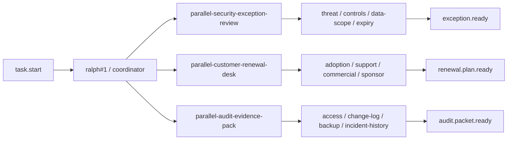
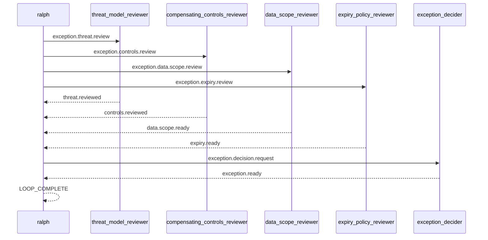

# Spec: 并行真实场景范例 - 第四批

## 背景

前三批真实并行 example 已经覆盖了:

- PR review
- release checklist
- human approval gate
- incident response war-room
- migration rehearsal
- proposal assembly
- launch readiness command
- vendor security procurement
- postmortem action board

它们已经把“工程交付”和“事故/发布协作”覆盖得比较厚。
第四批不再继续堆叠同型题材,而是补三个更偏治理、客户经营、合规的真实场景:

1. security exception review
2. customer renewal desk
3. audit evidence pack

## 目标

新增 3 个 runnable example,并为每个 example 配套一个 direct example E2E scenario:

1. `examples/parallel-security-exception-review`
2. `examples/parallel-customer-renewal-desk`
3. `examples/parallel-audit-evidence-pack`

每个 example 都要满足:

- 目录自包含,至少包含 `ralph.yml`、`PROMPT.md`、`README.md`
- worker hat 不输出 `LOOP_COMPLETE`
- terminal topic 由明确的 finalizer hat 发布
- coordinator 在未收齐所有 ready 前保持静默
- README 能说明真实价值、运行方法、关键 topic 与预期结果
- `ralph-e2e` 可直接运行 example 本身并做协议级断言

## 非目标

- 不引入新的 parallel runtime 机制
- 不要求真实工具调用、网络访问或仓库修改
- 不把 example 做成完整业务系统

## 设计原则

- 继续复用“4 lane + 1 fan-in request + 1 final topic”骨架
- payload 尽量结构化,让 E2E 优先断言 topic 与固定字段
- `LOOP_COMPLETE` 继续限制为最后一行的单独 token
- direct example scenario 继续默认限制在 `Codex`
- 避免与已有 launch / migration / incident / proposal 场景形成过高语义重叠

## 总览图

## Security exception 序列图

## 场景一: parallel-security-exception-review

### 用户价值

演示内部安全例外申请如何由多个审查面并行收敛:

- threat review
- compensating controls review
- data scope review
- expiry policy review

它和 `parallel-vendor-security-procurement` 的区别在于:
- vendor 场景是“外部供应商引入”
- 这里是“内部例外申请审批”

### 目录结构

- `examples/parallel-security-exception-review/ralph.yml`
- `examples/parallel-security-exception-review/PROMPT.md`
- `examples/parallel-security-exception-review/README.md`
- `crates/ralph-e2e/src/scenarios/parallel_security_exception_review_example.rs`

### 角色与 topic

- `threat_model_reviewer`
  - triggers: `exception.threat.review`
  - publishes: `threat.reviewed`
- `compensating_controls_reviewer`
  - triggers: `exception.controls.review`
  - publishes: `controls.reviewed`
- `data_scope_reviewer`
  - triggers: `exception.data.scope.review`
  - publishes: `data.scope.ready`
- `expiry_policy_reviewer`
  - triggers: `exception.expiry.review`
  - publishes: `expiry.ready`
- `exception_decider`
  - triggers: `exception.decision.request`
  - publishes: `exception.ready`

### 协调者语义

- `task.start` 后,`ralph#1` MUST 并行发布:
  - `exception.threat.review`
  - `exception.controls.review`
  - `exception.data.scope.review`
  - `exception.expiry.review`
- 当 `threat.reviewed`、`controls.reviewed`、`data.scope.ready`、`expiry.ready` 全部出现时:
  - `ralph#1` MUST 只发布一次 `exception.decision.request`
- `exception_decider` MUST 只发布一次 `exception.ready`
- 当收到 `exception.ready` 后:
  - `ralph#1` MUST 输出 exception decision 摘要
  - 最后一行 MUST 单独输出 `LOOP_COMPLETE`

### E2E 重点

- 断言 4 条 lane topic 都出现
- 断言 `exception.decision.request` 与 `exception.ready` 出现
- 断言 final payload 包含:
  - `decision: APPROVE_WITH_COMPENSATING_CONTROLS`
  - `required_controls: waf_rate_limit_plus_audit`
  - `expiry_date: 2026-06-30`
- 断言没有审批类 gate topic
- 断言 `LOOP_COMPLETE` 后没有新 job

## 场景二: parallel-customer-renewal-desk

### 用户价值

演示高价值客户续约前,客户成功、支持、商业、赞助人映射四条线如何并行收敛,最终形成保续约动作计划。

它和 `parallel-proposal-assembly` 的区别在于:
- proposal 场景偏“新方案/新投标材料”
- renewal 场景偏“存量客户经营与风险保卫”

### 目录结构

- `examples/parallel-customer-renewal-desk/ralph.yml`
- `examples/parallel-customer-renewal-desk/PROMPT.md`
- `examples/parallel-customer-renewal-desk/README.md`
- `crates/ralph-e2e/src/scenarios/parallel_customer_renewal_desk_example.rs`

### 角色与 topic

- `adoption_reviewer`
  - triggers: `renewal.adoption.review`
  - publishes: `adoption.ready`
- `support_health_reviewer`
  - triggers: `renewal.support.health`
  - publishes: `support.ready`
- `commercial_owner`
  - triggers: `renewal.commercial.review`
  - publishes: `commercial.ready`
- `sponsor_mapper`
  - triggers: `renewal.sponsor.map`
  - publishes: `sponsor.ready`
- `renewal_strategist`
  - triggers: `renewal.plan.request`
  - publishes: `renewal.plan.ready`

### 协调者语义

- `task.start` 后,`ralph#1` MUST 并行发布:
  - `renewal.adoption.review`
  - `renewal.support.health`
  - `renewal.commercial.review`
  - `renewal.sponsor.map`
- 当 `adoption.ready`、`support.ready`、`commercial.ready`、`sponsor.ready` 全部出现时:
  - `ralph#1` MUST 只发布一次 `renewal.plan.request`
- `renewal_strategist` MUST 只发布一次 `renewal.plan.ready`
- 当收到 `renewal.plan.ready` 后:
  - `ralph#1` MUST 输出 renewal plan 摘要
  - 最后一行 MUST 单独输出 `LOOP_COMPLETE`

### E2E 重点

- 断言 4 条 lane topic 都出现
- 断言 `renewal.plan.request` 与 `renewal.plan.ready` 出现
- 断言 final payload 包含:
  - `renewal_decision: SAVE_AND_RENEW`
  - `risk_level: MEDIUM`
  - `next_exec_action: schedule_qbr`
- 断言没有审批类 gate topic
- 断言 `LOOP_COMPLETE` 后没有新 job

## 场景三: parallel-audit-evidence-pack

### 用户价值

演示审计前的证据收集如何并行推进:

- access export
- change log collection
- backup verification
- incident history collection

最终统一形成 auditor packet。

它和 `parallel-postmortem-action-board` 的区别在于:
- postmortem 偏事故复盘材料
- audit evidence pack 偏合规审计证据包

### 目录结构

- `examples/parallel-audit-evidence-pack/ralph.yml`
- `examples/parallel-audit-evidence-pack/PROMPT.md`
- `examples/parallel-audit-evidence-pack/README.md`
- `crates/ralph-e2e/src/scenarios/parallel_audit_evidence_pack_example.rs`

### 角色与 topic

- `access_exporter`
  - triggers: `audit.access.export`
  - publishes: `access.evidence.ready`
- `change_log_collector`
  - triggers: `audit.change.log.collect`
  - publishes: `change.evidence.ready`
- `backup_verifier`
  - triggers: `audit.backup.verify`
  - publishes: `backup.evidence.ready`
- `incident_history_curator`
  - triggers: `audit.incident.history.collect`
  - publishes: `incident.evidence.ready`
- `audit_packet_editor`
  - triggers: `audit.packet.request`
  - publishes: `audit.packet.ready`

### 协调者语义

- `task.start` 后,`ralph#1` MUST 并行发布:
  - `audit.access.export`
  - `audit.change.log.collect`
  - `audit.backup.verify`
  - `audit.incident.history.collect`
- 当 `access.evidence.ready`、`change.evidence.ready`、`backup.evidence.ready`、`incident.evidence.ready` 全部出现时:
  - `ralph#1` MUST 只发布一次 `audit.packet.request`
- `audit_packet_editor` MUST 只发布一次 `audit.packet.ready`
- 当收到 `audit.packet.ready` 后:
  - `ralph#1` MUST 输出 audit packet 摘要
  - 最后一行 MUST 单独输出 `LOOP_COMPLETE`

### E2E 重点

- 断言 4 条 lane topic 都出现
- 断言 `audit.packet.request` 与 `audit.packet.ready` 出现
- 断言 final payload 包含:
  - `audit_status: READY_FOR_AUDITOR`
  - `control_set: soc2_cc7_cc8`
  - `owner: compliance-ops`
- 断言没有审批类 gate topic
- 断言 `LOOP_COMPLETE` 后没有新 job

## 注册与文档同步要求

实现时至少要同步这些文件:

- `crates/ralph-e2e/src/scenarios/mod.rs`
- `crates/ralph-e2e/src/lib.rs`
- `crates/ralph-e2e/src/main.rs`
- `crates/ralph-cli/tests/integration_examples.rs`
- `README.md`
- `crates/ralph-e2e/README.md`

## 验证要求

最少要覆盖:

1. 新增 example 的相关单元测试
   - config 不嵌 raw `<event>`
   - `prompt_file: "PROMPT.md"` 自包含
2. `cargo test -p ralph-e2e <new-scenario-id>`
3. `cargo test -p ralph-cli --test integration_examples`
4. 如时间允许,每个新 example 至少跑 1 次 live E2E
5. 最终跑 `cargo test`
