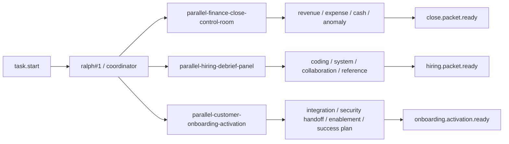
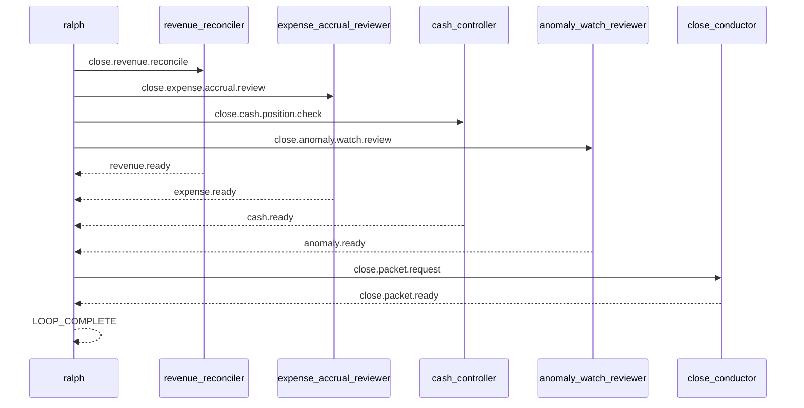

# Spec: 并行真实场景范例 - 第五批

## 背景

前四批真实并行 example 已经覆盖了:

- PR review
- release checklist
- human approval gate
- incident response war-room
- migration rehearsal
- proposal assembly
- launch readiness command
- vendor security procurement
- postmortem action board
- security exception review
- customer renewal desk
- audit evidence pack

它们已经把工程协作、治理、合规、客户经营覆盖得比较厚。
第五批不再继续堆同型题材,而是补三个更偏财务运营、人才招聘、客户落地的真实场景:

1. finance close control room
2. hiring debrief panel
3. customer onboarding activation

## 目标

新增 3 个 runnable example,并为每个 example 配套一个 direct example E2E scenario:

1. `examples/parallel-finance-close-control-room`
2. `examples/parallel-hiring-debrief-panel`
3. `examples/parallel-customer-onboarding-activation`

每个 example 都要满足:

- 目录自包含,至少包含 `ralph.yml`、`PROMPT.md`、`README.md`
- worker hat 不输出 `LOOP_COMPLETE`
- terminal topic 由明确的 finalizer hat 发布
- coordinator 在未收齐所有 ready 前保持静默
- worker / finalizer 明确禁止 self-closing `<event .../>`
- README 能说明真实价值、运行方法、关键 topic 与预期结果
- `ralph-e2e` 可直接运行 example 本身并做协议级断言

## 非目标

- 不引入新的 parallel runtime 机制
- 不要求真实工具调用、网络访问或仓库修改
- 不把 example 做成完整业务系统

## 设计原则

- 继续复用“4 lane + 1 fan-in request + 1 final topic”骨架
- payload 尽量结构化,让 E2E 优先断言 topic 与固定字段
- `LOOP_COMPLETE` 继续限制为最后一行的单独 token
- direct example scenario 继续默认限制在 `Codex`
- 避免与已有 release / launch / audit / incident / proposal / renewal 场景形成过高语义重叠

## 总览图

## Finance close 序列图

## 场景一: parallel-finance-close-control-room

### 用户价值

演示月结或季结前,财务运营最常见的四条输入线如何并行收敛:

- revenue reconciliation
- expense accrual review
- cash position check
- anomaly watch review

它和 `parallel-audit-evidence-pack` 的区别在于:
- audit 场景偏“给审计师准备证据”
- 这里偏“把 close packet 收齐,准备正式结账”

### 目录结构

- `examples/parallel-finance-close-control-room/ralph.yml`
- `examples/parallel-finance-close-control-room/PROMPT.md`
- `examples/parallel-finance-close-control-room/README.md`
- `crates/ralph-e2e/src/scenarios/parallel_finance_close_control_room_example.rs`

### 角色与 topic

- `revenue_reconciler`
  - triggers: `close.revenue.reconcile`
  - publishes: `revenue.ready`
- `expense_accrual_reviewer`
  - triggers: `close.expense.accrual.review`
  - publishes: `expense.ready`
- `cash_controller`
  - triggers: `close.cash.position.check`
  - publishes: `cash.ready`
- `anomaly_watch_reviewer`
  - triggers: `close.anomaly.watch.review`
  - publishes: `anomaly.ready`
- `close_conductor`
  - triggers: `close.packet.request`
  - publishes: `close.packet.ready`

### 协调者语义

- `task.start` 后,`ralph#1` MUST 并行发布:
  - `close.revenue.reconcile`
  - `close.expense.accrual.review`
  - `close.cash.position.check`
  - `close.anomaly.watch.review`
- 当 `revenue.ready`、`expense.ready`、`cash.ready`、`anomaly.ready` 全部出现时:
  - `ralph#1` MUST 只发布一次 `close.packet.request`
- `close_conductor` MUST 只发布一次 `close.packet.ready`
- 当收到 `close.packet.ready` 后:
  - `ralph#1` MUST 输出 close summary
  - 最后一行 MUST 单独输出 `LOOP_COMPLETE`

### E2E 重点

- 断言 4 条 lane topic 都出现
- 断言 `close.packet.request` 与 `close.packet.ready` 出现
- 断言 final payload 包含:
  - `close_status: READY_TO_CLOSE`
  - `materiality: WITHIN_THRESHOLD`
  - `owner: finance-ops`
- 断言没有审批类 gate topic
- 断言 `LOOP_COMPLETE` 后没有新 job

## 场景二: parallel-hiring-debrief-panel

### 用户价值

演示招聘 panel 如何把四条评估线并行收敛成统一 hiring recommendation:

- coding interview
- system design interview
- collaboration interview
- reference signal review

它和 `parallel-pr-review` 的区别在于:
- PR review 是工程变更评审
- 这里是招聘决策前的 panel 汇总

### 目录结构

- `examples/parallel-hiring-debrief-panel/ralph.yml`
- `examples/parallel-hiring-debrief-panel/PROMPT.md`
- `examples/parallel-hiring-debrief-panel/README.md`
- `crates/ralph-e2e/src/scenarios/parallel_hiring_debrief_panel_example.rs`

### 角色与 topic

- `coding_interviewer`
  - triggers: `hiring.coding.debrief`
  - publishes: `coding.ready`
- `system_design_interviewer`
  - triggers: `hiring.system.debrief`
  - publishes: `system.ready`
- `collaboration_interviewer`
  - triggers: `hiring.collaboration.debrief`
  - publishes: `collaboration.ready`
- `reference_reviewer`
  - triggers: `hiring.reference.debrief`
  - publishes: `reference.ready`
- `hiring_facilitator`
  - triggers: `hiring.packet.request`
  - publishes: `hiring.packet.ready`

### 协调者语义

- `task.start` 后,`ralph#1` MUST 并行发布:
  - `hiring.coding.debrief`
  - `hiring.system.debrief`
  - `hiring.collaboration.debrief`
  - `hiring.reference.debrief`
- 当 `coding.ready`、`system.ready`、`collaboration.ready`、`reference.ready` 全部出现时:
  - `ralph#1` MUST 只发布一次 `hiring.packet.request`
- `hiring_facilitator` MUST 只发布一次 `hiring.packet.ready`
- 当收到 `hiring.packet.ready` 后:
  - `ralph#1` MUST 输出 hiring summary
  - 最后一行 MUST 单独输出 `LOOP_COMPLETE`

### E2E 重点

- 断言 4 条 lane topic 都出现
- 断言 `hiring.packet.request` 与 `hiring.packet.ready` 出现
- 断言 final payload 包含:
  - `hiring_recommendation: STRONG_HIRE`
  - `level: SENIOR`
  - `next_step: prepare_offer`
- 断言没有审批类 gate topic
- 断言 `LOOP_COMPLETE` 后没有新 job

## 场景三: parallel-customer-onboarding-activation

### 用户价值

演示客户正式 kickoff 前,落地团队最常见的四条输入线如何并行收敛:

- integration readiness
- security handoff
- enablement plan
- success plan review

它和 `parallel-launch-readiness-command` 的区别在于:
- launch 场景偏“内部生产发布”
- 这里偏“客户交付落地与激活”

### 目录结构

- `examples/parallel-customer-onboarding-activation/ralph.yml`
- `examples/parallel-customer-onboarding-activation/PROMPT.md`
- `examples/parallel-customer-onboarding-activation/README.md`
- `crates/ralph-e2e/src/scenarios/parallel_customer_onboarding_activation_example.rs`

### 角色与 topic

- `integration_lead`
  - triggers: `onboarding.integration.review`
  - publishes: `integration.ready`
- `security_handoff_owner`
  - triggers: `onboarding.security.handoff`
  - publishes: `security.handoff.ready`
- `enablement_coordinator`
  - triggers: `onboarding.enablement.plan`
  - publishes: `enablement.ready`
- `success_plan_owner`
  - triggers: `onboarding.success.plan.review`
  - publishes: `success.plan.ready`
- `activation_manager`
  - triggers: `onboarding.activation.request`
  - publishes: `onboarding.activation.ready`

### 协调者语义

- `task.start` 后,`ralph#1` MUST 并行发布:
  - `onboarding.integration.review`
  - `onboarding.security.handoff`
  - `onboarding.enablement.plan`
  - `onboarding.success.plan.review`
- 当 `integration.ready`、`security.handoff.ready`、`enablement.ready`、`success.plan.ready` 全部出现时:
  - `ralph#1` MUST 只发布一次 `onboarding.activation.request`
- `activation_manager` MUST 只发布一次 `onboarding.activation.ready`
- 当收到 `onboarding.activation.ready` 后:
  - `ralph#1` MUST 输出 onboarding summary
  - 最后一行 MUST 单独输出 `LOOP_COMPLETE`

### E2E 重点

- 断言 4 条 lane topic 都出现
- 断言 `onboarding.activation.request` 与 `onboarding.activation.ready` 出现
- 断言 final payload 包含:
  - `onboarding_status: READY_FOR_KICKOFF`
  - `primary_risk: LOW`
  - `first_milestone: api_sandbox_enablement`
- 断言没有审批类 gate topic
- 断言 `LOOP_COMPLETE` 后没有新 job
