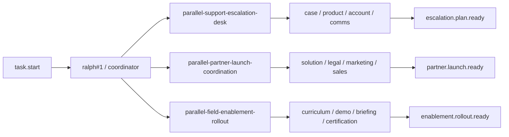
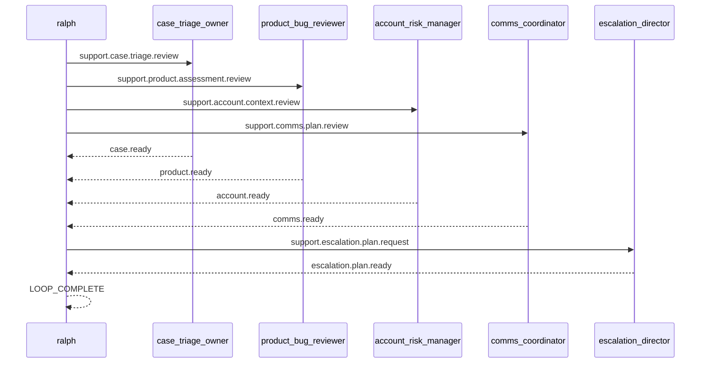

# Spec: 并行真实场景范例 - 第六批

## 背景

前五批真实并行 example 已经覆盖了:

- PR review
- release checklist
- human approval gate
- incident response war-room
- migration rehearsal
- proposal assembly
- launch readiness command
- vendor security procurement
- postmortem action board
- security exception review
- customer renewal desk
- audit evidence pack
- finance close control room
- hiring debrief panel
- customer onboarding activation

它们已经把工程协作、治理、合规、财务、招聘和客户落地覆盖得比较厚。
第六批不再继续堆同型题材,而是补三个更偏 support ops、partner ops、field enablement 的真实场景:

1. support escalation desk
2. partner launch coordination
3. field enablement rollout

## 目标

新增 3 个 runnable example,并为每个 example 配套一个 direct example E2E scenario:

1. `examples/parallel-support-escalation-desk`
2. `examples/parallel-partner-launch-coordination`
3. `examples/parallel-field-enablement-rollout`

每个 example 都要满足:

- 目录自包含,至少包含 `ralph.yml`、`PROMPT.md`、`README.md`
- worker hat 不输出 `LOOP_COMPLETE`
- terminal topic 由明确的 finalizer hat 发布
- coordinator 在未收齐所有 ready 前保持静默
- worker / finalizer 明确禁止 self-closing `<event .../>`
- README 能说明真实价值、运行方法、关键 topic 与预期结果
- `ralph-e2e` 可直接运行 example 本身并做协议级断言

## 非目标

- 不引入新的 parallel runtime 机制
- 不要求真实工具调用、网络访问或仓库修改
- 不把 example 做成完整业务系统

## 设计原则

- 继续复用“4 lane + 1 fan-in request + 1 final topic”骨架
- payload 尽量结构化,让 E2E 优先断言 topic 与固定字段
- `LOOP_COMPLETE` 继续限制为最后一行的单独 token
- direct example scenario 继续默认限制在 `Codex`
- 避免与已有 incident / launch / onboarding / vendor procurement 场景形成过高语义重叠

## 总览图

## Support escalation 序列图

## 场景一: parallel-support-escalation-desk

### 用户价值

演示高优先级客户 support escalation 如何把四条输入线并行收敛:

- case triage
- product assessment
- account risk review
- communications plan review

它和 `parallel-incident-response-war-room` 的区别在于:
- incident 场景偏平台故障与回滚协同
- 这里偏客户支持升级与跨团队响应计划

### 目录结构

- `examples/parallel-support-escalation-desk/ralph.yml`
- `examples/parallel-support-escalation-desk/PROMPT.md`
- `examples/parallel-support-escalation-desk/README.md`
- `crates/ralph-e2e/src/scenarios/parallel_support_escalation_desk_example.rs`

### 角色与 topic

- `case_triage_owner`
  - triggers: `support.case.triage.review`
  - publishes: `case.ready`
- `product_bug_reviewer`
  - triggers: `support.product.assessment.review`
  - publishes: `product.ready`
- `account_risk_manager`
  - triggers: `support.account.context.review`
  - publishes: `account.ready`
- `comms_coordinator`
  - triggers: `support.comms.plan.review`
  - publishes: `comms.ready`
- `escalation_director`
  - triggers: `support.escalation.plan.request`
  - publishes: `escalation.plan.ready`

### 协调者语义

- `task.start` 后,`ralph#1` MUST 并行发布:
  - `support.case.triage.review`
  - `support.product.assessment.review`
  - `support.account.context.review`
  - `support.comms.plan.review`
- 当 `case.ready`、`product.ready`、`account.ready`、`comms.ready` 全部出现时:
  - `ralph#1` MUST 只发布一次 `support.escalation.plan.request`
- `escalation_director` MUST 只发布一次 `escalation.plan.ready`
- 当收到 `escalation.plan.ready` 后:
  - `ralph#1` MUST 输出 escalation summary
  - 最后一行 MUST 单独输出 `LOOP_COMPLETE`

### E2E 重点

- 断言 4 条 lane topic 都出现
- 断言 `support.escalation.plan.request` 与 `escalation.plan.ready` 出现
- 断言 final payload 包含:
  - `escalation_status: READY_FOR_EXECUTION`
  - `severity: SEV_2`
  - `next_update_owner: support-director`
- 断言没有审批类 gate topic
- 断言 `LOOP_COMPLETE` 后没有新 job

## 场景二: parallel-partner-launch-coordination

### 用户价值

演示 partner launch 前,solution、legal、marketing、sales handoff 四条线如何并行收敛成统一 launch packet:

- solution enablement review
- legal terms review
- channel marketing review
- sales handoff review

它和 `parallel-launch-readiness-command` 的区别在于:
- launch readiness 偏内部产品发布
- 这里偏渠道/伙伴联合上市协同

### 目录结构

- `examples/parallel-partner-launch-coordination/ralph.yml`
- `examples/parallel-partner-launch-coordination/PROMPT.md`
- `examples/parallel-partner-launch-coordination/README.md`
- `crates/ralph-e2e/src/scenarios/parallel_partner_launch_coordination_example.rs`

### 角色与 topic

- `solution_enablement_lead`
  - triggers: `partner.solution.enablement.review`
  - publishes: `solution.ready`
- `legal_terms_owner`
  - triggers: `partner.legal.terms.review`
  - publishes: `legal.ready`
- `channel_marketing_manager`
  - triggers: `partner.channel.marketing.review`
  - publishes: `marketing.ready`
- `sales_handoff_manager`
  - triggers: `partner.sales.handoff.review`
  - publishes: `sales.ready`
- `partner_launch_manager`
  - triggers: `partner.launch.packet.request`
  - publishes: `partner.launch.ready`

### 协调者语义

- `task.start` 后,`ralph#1` MUST 并行发布:
  - `partner.solution.enablement.review`
  - `partner.legal.terms.review`
  - `partner.channel.marketing.review`
  - `partner.sales.handoff.review`
- 当 `solution.ready`、`legal.ready`、`marketing.ready`、`sales.ready` 全部出现时:
  - `ralph#1` MUST 只发布一次 `partner.launch.packet.request`
- `partner_launch_manager` MUST 只发布一次 `partner.launch.ready`
- 当收到 `partner.launch.ready` 后:
  - `ralph#1` MUST 输出 partner launch summary
  - 最后一行 MUST 单独输出 `LOOP_COMPLETE`

### E2E 重点

- 断言 4 条 lane topic 都出现
- 断言 `partner.launch.packet.request` 与 `partner.launch.ready` 出现
- 断言 final payload 包含:
  - `partner_launch_status: READY_TO_ANNOUNCE`
  - `launch_region: NORTH_AMERICA`
  - `next_checkpoint: channel_enablement`
- 断言没有审批类 gate topic
- 断言 `LOOP_COMPLETE` 后没有新 job

## 场景三: parallel-field-enablement-rollout

### 用户价值

演示 field enablement rollout 前,课程、demo 环境、manager briefing、认证计划四条线如何并行收敛:

- curriculum review
- demo environment review
- manager briefing review
- certification plan review

它和 `parallel-customer-onboarding-activation` 的区别在于:
- onboarding 偏单个客户 kickoff
- 这里偏面向内部 field 团队的统一 rollout

### 目录结构

- `examples/parallel-field-enablement-rollout/ralph.yml`
- `examples/parallel-field-enablement-rollout/PROMPT.md`
- `examples/parallel-field-enablement-rollout/README.md`
- `crates/ralph-e2e/src/scenarios/parallel_field_enablement_rollout_example.rs`

### 角色与 topic

- `curriculum_designer`
  - triggers: `enablement.curriculum.review`
  - publishes: `curriculum.ready`
- `demo_environment_owner`
  - triggers: `enablement.demo.environment.review`
  - publishes: `demo.ready`
- `manager_briefing_owner`
  - triggers: `enablement.manager.briefing.review`
  - publishes: `briefing.ready`
- `certification_tracker`
  - triggers: `enablement.certification.plan.review`
  - publishes: `certification.ready`
- `rollout_conductor`
  - triggers: `enablement.rollout.packet.request`
  - publishes: `enablement.rollout.ready`

### 协调者语义

- `task.start` 后,`ralph#1` MUST 并行发布:
  - `enablement.curriculum.review`
  - `enablement.demo.environment.review`
  - `enablement.manager.briefing.review`
  - `enablement.certification.plan.review`
- 当 `curriculum.ready`、`demo.ready`、`briefing.ready`、`certification.ready` 全部出现时:
  - `ralph#1` MUST 只发布一次 `enablement.rollout.packet.request`
- `rollout_conductor` MUST 只发布一次 `enablement.rollout.ready`
- 当收到 `enablement.rollout.ready` 后:
  - `ralph#1` MUST 输出 enablement rollout summary
  - 最后一行 MUST 单独输出 `LOOP_COMPLETE`

### E2E 重点

- 断言 4 条 lane topic 都出现
- 断言 `enablement.rollout.packet.request` 与 `enablement.rollout.ready` 出现
- 断言 final payload 包含:
  - `rollout_status: READY_TO_ROLLOUT`
  - `audience: field-sellers`
  - `first_wave: ae_managers`
- 断言没有审批类 gate topic
- 断言 `LOOP_COMPLETE` 后没有新 job
