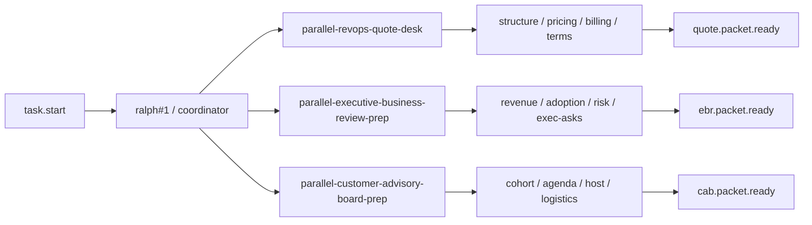
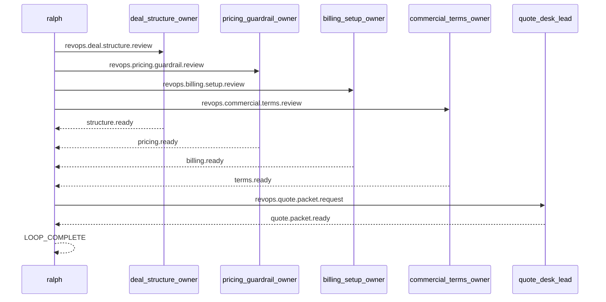

# Spec: 并行真实场景范例 - 第七批

## 背景

前六批真实并行 example 已经覆盖了:

- PR review
- release checklist
- human approval gate
- incident response war-room
- migration rehearsal
- proposal assembly
- launch readiness command
- vendor security procurement
- postmortem action board
- security exception review
- customer renewal desk
- audit evidence pack
- finance close control room
- hiring debrief panel
- customer onboarding activation
- support escalation desk
- partner launch coordination
- field enablement rollout

它们已经把工程协作、治理、合规、支持、伙伴协作和内部赋能铺得比较宽。
第七批不再回到 incident、launch、onboarding、vendor 这些已经较厚的题材。
这轮继续往商业协同和经营运营扩:

1. 营收运营报价台
2. 高层业务回顾材料准备
3. 客户顾问委员会筹备

## 目标

新增 3 个 runnable example,并为每个 example 配套一个 direct example E2E scenario:

1. `examples/parallel-revops-quote-desk`
2. `examples/parallel-executive-business-review-prep`
3. `examples/parallel-customer-advisory-board-prep`

每个 example 都要满足:

- 目录自包含,至少包含 `ralph.yml`、`PROMPT.md`、`README.md`
- worker hat 不输出 `LOOP_COMPLETE`
- terminal topic 由明确的 finalizer hat 发布
- coordinator 在未收齐所有 ready 前保持静默
- worker / finalizer 明确禁止 self-closing `<event .../>`
- README 能说明真实价值、运行方法、关键 topic 与预期结果
- `ralph-e2e` 可直接运行 example 本身并做协议级断言

## 非目标

- 不引入新的 parallel runtime 机制
- 不要求真实工具调用、网络访问或仓库修改
- 不把 example 做成完整业务系统

## 设计原则

- 继续复用“4 lane + 1 fan-in request + 1 final topic”骨架
- payload 尽量结构化,让 E2E 优先断言 topic 与固定字段
- `LOOP_COMPLETE` 继续限制为最后一行的单独 token
- direct example scenario 继续默认限制在 `Codex`
- 避免与 `parallel-proposal-assembly`、`parallel-customer-renewal-desk`、`parallel-partner-launch-coordination` 形成过高语义重叠

## 总览图

## Quote desk 序列图

## 场景一: parallel-revops-quote-desk

### 用户价值

演示营收运营报价台如何把四条输入线并行收敛:

- deal structure review
- pricing guardrail review
- billing setup review
- commercial terms review

它和 `parallel-proposal-assembly` 的区别在于:
- proposal assembly 偏售前材料拼装
- 这里偏报价运营落单前的内部收口

### 目录结构

- `examples/parallel-revops-quote-desk/ralph.yml`
- `examples/parallel-revops-quote-desk/PROMPT.md`
- `examples/parallel-revops-quote-desk/README.md`
- `crates/ralph-e2e/src/scenarios/parallel_revops_quote_desk_example.rs`

### 角色与 topic

- `deal_structure_owner`
  - triggers: `revops.deal.structure.review`
  - publishes: `structure.ready`
- `pricing_guardrail_owner`
  - triggers: `revops.pricing.guardrail.review`
  - publishes: `pricing.ready`
- `billing_setup_owner`
  - triggers: `revops.billing.setup.review`
  - publishes: `billing.ready`
- `commercial_terms_owner`
  - triggers: `revops.commercial.terms.review`
  - publishes: `terms.ready`
- `quote_desk_lead`
  - triggers: `revops.quote.packet.request`
  - publishes: `quote.packet.ready`

### 协调者语义

- `task.start` 后,`ralph#1` MUST 并行发布:
  - `revops.deal.structure.review`
  - `revops.pricing.guardrail.review`
  - `revops.billing.setup.review`
  - `revops.commercial.terms.review`
- 当 `structure.ready`、`pricing.ready`、`billing.ready`、`terms.ready` 全部出现时:
  - `ralph#1` MUST 只发布一次 `revops.quote.packet.request`
- `quote_desk_lead` MUST 只发布一次 `quote.packet.ready`
- 当收到 `quote.packet.ready` 后:
  - `ralph#1` MUST 输出 quote summary
  - 最后一行 MUST 单独输出 `LOOP_COMPLETE`

### E2E 重点

- 断言 4 条 lane topic 都出现
- 断言 `revops.quote.packet.request` 与 `quote.packet.ready` 出现
- 断言 final payload 包含:
  - `quote_status: READY_FOR_SELLER_HANDOFF`
  - `deal_motion: EXPANSION_UPSELL`
  - `pricing_owner: revops-desk`
- 断言没有审批类 gate topic
- 断言 `LOOP_COMPLETE` 后没有新 job

## 场景二: parallel-executive-business-review-prep

### 用户价值

演示高层业务回顾材料如何把四条输入线并行收敛:

- revenue narrative review
- product adoption review
- risk outlook review
- executive asks review

它和 `parallel-customer-renewal-desk` 的区别在于:
- renewal desk 偏单个客户经营收口
- 这里偏管理层业务回顾材料准备

### 目录结构

- `examples/parallel-executive-business-review-prep/ralph.yml`
- `examples/parallel-executive-business-review-prep/PROMPT.md`
- `examples/parallel-executive-business-review-prep/README.md`
- `crates/ralph-e2e/src/scenarios/parallel_executive_business_review_prep_example.rs`

### 角色与 topic

- `revenue_narrative_owner`
  - triggers: `ebr.revenue.narrative.review`
  - publishes: `revenue.ready`
- `product_adoption_owner`
  - triggers: `ebr.product.adoption.review`
  - publishes: `adoption.ready`
- `risk_outlook_owner`
  - triggers: `ebr.risk.outlook.review`
  - publishes: `risk.ready`
- `executive_asks_owner`
  - triggers: `ebr.exec.asks.review`
  - publishes: `asks.ready`
- `ebr_chief_of_staff`
  - triggers: `ebr.packet.request`
  - publishes: `ebr.packet.ready`

### 协调者语义

- `task.start` 后,`ralph#1` MUST 并行发布:
  - `ebr.revenue.narrative.review`
  - `ebr.product.adoption.review`
  - `ebr.risk.outlook.review`
  - `ebr.exec.asks.review`
- 当 `revenue.ready`、`adoption.ready`、`risk.ready`、`asks.ready` 全部出现时:
  - `ralph#1` MUST 只发布一次 `ebr.packet.request`
- `ebr_chief_of_staff` MUST 只发布一次 `ebr.packet.ready`
- 当收到 `ebr.packet.ready` 后:
  - `ralph#1` MUST 输出 EBR summary
  - 最后一行 MUST 单独输出 `LOOP_COMPLETE`

### E2E 重点

- 断言 4 条 lane topic 都出现
- 断言 `ebr.packet.request` 与 `ebr.packet.ready` 出现
- 断言 final payload 包含:
  - `ebr_status: READY_FOR_EXEC_REVIEW`
  - `meeting_tier: Q2_BUSINESS_REVIEW`
  - `narrative_owner: gm-office`
- 断言没有审批类 gate topic
- 断言 `LOOP_COMPLETE` 后没有新 job

## 场景三: parallel-customer-advisory-board-prep

### 用户价值

演示客户顾问委员会筹备如何把四条输入线并行收敛:

- customer cohort review
- agenda shaping review
- executive host prep review
- logistics readiness review

它和 `parallel-partner-launch-coordination` 的区别在于:
- partner launch 偏伙伴对外发布
- 这里偏高价值客户共创活动筹备

### 目录结构

- `examples/parallel-customer-advisory-board-prep/ralph.yml`
- `examples/parallel-customer-advisory-board-prep/PROMPT.md`
- `examples/parallel-customer-advisory-board-prep/README.md`
- `crates/ralph-e2e/src/scenarios/parallel_customer_advisory_board_prep_example.rs`

### 角色与 topic

- `customer_cohort_owner`
  - triggers: `cab.customer.cohort.review`
  - publishes: `cohort.ready`
- `agenda_shaping_owner`
  - triggers: `cab.agenda.shaping.review`
  - publishes: `agenda.ready`
- `executive_host_owner`
  - triggers: `cab.exec.host.prep.review`
  - publishes: `host.ready`
- `logistics_readiness_owner`
  - triggers: `cab.logistics.readiness.review`
  - publishes: `logistics.ready`
- `cab_program_lead`
  - triggers: `cab.packet.request`
  - publishes: `cab.packet.ready`

### 协调者语义

- `task.start` 后,`ralph#1` MUST 并行发布:
  - `cab.customer.cohort.review`
  - `cab.agenda.shaping.review`
  - `cab.exec.host.prep.review`
  - `cab.logistics.readiness.review`
- 当 `cohort.ready`、`agenda.ready`、`host.ready`、`logistics.ready` 全部出现时:
  - `ralph#1` MUST 只发布一次 `cab.packet.request`
- `cab_program_lead` MUST 只发布一次 `cab.packet.ready`
- 当收到 `cab.packet.ready` 后:
  - `ralph#1` MUST 输出 CAB summary
  - 最后一行 MUST 单独输出 `LOOP_COMPLETE`

### E2E 重点

- 断言 4 条 lane topic 都出现
- 断言 `cab.packet.request` 与 `cab.packet.ready` 出现
- 断言 final payload 包含:
  - `cab_status: READY_TO_CONFIRM`
  - `event_region: APJ`
  - `next_owner: customer-marketing`
- 断言没有审批类 gate topic
- 断言 `LOOP_COMPLETE` 后没有新 job

## 注册与文档同步要求

实现时至少要同步这些文件:

- `crates/ralph-e2e/src/scenarios/mod.rs`
- `crates/ralph-e2e/src/lib.rs`
- `crates/ralph-e2e/src/main.rs`
- `crates/ralph-cli/tests/integration_examples.rs`
- `README.md`
- `crates/ralph-e2e/README.md`
- `docs/examples/parallel-real-world-examples.zh-CN.md`

## 验证要求

最少要覆盖:

1. `beautiful-mermaid-rs --ascii < specs/parallel-real-world-examples-batch-7.spec.md` 对 2 个 mermaid block 做语法校验
2. `cargo fmt --all --check`
3. 三个 direct example scenario 的定向测试
4. `cargo test -p ralph-cli --test integration_examples`
5. 必要时对 3 个新场景跑 live Codex E2E
6. `cargo test`
