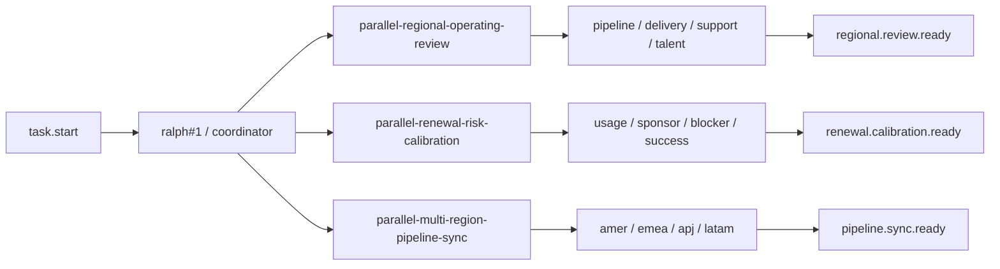
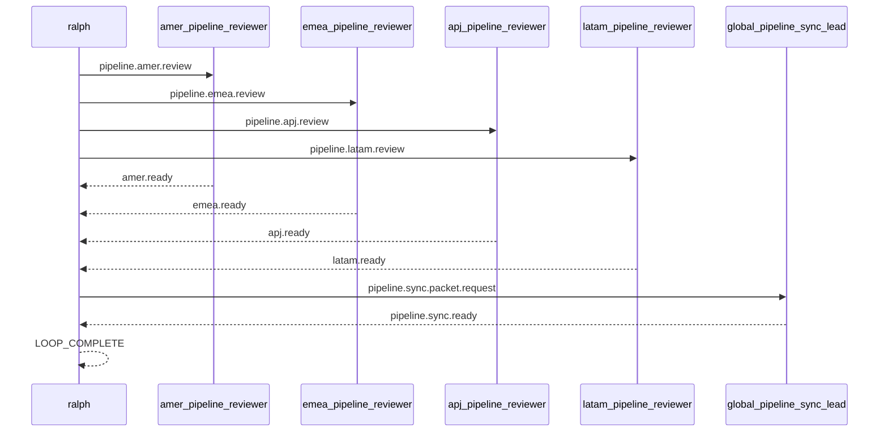

# Spec: 并行真实场景范例 - 第八批

## 背景

前七批真实并行 example 已经覆盖了:

- PR review
- release checklist
- human approval gate
- incident response war-room
- migration rehearsal
- proposal assembly
- launch readiness command
- vendor security procurement
- postmortem action board
- security exception review
- customer renewal desk
- audit evidence pack
- finance close control room
- hiring debrief panel
- customer onboarding activation
- support escalation desk
- partner launch coordination
- field enablement rollout
- revops quote desk
- executive business review prep
- customer advisory board prep

它们已经把工程协作、治理、合规、客户经营、支持升级、伙伴协同和高层材料准备铺得比较宽。
第八批不再继续堆 launch、onboarding、单客户续约这类已经较厚的题材。
这轮继续往“经营节奏 / 预测校准”扩:

1. 区域经营周会收口
2. 续费组合盘风险校准
3. 多区域 pipeline 同步

## 目标

新增 3 个 runnable example,并为每个 example 配套一个 direct example E2E scenario:

1. `examples/parallel-regional-operating-review`
2. `examples/parallel-renewal-risk-calibration`
3. `examples/parallel-multi-region-pipeline-sync`

每个 example 都要满足:

- 目录自包含,至少包含 `ralph.yml`、`PROMPT.md`、`README.md`
- worker hat 不输出 `LOOP_COMPLETE`
- terminal topic 由明确的 finalizer hat 发布
- coordinator 在未收齐所有 ready 前保持静默
- worker / finalizer 明确禁止 self-closing `<event .../>`
- README 能说明真实价值、运行方法、关键 topic 与预期结果
- `ralph-e2e` 可直接运行 example 本身并做协议级断言

## 非目标

- 不引入新的 parallel runtime 机制
- 不要求真实工具调用、网络访问或仓库修改
- 不把 example 做成完整业务系统

## 设计原则

- 继续复用“4 lane + 1 fan-in request + 1 final topic”骨架
- payload 尽量结构化,让 E2E 优先断言 topic 与固定字段
- `LOOP_COMPLETE` 继续限制为最后一行的单独 token
- direct example scenario 继续默认限制在 `Codex`
- 避免与 `parallel-customer-renewal-desk`、`parallel-executive-business-review-prep` 形成过高语义重叠
- 对最脆弱的 lane,优先锁成“单行 JSON event + 精确 `</event>`”

## 总览图

## Multi-region pipeline sync 序列图

## 场景一: parallel-regional-operating-review

### 用户价值

演示单一区域经营周会前,四条跨职能输入线如何并行收敛:

- pipeline health review
- delivery capacity review
- support signal review
- talent plan review

它和 `parallel-multi-region-pipeline-sync` 的区别在于:
- regional operating review 是“单一区域 + 多职能”
- multi-region pipeline sync 是“同一经营主题 + 多区域”

### 目录结构

- `examples/parallel-regional-operating-review/ralph.yml`
- `examples/parallel-regional-operating-review/PROMPT.md`
- `examples/parallel-regional-operating-review/README.md`
- `crates/ralph-e2e/src/scenarios/parallel_regional_operating_review_example.rs`

### 角色与 topic

- `pipeline_health_reviewer`
  - triggers: `regional.pipeline.health.review`
  - publishes: `pipeline.ready`
- `delivery_capacity_reviewer`
  - triggers: `regional.delivery.capacity.review`
  - publishes: `delivery.ready`
- `support_signal_reviewer`
  - triggers: `regional.support.signal.review`
  - publishes: `support.ready`
- `talent_plan_reviewer`
  - triggers: `regional.talent.plan.review`
  - publishes: `talent.ready`
- `regional_operating_lead`
  - triggers: `regional.operating.packet.request`
  - publishes: `regional.review.ready`

### 协调者语义

- `task.start` 后,`ralph#1` MUST 并行发布:
  - `regional.pipeline.health.review`
  - `regional.delivery.capacity.review`
  - `regional.support.signal.review`
  - `regional.talent.plan.review`
- 当 `pipeline.ready`、`delivery.ready`、`support.ready`、`talent.ready` 全部出现时:
  - `ralph#1` MUST 只发布一次 `regional.operating.packet.request`
- `regional_operating_lead` MUST 只发布一次 `regional.review.ready`
- 当收到 `regional.review.ready` 后:
  - `ralph#1` MUST 输出 regional summary
  - 最后一行 MUST 单独输出 `LOOP_COMPLETE`

### E2E 重点

- 断言 4 条 lane topic 都出现
- 断言 `regional.operating.packet.request` 与 `regional.review.ready` 出现
- 断言 final payload 包含:
  - `review_status: READY_FOR_REGION_WEEKLY`
  - `region_code: APAC_ENTERPRISE`
  - `operating_owner: regional-chief-of-staff`
- 断言没有审批类 gate topic
- 断言 `LOOP_COMPLETE` 后没有新 job

## 场景二: parallel-renewal-risk-calibration

### 用户价值

演示续费组合盘 forecast 校准如何把四条输入线并行收敛:

- usage signal review
- sponsor coverage review
- commercial blocker review
- success plan review

它和 `parallel-customer-renewal-desk` 的区别在于:
- renewal desk 偏单个客户续约保卫
- 这里偏组合盘预测口径统一

### 目录结构

- `examples/parallel-renewal-risk-calibration/ralph.yml`
- `examples/parallel-renewal-risk-calibration/PROMPT.md`
- `examples/parallel-renewal-risk-calibration/README.md`
- `crates/ralph-e2e/src/scenarios/parallel_renewal_risk_calibration_example.rs`

### 角色与 topic

- `usage_signal_reviewer`
  - triggers: `renewal.usage.signal.review`
  - publishes: `usage.ready`
- `sponsor_coverage_reviewer`
  - triggers: `renewal.sponsor.coverage.review`
  - publishes: `sponsor.ready`
- `commercial_blocker_reviewer`
  - triggers: `renewal.commercial.blocker.review`
  - publishes: `blocker.ready`
- `success_plan_reviewer`
  - triggers: `renewal.success.plan.review`
  - publishes: `success.ready`
- `renewal_calibration_lead`
  - triggers: `renewal.calibration.packet.request`
  - publishes: `renewal.calibration.ready`

### 协调者语义

- `task.start` 后,`ralph#1` MUST 并行发布:
  - `renewal.usage.signal.review`
  - `renewal.sponsor.coverage.review`
  - `renewal.commercial.blocker.review`
  - `renewal.success.plan.review`
- 当 `usage.ready`、`sponsor.ready`、`blocker.ready`、`success.ready` 全部出现时:
  - `ralph#1` MUST 只发布一次 `renewal.calibration.packet.request`
- `renewal_calibration_lead` MUST 只发布一次 `renewal.calibration.ready`
- 当收到 `renewal.calibration.ready` 后:
  - `ralph#1` MUST 输出 calibration summary
  - 最后一行 MUST 单独输出 `LOOP_COMPLETE`

### E2E 重点

- 断言 4 条 lane topic 都出现
- 断言 `renewal.calibration.packet.request` 与 `renewal.calibration.ready` 出现
- 断言 final payload 包含:
  - `calibration_status: READY_FOR_FORECAST_COMMIT`
  - `forecast_window: Q3_RENEWAL_CALIBRATION`
  - `forecast_owner: retention-ops`
- 断言没有审批类 gate topic
- 断言 `LOOP_COMPLETE` 后没有新 job

## 场景三: parallel-multi-region-pipeline-sync

### 用户价值

演示多区域 pipeline 同步如何把四个区域输入线并行收敛:

- amer pipeline review
- emea pipeline review
- apj pipeline review
- latam pipeline review

它和 `parallel-regional-operating-review` 的区别在于:
- regional operating review 偏区域周会收口
- 这里偏全球 forecast call 前的区域口径同步

### 目录结构

- `examples/parallel-multi-region-pipeline-sync/ralph.yml`
- `examples/parallel-multi-region-pipeline-sync/PROMPT.md`
- `examples/parallel-multi-region-pipeline-sync/README.md`
- `crates/ralph-e2e/src/scenarios/parallel_multi_region_pipeline_sync_example.rs`

### 角色与 topic

- `amer_pipeline_reviewer`
  - triggers: `pipeline.amer.review`
  - publishes: `amer.ready`
- `emea_pipeline_reviewer`
  - triggers: `pipeline.emea.review`
  - publishes: `emea.ready`
- `apj_pipeline_reviewer`
  - triggers: `pipeline.apj.review`
  - publishes: `apj.ready`
- `latam_pipeline_reviewer`
  - triggers: `pipeline.latam.review`
  - publishes: `latam.ready`
- `global_pipeline_sync_lead`
  - triggers: `pipeline.sync.packet.request`
  - publishes: `pipeline.sync.ready`

### 协调者语义

- `task.start` 后,`ralph#1` MUST 并行发布:
  - `pipeline.amer.review`
  - `pipeline.emea.review`
  - `pipeline.apj.review`
  - `pipeline.latam.review`
- 当 `amer.ready`、`emea.ready`、`apj.ready`、`latam.ready` 全部出现时:
  - `ralph#1` MUST 只发布一次 `pipeline.sync.packet.request`
- `global_pipeline_sync_lead` MUST 只发布一次 `pipeline.sync.ready`
- 当收到 `pipeline.sync.ready` 后:
  - `ralph#1` MUST 输出 pipeline sync summary
  - 最后一行 MUST 单独输出 `LOOP_COMPLETE`

### E2E 重点

- 断言 4 条 lane topic 都出现
- 断言 `pipeline.sync.packet.request` 与 `pipeline.sync.ready` 出现
- 断言 final payload 包含:
  - `sync_status: READY_FOR_GLOBAL_FORECAST_CALL`
  - `forecast_week: FY26_W15`
  - `sync_owner: global-revenue-operations`
- 断言没有审批类 gate topic
- 断言 `LOOP_COMPLETE` 后没有新 job
