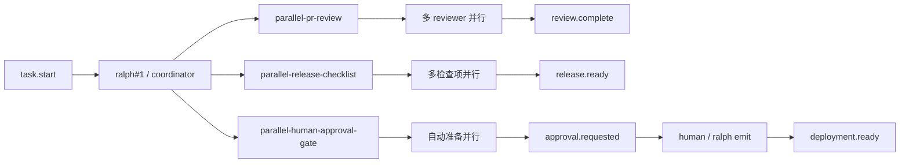
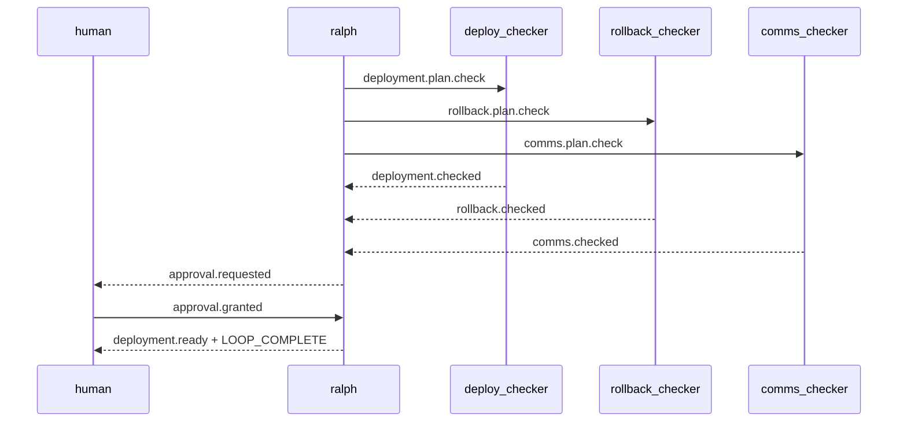

# Spec: 并行真实场景范例

## 背景

当前仓库已经有两个并行 example:

- `parallel-trigger-routing`
- `parallel-experimental-dev-engine`

它们分别覆盖了:

- 基础 fanout / queue 语义
- 多实验并行 + 审计 + 集成收敛

但还缺一批更贴近日常协作的 runnable example。
尤其是下面这三类场景,在真实团队里很常见:

- PR 评审
- Release 前置检查
- 自动化完成后等待人类批准

## 目标

新增 3 个并行 example,并为每个 example 配套一个 `ralph-e2e` 场景:

1. `examples/parallel-pr-review`
2. `examples/parallel-release-checklist`
3. `examples/parallel-human-approval-gate`

每个 example 都要满足:

- 目录自包含,至少包含 `ralph.yml`、`README.md`
- 若使用 `prompt_file`,则同目录必须存在 `PROMPT.md`
- README 能说明它在解决什么真实问题
- E2E 能直接跑 example 本身,而不是跑一份“测试专用配置”

## 非目标

- 这第一批不追求复杂工具调用或真实代码修改
- 不新增新的并行 runtime 机制
- 不要求所有 example 都依赖 TUI

## 设计原则

- 优先复用现有 parallel example 的稳定模式
- 优先让 `ralph#1` 承担协调收敛,不要为第一批 example 引入额外 coordinator hat
- 事件 payload 尽量结构化,避免把断言绑死在长自然语言
- README 要偏“真实使用说明”,不是只列技术细节

## 总览图

## 场景一: parallel-pr-review

### 用户价值

演示“多视角 reviewer 并行工作,最后再合并意见”。
这个场景更接近真实代码评审,也能直接呼应仓库里已有的 `pr-review` preset。

### 目录结构

- `examples/parallel-pr-review/ralph.yml`
- `examples/parallel-pr-review/PROMPT.md`
- `examples/parallel-pr-review/README.md`
- `crates/ralph-e2e/src/scenarios/parallel_pr_review_example.rs`

### 角色与 topic

- `correctness_reviewer`
  - triggers: `review.correctness`
  - publishes: `correctness.done`
- `security_reviewer`
  - triggers: `review.security`
  - publishes: `security.done`
- `architecture_reviewer`
  - triggers: `review.architecture`
  - publishes: `architecture.done`
- `review_synthesizer`
  - triggers: `synthesis.request`
  - publishes: `review.complete`

### 协调者语义

- `task.start` 后,`ralph#1` MUST 从 `PROMPT.md` 的 PR packet 中提炼 3 条 review 任务
- `ralph#1` MUST 在同一轮里并行发布:
  - `review.correctness`
  - `review.security`
  - `review.architecture`
- 当 3 条 reviewer 结果都到齐后,`ralph#1` MUST 发布 `synthesis.request`
- 当收到 `review.complete` 后,`ralph#1` MUST 先输出最终结论摘要
- 然后 `ralph#1` MUST 在最后一行输出 `LOOP_COMPLETE`

### E2E 重点

- 断言 3 条 review 任务都出现
- 断言 3 条 reviewer 完成事件都出现
- 断言 `synthesis.request` 与 `review.complete` 出现
- 断言最终有 `LOOP_COMPLETE`
- 断言 `.ralph/agents.json` 至少包含 3 个 reviewer hat

## 场景二: parallel-release-checklist

### 用户价值

演示“多个 release 前置条件并行验证,全部就绪后才允许发布”。
这个场景适合展示 fanout 检查 + fanin 收敛。

### 目录结构

- `examples/parallel-release-checklist/ralph.yml`
- `examples/parallel-release-checklist/PROMPT.md`
- `examples/parallel-release-checklist/README.md`
- `crates/ralph-e2e/src/scenarios/parallel_release_checklist_example.rs`

### 角色与 topic

- `qa_checker`
  - triggers: `release.qa.check`
  - publishes: `qa.ready`
- `docs_checker`
  - triggers: `release.docs.check`
  - publishes: `docs.ready`
- `ops_checker`
  - triggers: `release.ops.check`
  - publishes: `ops.ready`
- `release_synthesizer`
  - triggers: `release.summary.request`
  - publishes: `release.ready`

### 协调者语义

- `task.start` 后,`ralph#1` MUST 从 `PROMPT.md` 的 release packet 中派发 3 条检查任务
- `ralph#1` MUST 并行发布:
  - `release.qa.check`
  - `release.docs.check`
  - `release.ops.check`
- 当 `qa.ready`、`docs.ready`、`ops.ready` 全部出现时:
  - `ralph#1` MUST 发布 `release.summary.request`
- `release_synthesizer` MUST 产出 `release.ready`
- 当收到 `release.ready` 后:
  - `ralph#1` MUST 输出版本号、关键证据摘要、剩余注意事项
  - 然后输出 `LOOP_COMPLETE`

### E2E 重点

- 断言 3 条检查任务 topic 都出现
- 断言 `qa.ready`、`docs.ready`、`ops.ready` 都出现
- 断言 `release.summary.request` 出现
- 断言 `release.ready` 出现
- 断言没有 `gate.request`
- 断言最终 `LOOP_COMPLETE`

## 场景三: parallel-human-approval-gate

### 用户价值

演示“自动化阶段都准备好了,但最终动作必须等人批准”。
这个场景最接近真实上线、数据库迁移、灰度发布前的人工确认流程。

### 目录结构

- `examples/parallel-human-approval-gate/ralph.yml`
- `examples/parallel-human-approval-gate/PROMPT.md`
- `examples/parallel-human-approval-gate/README.md`
- `crates/ralph-e2e/src/scenarios/parallel_human_approval_gate_example.rs`

### 角色与 topic

- `deploy_checker`
  - triggers: `deployment.plan.check`
  - publishes: `deployment.checked`
- `rollback_checker`
  - triggers: `rollback.plan.check`
  - publishes: `rollback.checked`
- `comms_checker`
  - triggers: `comms.plan.check`
  - publishes: `comms.checked`
- `deployment_finalizer`
  - triggers: `deployment.finalize`
  - publishes: `deployment.ready`

### 协调者语义

- `task.start` 后,`ralph#1` MUST 并行发布:
  - `deployment.plan.check`
  - `rollback.plan.check`
  - `comms.plan.check`
- 当 3 条自动化检查都到齐后:
  - `ralph#1` MUST 发布 `approval.requested`
  - `ralph#1` MUST 明确提示 operator 使用 `ralph emit approval.granted ... --target-instance ralph#1`
- 在收到 `approval.granted` 之前:
  - `ralph#1` MUST NOT 输出 `LOOP_COMPLETE`
  - `ralph#1` MUST 保持等待状态
- 当收到 `approval.granted` 后:
- `ralph#1` MUST 发布 `deployment.finalize`
- `deployment_finalizer` MUST 发布 `deployment.ready`
- 输出最终执行摘要
- 最后一行输出 `LOOP_COMPLETE`

### 审批流程序列图

### E2E 重点

- 断言 3 条自动化检查任务都出现
- 断言 `approval.requested` 出现
- E2E 运行中主动执行一次 `ralph emit approval.granted ... --target-instance ralph#1`
- 断言 `approval.granted` 出现在事件日志中
- 断言 `deployment.ready` 出现
- 断言最终 `LOOP_COMPLETE`

## 注册与文档同步要求

实现时至少要同步这些文件:

- `crates/ralph-e2e/src/scenarios/mod.rs`
- `crates/ralph-e2e/src/lib.rs`
- `crates/ralph-e2e/src/main.rs`
- `crates/ralph-cli/tests/integration_examples.rs`
- `README.md`
- `crates/ralph-e2e/README.md`

## 验证要求

最少要覆盖:

1. 新增 example 的相关单元测试
2. 新增 example 的 E2E 场景过滤运行
3. `cargo test -p ralph-e2e`
4. `cargo test`
