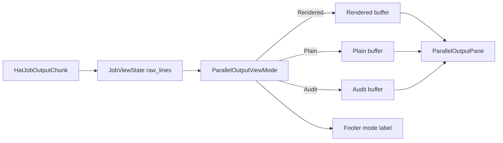
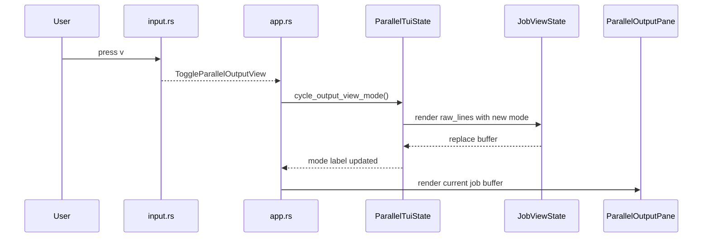

# Parallel TUI raw/audit view spec

## Goal

并行 TUI 需要同时满足两类观察需求:

1. 默认可读视图: 方便读 Markdown、reply payload 和 activity 状态。
2. raw/audit 视图: 方便排障时核对 stdout / stderr / activity 的真实到达顺序和归属。

本规格只改 TUI 展示层,不改变并行 runtime、event parser、record-session 或调度语义。

## Requirements

### Requirement: Parallel output view mode SHALL have three states

Parallel output view mode SHALL support:

- `Rendered`: 当前默认 Markdown 渲染视图。
- `Plain`: 保留 Markdown 控制符的纯文本视图。
- `Audit`: 接近 CLI/log-mode 的审计视图。

`--plain` 只决定初始状态是 `Plain`,用户仍可在 TUI 内继续切换。

### Requirement: Audit view SHALL reuse existing raw_lines

Audit view SHALL reuse `JobViewState.raw_lines` 作为单一输出真相源。

不得新增第二套输出缓存来记录 stdout / stderr / activity。

### Requirement: Audit view SHALL show stream and job attribution

Audit view SHALL render each raw line as a human-readable audit line:

```text
[writer#1:out:job=7] hello
[writer#1:err:job=7] warning
[writer#1:act:job=7] Working
```

其中 `out`、`err`、`act` 分别对应 stdout、stderr 和 activity。

### Requirement: Activity SHALL remain out of normal body views

`Activity` SHALL remain hidden from `Rendered` and `Plain` output body views.

`Audit` MAY show activity lines, because audit mode 的目标是排障和完整性核对。

### Requirement: Footer and output title SHALL expose the active view mode

Footer and Output title SHALL show the active view mode, so the user can tell whether current output is rendered, plain, or audit.

### Requirement: Key binding SHALL switch output view mode

Pressing `v` SHALL cycle view mode in this order:

```text
Rendered -> Plain -> Audit -> Rendered
```

## Flow



## Interaction sequence



## Validation plan

- Focused unit test: `v` maps to `ToggleParallelOutputView`.
- Focused state test: Audit mode renders stdout / stderr / activity with instance、stream、job attribution。
- Focused state test: cycling mode re-renders existing raw_lines without new chunks。
- Widget/footer test: Footer exposes `m:A` for audit mode。
- Package test: `cargo test -p ralph-tui`。
