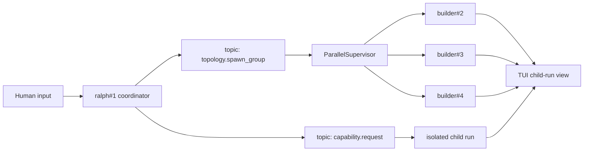
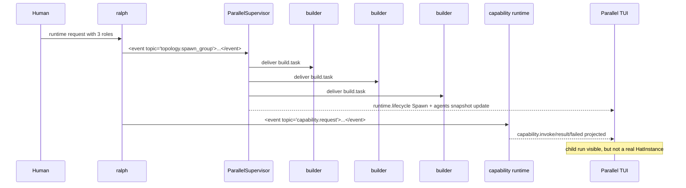

# Spec: parent-visible topology spawn and parent-observable child runs

> 状态: IMPLEMENTED
> 更新时间: 2026-05-20

## 背景

当前仓库里已经有两条真实但不同的运行语义:

1. `workflow:default-parallel` / `workflow:*` 的 runtime capability invocation.
   - 它是 isolated child run.
   - `parent_topology_unchanged=true`.
   - 适合做隔离分析,但不会在父级拓扑里真的新增 HatInstance。
2. 现有 `spawn_instance=true + target=<hat_id>` 的动态实例路由.
   - 它会真的创建 runtime lifecycle `Spawn` 记录.
   - 它会在 `.ralph/agents.json` 和并行 TUI 里变成真实实例。

用户现在要的是第三种能力:

- 在父级 TUI 里**真实新增** 3 个 hat instance。
- 同时,即使某些工作仍以 isolated child run 形式执行,也要**可观测**.
- `功能补充 / 功能完善 / review` 这类角色名必须来自运行时输入,不能写死在静态配置里。

这个 spec 的目标是把这三件事明确拆开,避免把“看见了 event”误判成“真的创建了实例”。

## 术语

### parent-visible dynamic spawn

由父级 Supervisor 真正创建的动态 HatInstance。
它必须进入 runtime lifecycle、agents snapshot 和 TUI 实例列表。

### parent-observable child run

保持 isolated child run 语义的 capability invocation 投影。
它不是 HatInstance,不能进入实例列表,但必须在 UI 中能看见运行态、结果态和证据路径。

### topology.spawn_group

一个新的 runtime event topic,用于表达“请父级 runtime 真的创建一组实例并分别派发任务”。

## 需求

### Requirement 1: spawn_group MUST create real parent-visible instances

当 `ralph#1` 输出一个 `topology.spawn_group` 事件时,Supervisor MUST 依据 payload 里的 `instances[]` 真正创建对应数量的动态 HatInstance。

- 每个实例 MUST 走现有动态 spawn 机制。
- 每个实例 MUST 有独立 `HatInstanceId`。
- 每个实例 MUST 进入 runtime lifecycle `Spawn` 记录。
- 每个仍在 current registry 的实例 MUST 出现在 `.ralph/agents.json` 的 `instances`。
- 每个已完成并被 dynamic idle / shutdown 回收的实例 MUST 出现在 `.ralph/agents.json` 的 `completed_dynamic_instances`,不能静默消失。
- 每个实例 MUST 在并行 TUI 的实例列表中可见。

### Requirement 2: spawn_group payload MUST be runtime-shaped

`topology.spawn_group` 的 payload MUST 是运行时结构,不能依赖静态 YAML 预配置角色名。

最低字段应包含:

- `request_id`: 幂等键。
- `hat`: 目标 hat,例如 `builder`。
- `delivery_topic`: 新实例收到后应处理的 topic,例如 `build.task`。
- `instances[]`: 运行时输入的实例清单。

其中 `instances[]` 的每一项 SHOULD 至少包含:

- `role`: 人类输入的角色名,例如 `功能补充`。
- `task`: 该实例的工作说明。
- `input`: 可选,更长的任务正文。若存在,它 MUST 是 string。
- `role_contract`: 可选,作为 `instances[]` 成员上的 sibling 字段提供 raw contract hint。

`role_contract` MUST NOT 放进 `input` object。`input` 是自由文本输入,`role_contract` 是结构化 sibling field。错误形态示例: `{"input":{"role_contract":{...}}}`。

### Requirement 3: spawn_group MUST not silently collapse to an existing instance

当请求明确要求 `topology.spawn_group` 时,Supervisor MUST 不要把这组实例静默折叠成现有的 `builder#1` 或其他已存在实例。

- 可以允许部分失败,但失败必须被显式记录。
- 不能把“新建三实例”悄悄降级成“投递给一个已有实例”。
- 不能靠 `parent_topology_unchanged=false` 这种结果字段来假装已经创建成功。

### Requirement 4: capability invocation MUST remain isolated child run

`workflow:default-parallel` 和其他 `workflow:*` capability invocation MUST 继续保持 isolated child run 语义。

- 它们 MUST 仍然产出 `capability.invoke/result/failed`。
- 它们 MUST 继续使用自己的 resolved config 和 child record-session。
- 它们 MUST NOT 改变父级 topology。
- 它们 MUST NOT 被误当成真实 HatInstance。

### Requirement 5: parent-observable child runs MUST have a separate UI state

并行 TUI MUST 维护一份独立于 `ParallelTuiState.instances` 的 child run 状态。

这份状态 SHOULD 记录:

- `invocation_id`
- `request_id`
- `capability_id`
- `status`(`running` / `result` / `failed`)
- `artifacts`
- `summary`

它 MUST 只负责观测,不能参与真实实例调度。

### Requirement 6: parent-observable child runs MUST be visible

child run 状态 MUST 在 UI 里可见。

推荐位置:

- footer 状态栏。
- Output 底部状态区。
- 必要时在实例列表里显示 `child:n` badge。

但它 MUST 不伪装成真实实例。

### Requirement 7: TUI MUST forward capability and topology events

并行 UI observer MUST 能收到:

- `capability.*`
- `topology.*`
- 以及现有 `gate.*` / `human.message` / `reply.human.message`

否则 parent-observable child run 和 parent-visible spawn 都无法在 UI 中稳定显示。

### Requirement 8: `spawn_instance=true` MUST keep its current single-event meaning

现有 `spawn_instance=true + target=<hat_id>` 的单事件显式 spawn 行为 MUST 保持不变。

`topology.spawn_group` 是更高层的 group-spawn 语义,不是对它的替代改名。


### Requirement 9: spawn_group SHOULD allow partial success

`topology.spawn_group` 不要求原子成功。

- 当部分实例创建失败时,Supervisor SHOULD 保留已经成功创建并成功投递的实例。
- 失败项 MUST 出现在 `topology.spawn.result` 或 `topology.spawn.failed` 的结构化 payload 中。
- 运行时 MUST 不把部分失败静默降级为已有实例投递。

### Requirement 9.1: spawn result MUST NOT redeliver the original task

`topology.spawn.result` MUST be treated as an acknowledgement, not as a request to delegate the original work again.

- The spawned instances have already received direct delivery through the original `delivery_topic`.
- The coordinator MUST NOT re-emit the original `delivery_topic` after receiving `topology.spawn.result`.
- The coordinator MUST NOT use `audience_instances` as a replay mechanism for the original task.
- If the result contains failed members, the coordinator SHOULD only handle or report those failed members.

### Requirement 10: child-run status SHOULD also be visible in `ralph agents`

child-run 状态最好同时在并行 TUI 和 `ralph agents` 中可见。

- TUI SHOULD 展示更完整的运行态、artifact 路径和摘要。
- `ralph agents` SHOULD 展示轻量摘要,例如 running / done / failed 计数和最近 child-run id。
- child-run 仍然 MUST 不进入真实 HatInstance 列表。

### Requirement 11: temporary roles SHOULD NOT be persisted as first-class agent roles

`功能补充` / `功能完善` / `review` 这类运行中临时视角默认 SHOULD NOT 作为 `.ralph/agents.json` 的一等角色字段持久化。

- 临时角色 MAY 在 TUI 当前会话中显示,也 MAY 从 last input / spawn request preview 中推导。
- 如果 LLM coordinator 明确认为某个角色应该成为固定角色,它 MAY 在 `topology.spawn_group` payload 中标记该角色为固定角色。
- 只有固定角色 SHOULD 被写入 `.ralph/agents.json` 的一等字段。
- 如果没有固定角色标记,运行时 MUST 按临时角色处理。

### Requirement 12: task-derived role contracts MUST be canonicalized by runtime

`topology.spawn_group.instances[].role_contract` MUST be treated as raw input hint only.

- Runtime MUST validate and canonicalize it into an `EffectiveRoleContract` before spawning the worker.
- Worker prompt, `.ralph/agents.json`, TUI, plain stdout and `ralph record summary` MUST consume the effective contract or `RoleContractSummary`, not the raw hint.
- `EffectiveRoleContract.objective` MUST come from `member.task`.
- If raw `role_contract.objective` differs from `member.task`, runtime SHOULD record a warning/evidence item, but MUST NOT use the raw objective as canonical worker objective.
- `identity_source` MUST remain `task-derived` for task-derived dynamic instances, even when `fixed_role=true`.
- `fixed_role=true` MUST only change role persistence to `fixed` and may populate fixed-role display metadata.
- `.ralph/agents.json` MUST remain summary-only: hash, schema version, source spawn request id, persistence, allowed result topics and preview are allowed; full prompt, full raw contract, `input_contract`, `output_contract`, `forbidden_responsibilities` and full success criteria are not allowed.

### Requirement 13: result topic allowlist MUST be output-only

The `delivery_topic` in `topology.spawn_group` is an input topic and MUST NOT become an allowed result topic.

- Runtime MUST derive the allowed result topic list from the target hat `publishes` and optional raw contract `allowed_topics`.
- Runtime MUST intersect raw allowed topics with target hat `publishes`.
- Runtime MUST remove `delivery_topic` from the resulting output allowlist.
- Runtime MUST reject empty output allowlists.
- Runtime MUST reject control-plane topics such as `topology.*`, `capability.*`, `runtime.*`, `gate.*`, `task.start`, `task.resume`, `human.message`, and `reply.human.message`.

### Requirement 14: completed dynamic instances MUST remain observable after registry reaping

When a parent-visible dynamic instance reaches `Done` and is removed from the routable current registry, runtime MUST preserve a summary-only tombstone in agents snapshot.

- Tombstones MUST live in a separate `completed_dynamic_instances` collection,not in the current `instances` list.
- Tombstones MUST include instance_id, hat_id, final_state, identity_source, completed_at, retirement_reason, role_contract_summary if present, and last_input if present.
- Tombstones MUST NOT contain full prompt, full raw role contract, full input contract, full output contract, or other long/private prompt surfaces.
- `ralph record summary --agents-file ...` MUST render completed dynamic instances as a dedicated Evidence Inspect section.

## 数据模型

### TopologySpawnGroupRequest

```json
{
  "request_id": "create-three-evolution-hats-20260519-001",
  "hat": "builder",
  "delivery_topic": "build.task",
  "instances": [
    { "role": "功能补充", "task": "..." },
    { "role": "功能完善", "task": "..." },
    { "role": "review", "task": "..." }
  ]
}
```

### TopologySpawnGroupResult

```json
{
  "status": "spawned",
  "request_id": "create-three-evolution-hats-20260519-001",
  "spawned": [
    { "instance_id": "builder#2", "role": "功能补充" },
    { "instance_id": "builder#3", "role": "功能完善" },
    { "instance_id": "builder#4", "role": "review" }
  ],
  "parent_topology_unchanged": false
}
```

### ChildRunViewState

```text
invocation_id -> request_id -> capability_id -> status -> artifacts -> summary
```

它是 UI 观测态,不是实例态。

## 运行流程





## 验收标准

1. 发出 `topology.spawn_group` 后,父级 TUI 里能看到 3 个真实新实例。
2. `.ralph/events.jsonl` 能看到对应 `runtime.lifecycle kind=Spawn` 和 `runtime.delivery` 记录。
3. `.ralph/agents.json` 能看到新实例,并且它们是动态实例。
4. `workflow:default-parallel` 仍然保持 isolated child run,不会自己新增父级实例。
5. child run 的状态能在 TUI 里看到,并且 `ralph agents` 能看到轻量摘要,但不会混进真实实例列表。
6. 临时角色默认不作为 `.ralph/agents.json` 一等字段;只有 coordinator 标记为固定角色时才持久化。
7. 现有 `spawn_instance=true` 的单实例显式 spawn 仍然可用。
8. 收到 `topology.spawn.result` 后,不会再追加投递原始 `delivery_topic` 给已有配置实例或 spawned instances。

## 验证建议

- 先写 `routing_tests.rs` / `parallel` state 单测。
- 再补 CLI integration guardrail:
  - 使用真实 `ralph run --no-tui --record-session`。
  - 断言 `.ralph/agents.json` 出现 dynamic parent-visible instances。
  - 断言 `.ralph/events.jsonl` 中 `topology.spawn.result` 之后不再出现原始 `delivery_topic` redelivery。
  - 断言 `ralph record summary FILE --agents-file .ralph/agents.json` 能回放 topology/result/termination 证据。
- 再跑 targeted cargo test。
- 最后用 `parallel_rec.jsonl` 一类真实录制证据复核 UI 与 runtime 是否一致。
