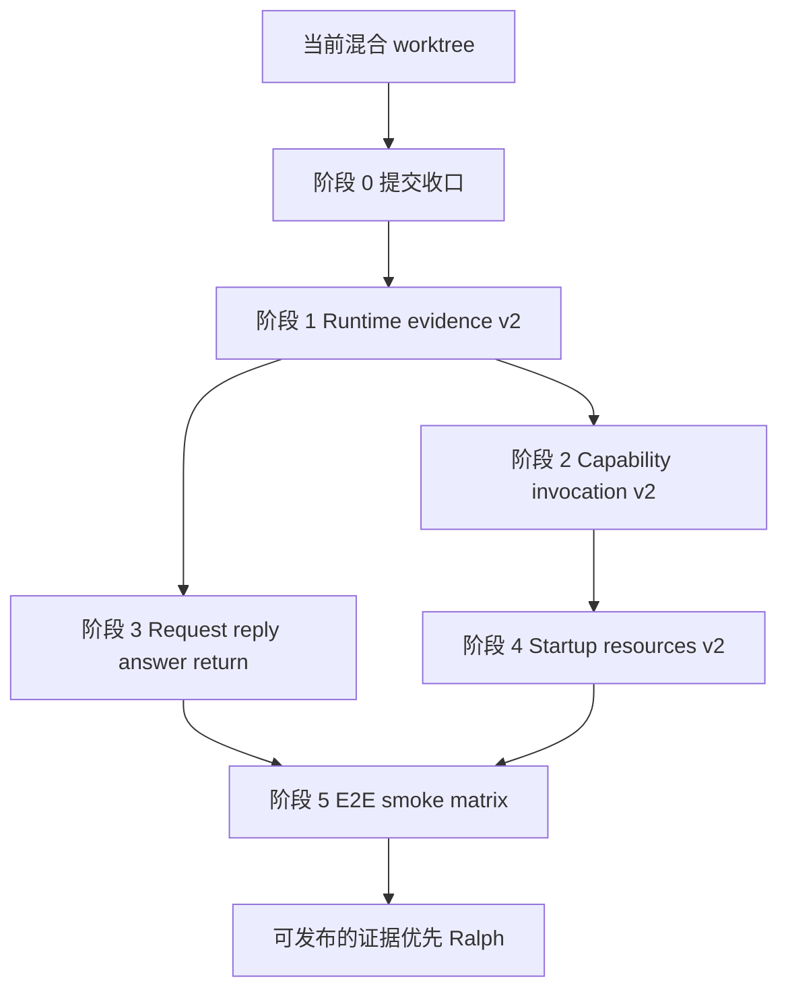
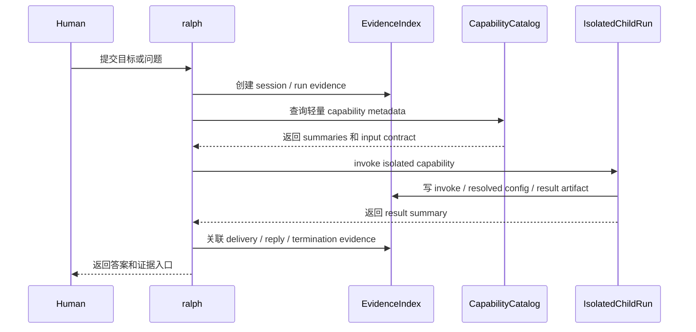

# Ralph 后续演进方案

## 目标

把当前 Ralph 从“功能已经能跑”继续推进到“证据可追踪、能力可隔离调用、启动可自举、协议可组合”的状态。

这份方案先作为 roadmap 和后续 OpenSpec 入口。它不直接替代 OpenSpec change,也不代表已经批准实现。

## 当前基线

已完成的主线:

- completed OpenSpec changes 已归档并同步主规格。
- `adapter-contract-tests` 已补齐,覆盖 stdout-only event parsing、`prompt_mode`、event envelope、termination flush。
- `startup-resource-bootstrap v1` 已完成,采用 startup-only selector + resolved config artifact。
- `runtime-capability-invocation v1` 已完成,采用 isolated child run / micro-run,不热改 live topology。

当前仍要先处理的工程状态:

- worktree 混有多条历史线和本轮主线。
- 不应执行 `git add .` 或单个大提交。
- 继续开发新功能前,应先把已完成主题拆成可 review / 可 revert 的提交。

## 核心原则

1. **提交边界优先**: 先把当前大 diff 拆清楚,再继续堆功能。
2. **证据优先**: runtime 失败时先回答“证据在哪里断了”,不要靠猜。
3. **启动前选择,运行中隔离**: bootstrap selector 发生在真实 run 之前; runtime capability 走隔离调用。
4. **不热改 live topology**: 不在运行中动态重建 `HatRegistry` / `EventLoop` / `Supervisor`。
5. **薄 orchestrator**: Ralph 负责协议、证据和边界;复杂工作交给 agent 和 capability。
6. **单一真相源**: 每类状态和 artifact 都要有明确的权威位置。

## 总体路线图

## 目标运行形态

## 阶段 0: 提交收口

### 要做什么

把当前 worktree 按主题拆成可审查提交。

建议提交组:

1. `adapter contract tests + evidence stream fixes`
2. `startup-resource-bootstrap v1`
3. `runtime-capability-invocation v1`
4. `OpenSpec archive/spec sync`
5. 其他历史支线单独处理:
   - runtime graph
   - state / experience / guidance governance
   - docs site
   - TUI
   - parallel example
   - context logs

### 交付物

- 每组都有独立 staged diff。
- 每组都有对应 focused tests。
- 不混入 unrelated files。

### 验收门禁

- `git diff --cached --check`
- 主题相关 focused tests
- 必要时补 `openspec validate <name> --type spec|change`
- 最后再跑全量 `cargo test`、smoke、docs gate

### 不做事项

- 不执行 `git add .`。
- 不把 context logs 和代码功能混成一个提交。
- 不在提交拆分期间顺手开发新功能。

## 阶段 1: Runtime evidence v2

### 要解决的问题

现在已经有 record-session、event envelope、runtime delivery / lifecycle、capability invocation artifact。下一步要把这些证据统一成可查询、可诊断、可回放的 evidence contract。

### 功能方向

- `ralph evidence summary`
- `ralph evidence inspect`
- `ralph doctor evidence`
- 统一 session / runtime / capability artifact 索引
- 失败诊断分类:
  - topic 未发布
  - hat 未收到
  - reply 未回流
  - stdout / stderr 边界错误
  - termination 未 flush
  - resolved config 与实际 run 不一致

### 交付物

- evidence index schema
- CLI inspect / summary 命令
- doctor evidence 规则
- replay / debug 文档

### 验收门禁

- contract tests 覆盖 JSONL strict parse、artifact link、缺失证据诊断。
- 至少一个失败 fixture 能输出明确断点。
- smoke test 验证普通 run 不受影响。

## 阶段 2: Capability invocation v2

### 要解决的问题

v1 只能做单 capability 隔离调用。v2 要支持 capability 计划,但仍不热改 live topology。

### 功能方向

- capability plan schema
- 多 capability 串联:
  - explore -> review -> summarize
  - inspect -> propose -> verify
- result 回流到 requester
- capability metadata lint
- capability invocation replay
- 规则优先 + 可选 LLM fallback chooser

### 交付物

- `capability.plan` artifact
- 多步 invocation artifact
- result aggregation contract
- capability authoring guide

### 验收门禁

- 多 capability 流程可在隔离目录完成。
- parent `ralph.yml` / active topology 不被修改。
- 失败时写 `failed.json` 且能被 evidence summary 引用。

## 阶段 3: Request reply / answer return 协议

### 要解决的问题

`event.reply` 现在只表达“回复哪条事件”。它还没有完整表达“回复应该回到谁、是否显示给 human、超时如何处理、多个回复如何聚合”。

### 功能方向

- request / reply correlation table
- answer return routing
- reply timeout evidence
- 多回复 aggregation
- human-visible answer 与 internal answer 分层

### 交付物

- request-reply OpenSpec
- routing table / evidence record
- timeout / aggregation tests

### 验收门禁

- explorer / reviewer / summarizer 这类 ask-reply 场景有明确回流路径。
- 不再依赖每个 hat 自造 `*.answer` / `*.result` topic。
- reply timeout 能在 evidence 中定位。

## 阶段 4: Startup resources v2

### 要解决的问题

v1 已经能让空目录启动闭环。v2 要让 resource catalog 可见、可解释、可覆盖。

### 功能方向

- `ralph resources list`
- `ralph resources inspect`
- `ralph resources sync`
- `ralph run --bootstrap-preview`
- 用户级 resource catalog
- selector 决策解释:
  - 选择了什么
  - 为什么选择
  - 哪些候选被排除

### 交付物

- resources CLI
- selector explanation artifact
- user resource catalog 文档

### 验收门禁

- preview 不启动真实 run。
- sync 不覆盖用户已修改资源。
- selector explanation 能和 `.ralph/resolved-config.yml` 对上。

## 阶段 5: E2E / smoke matrix 固化

### 要解决的问题

runtime 面越来越多后,不能只靠局部单测。需要把核心契约固化为 smoke matrix。

### 功能方向

- adapter contract smoke suite
- startup bootstrap smoke suite
- capability invocation smoke suite
- runtime evidence replay smoke suite
- CI tier:
  - fast
  - smoke
  - docs
  - full

### 交付物

- smoke matrix 文档
- CI 分层策略
- fixture 更新流程

### 验收门禁

- 核心契约变动必须触发相应 smoke。
- 新 fixture 有 record-session 证据。
- CI 输出能区分 adapter / runtime / docs / full 失败域。

## 建议优先级

| 优先级 | 项目 | 原因 |
| --- | --- | --- |
| P0 | 提交收口 | 当前 worktree 混线,不先收口会拖累所有后续演进 |
| P1 | Runtime evidence v2 | 直接提升排障和验证能力,收益最大 |
| P2 | Capability invocation v2 | 让 Ralph 能组合使用能力,但仍保持拓扑稳定 |
| P3 | Request reply / answer return | 为多 hat ask/reply 场景补协议基础 |
| P4 | Startup resources v2 | 改善默认启动体验和可解释性 |
| P5 | E2E / smoke matrix | 把前面协议固化成长期防线 |

## 明确不建议现在做

- live topology hot switch。
- 运行中动态替换整套 preset / hat topology。
- 把所有 workflow / hat capability 全量塞进主 prompt。
- 没有 evidence contract 的新 runtime feature。
- 在当前大 diff 未拆清前继续新增功能。

## 如果继续执行,下一步是什么

默认下一步不是实现新功能,而是先完成阶段 0:

1. 检查当前 index 是否仍有 staged diff。
2. 如果第一组 staged diff 仍在,先 review 并提交 `adapter contract tests + evidence stream fixes`。
3. 然后按顺序拆 `startup-resource-bootstrap v1` 和 `runtime-capability-invocation v1`。
4. 每个提交都配 focused tests 和必要 OpenSpec validate。
