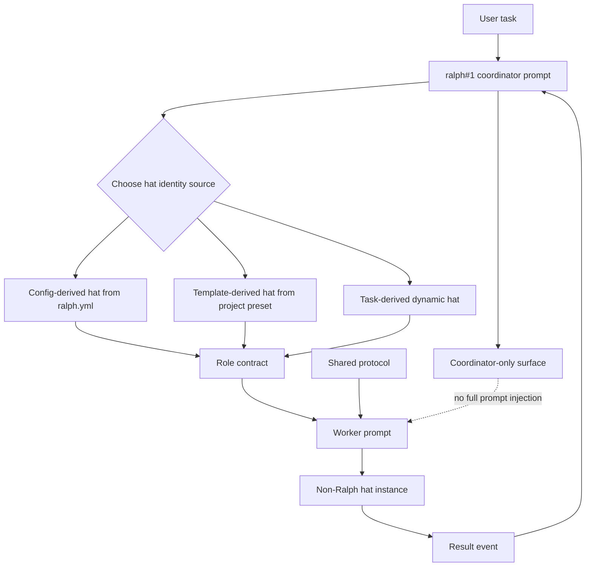
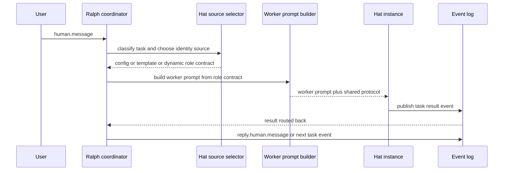

# Ralph prompt role layering

## 目标

把 Ralph 的职责重新定义为 **coordinator / dispatcher**,而不是默认亲自解决问题。

非 Ralph hat instance 应该是 worker。它们可以来自项目模板、`ralph.yml` 静态配置,也可以由 Ralph 根据当前任务性质实时生成。无论来源是哪一种,worker 都不应该继承完整的 Ralph coordinator prompt。

## 设计原则

1. **Ralph 只负责分发和收敛**
   - 判断任务类型。
   - 选择 hat 身份来源。
   - 创建或复用 hat instance。
   - 发布任务事件。
   - 收集结果并决定继续分发或回复 human。

2. **Worker 只负责执行被分配的任务**
   - 读取自己的 role contract。
   - 完成具体目标。
   - 按允许的 topic 输出结果。
   - 不做全局任务分发,除非 role contract 明确允许。

3. **共享 prompt 只能包含最小协议**
   - event envelope。
   - `reply` 语义。
   - 当前角色允许发布的 topics。
   - stop / completion 语义。

4. **动态 hat 是一等身份来源**
   - 若 `ralph.yml` 中已有合适 hat,优先复用。
   - 若项目模板/preset 中有合适角色,从模板派生。
   - 若两者都不合适,Ralph 可以根据任务性质合成 task-derived dynamic hat。

## Prompt 分层结构图



## 调度时序图



## 三类 hat 身份来源

### 1. Config-derived hat

来源: `ralph.yml` 中的 `hats` 配置。

适用场景:
- 项目已经有稳定职责。
- 触发 topic / 发布 topic / description 已经配置好。
- 需要可重复、可测试的固定角色。

要求:
- Ralph 应优先考虑这类 hat。
- Worker prompt 只注入该 hat 的职责和输入输出契约。
- 不注入完整 coordinator prompt。

### 2. Template-derived hat

来源: 项目内模板、preset 或 startup resource。

适用场景:
- 项目没有显式配置该 hat,但已有可复用角色模板。
- 常见任务类型可以从模板生成角色。

要求:
- 需要记录模板来源。
- 需要 materialize 成明确 role contract。
- 不能把模板当成完整 coordinator 指令复制给 worker。

### 3. Task-derived dynamic hat

来源: Ralph 根据当前任务性质即时合成。

适用场景:
- 静态配置和模板都不合适。
- 任务需要临时视角,例如: 风险审查者、证据审查者、架构边界分析者。

最小 role contract:
- `role_name`
- `objective`
- `input_contract`
- `output_contract`
- `allowed_topics`
- `success_criteria`
- `forbidden_responsibilities`
- `identity_source = task-derived`

运行时 MUST 再把 raw role contract 归一化为 `EffectiveRoleContract`:

- raw `topology.spawn_group.instances[].role_contract` 只表示输入 intent / hint。
- downstream worker prompt、`.ralph/agents.json` 和 `ralph record summary` MUST 只消费 runtime canonical `EffectiveRoleContract` 或其 summary。
- canonical `objective` MUST 来自 `member.task`; raw `role_contract.objective` 不得覆盖它。
- `delivery_topic` 是输入 topic,不得进入 `allowed_topics` / result publish allowlist。
- result publish allowlist MUST 与目标 hat 的 `publishes` 取交集,并剔除 `topology.*`, `capability.*`, `runtime.*`, `gate.*`, `task.start`, `task.resume`, `human.message`, `reply.human.message` 等 control-plane topics。
- `fixed_role=true` 只影响 `RolePersistence::Fixed` 和 fixed-role 展示,不得把 `identity_source=task-derived` 改写成其他来源。
- `.ralph/agents.json` MUST 只写 `RoleContractSummary`,包含 hash / schema / source request id / persistence,不得写完整 prompt 或完整 contract。

## Coordinator-only surface

只允许注入给 `ralph#1`:

- runtime capability catalog。
- topology / route policy。
- task decomposition policy。
- hat identity source selection policy。
- result aggregation policy。
- failure fallback policy。
- human reply policy。

这些内容不应默认注入给非 Ralph worker。

## Worker-only surface

只允许注入给非 Ralph hat:

- 当前 role name。
- 当前 objective。
- 输入事件摘要。
- 输出格式要求。
- 允许发布的 topics。
- shared event protocol。
- 明确禁止事项。

Worker 默认禁止:

- 重新分发任务。
- 创建其他 hat。
- 调用 runtime capability catalog。
- 自行解释全局 topology。
- 执行六文件治理,除非 role contract 明确要求。

## Reasoning effort 默认值

Ralph 和 worker 的 reasoning effort 不应该共用一个全局默认值。

建议默认策略:

| 角色 | 默认 reasoning effort | 理由 |
|------|-----------------------|------|
| `ralph#1` coordinator | `medium` | Ralph 主要做分发、安排、收敛,不应该在 coordinator turn 中深度解题。 |
| non-Ralph worker hat | `high` | Worker 负责具体任务执行,需要更充分推理来保证质量。 |

### `ralph.yml` 场景

当项目提供 `ralph.yml` 时,不能只在全局 `cli.args` 中设置一个 `model_reasoning_effort`。

原因:
- 全局 `cli.args` 会被 Ralph 和 worker 一起继承。
- 如果把全局设为 `medium`,worker 会被错误降级。
- 如果把全局设为 `high`,Ralph 会继续过度思考。

因此应使用 role-aware default:

- `ralph#1` job 默认注入 `model_reasoning_effort="medium"`。
- 非 Ralph worker job 默认注入 `model_reasoning_effort="high"`。
- 显式配置应优先于默认值。

### 无配置启动场景

当没有 `ralph.yml` 时,启动默认值也应保持同样语义:

- Ralph coordinator 默认 `medium`。
- non-Ralph worker 默认 `high`。

这条规则应该由 runtime / prompt-builder / backend-adapter 的 role-aware 层保证,而不是依赖用户手动给每个 hat 写 backend args。

### 显式配置优先级

建议优先级从高到低:

1. hat-level backend args 中显式配置的 reasoning effort。
2. role-level semantic config: `cli.reasoning_effort.coordinator` / `cli.reasoning_effort.worker`。
3. runtime role-aware default: Ralph=`medium`, worker=`high`。
4. backend 自身默认。

### Codex CLI 映射

对 Codex backend,该语义可以映射为:

```text
--config model_reasoning_effort="medium"
--config model_reasoning_effort="high"
```

但这只是 Codex backend 的 adapter 映射,不是 Ralph 的通用配置语义。

## Fast path 的正确含义

这里的 fast path 不是让 Ralph 亲自快速回答。

正确语义是:

> Ralph 在简单任务上快速完成分发决策,尽早产出 task event 或 reply event,而不是先执行完整研究/文件治理/长期记忆流程。

建议 hard gate:

- 若输入是简单 human message,`ralph#1` 第一轮必须产出以下之一:
  - `reply.human.message`
  - worker task event
  - capability.request
- 若第一轮没有结构化 event,运行时应记录 `coordinator.no_event_first_turn` 诊断。

## 回归测试建议

1. `ralph_prompt_contains_coordinator_only_sections`
   - 断言 `ralph#1` prompt 包含 coordinator-only sections。

2. `worker_prompt_excludes_coordinator_only_sections`
   - 断言非 Ralph hat prompt 不包含 runtime capability catalog。
   - 断言非 Ralph hat prompt 不包含 topology / route policy / task decomposition policy。

3. `dynamic_hat_records_identity_source`
   - 创建 task-derived dynamic hat 时,artifact 中必须记录 `identity_source = task-derived`。

4. `simple_task_dispatches_on_first_turn`
   - 简单 human input 在第一轮必须产生结构化 event。
   - 若 Ralph 没有发 event,测试失败。

5. `coordinator_and_worker_have_distinct_reasoning_defaults`
   - 断言 `ralph#1` 默认 reasoning effort 是 `medium`。
   - 断言 non-Ralph worker 默认 reasoning effort 是 `high`。
   - 断言 hat-level 显式 reasoning effort 不会被默认值覆盖。

## 设计结论

Ralph 的核心能力应该是分配任务、安排工作流、聚合结果。

Hat 的核心能力应该是完成被分配的具体职责。

二者共享的只应该是最小协议,不应该共享完整 prompt。
