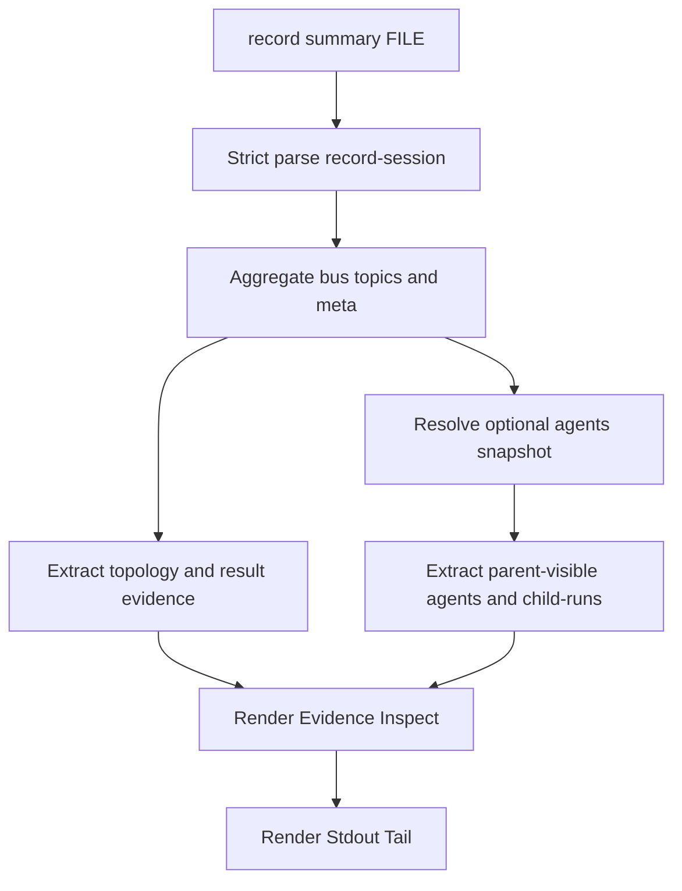
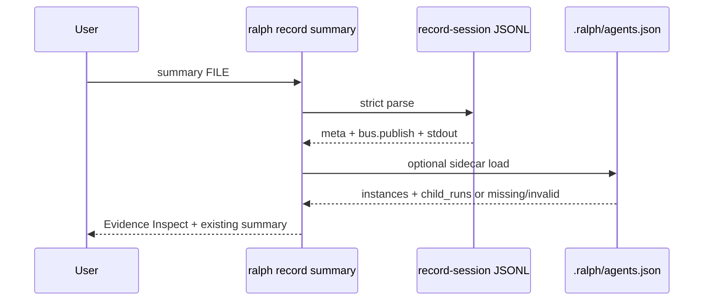

# Unified Evidence Inspect Spec

## 目标

给 `ralph record summary <record-session.jsonl>` 增加一段统一 evidence inspect 输出,让用户不用手写 jq / Python / tail stdout,就能判断一次 run 里:

- topology 是否真实变更。
- child-run 是否只是 isolated projection。
- parent-visible agents 是否可见。
- worker/result topic 是否返回。
- termination 是否收敛。

## 设计原则

1. MUST 复用现有 `record summary` 入口,避免新增分散命令。
2. MUST 以 record-session 为主证据,`.ralph/agents.json` 只作为可选 sidecar snapshot。
3. MUST 明确区分 parent-visible instance 和 isolated child-run。
4. MUST 打印证据缺失状态,不能静默省略。
5. SHOULD 保持人类可读文本输出,未来如需机器消费再新增 `--json`。

## Scope

### In scope

- `ralph record summary FILE` 输出新增 `Evidence Inspect` section。
- 自动尝试加载 agents snapshot:
  - 优先 `--agents-file FILE`。
  - 否则使用 `_meta.session_start.workspace_root/.ralph/agents.json`。
  - 再否则按当前目录向上查找 `.ralph/agents.json`。
- 输出 topology / child-runs / agents / result topics / termination 五类证据。
- parallel no-tui/plain 模式输出低频控制面事件摘要,让用户运行中也能看到 topology/capability 证据。
- agents sidecar 中明确区分 current registry instances 与 completed dynamic instance tombstones。

### Out of scope

- 不新增复杂 TUI UI；TUI 侧先复用已有 footer / instances / output status strip。
- 不实现 Claude stream-json adapter。
- 不改变 runtime 路由语义。
- 不把临时 role 写成 agents snapshot 一等字段。

## 输出契约

### Requirement: Evidence inspect section

The summary command MUST print an `Evidence Inspect` section after `Topics` and before `Stdout Tail`.

该 section 至少包含:

- `Termination`: reason / iterations / elapsed_secs。
- `Topology`: spawn_group / spawn_result / spawn_failed 摘要。
- `Agents Snapshot`: sidecar 加载状态和 parent-visible instances。
- `Child Runs`: child-run projection 摘要。
- `Result Topics`: `*.done`、`reply.human.message`、capability/topology result/failed 等结果证据。

### Requirement: Parent-visible topology evidence

The summary command MUST identify `topology.spawn_group`, `topology.spawn.result`, and `topology.spawn.failed` events from record-session bus events.

成功结果应展示:

- request_id。
- hat。
- delivery_topic。
- status。
- spawned instance ids。
- failed member count。
- parent_topology_unchanged。

### Requirement: Agents sidecar evidence

The summary command MUST load `.ralph/agents.json` as optional sidecar evidence and clearly report whether it was loaded, missing, or invalid.

加载成功时应展示:

- instance_id。
- hat_id。
- state。
- dynamic/static。
- fixed_role_label,若存在。
- last_input.topic,若存在。

### Requirement: Completed dynamic instance evidence

The summary command MUST show completed dynamic instances from the agents snapshot when present.

该输出必须明确说明:

- `instances` 表示 current registry,不是完整历史拓扑。
- `completed_dynamic_instances` 表示已完成并从 current registry 回收的 dynamic instance tombstones。
- 每条 tombstone 至少展示 instance_id、hat_id、final_state、identity_source、role_contract_summary,若存在,以及 last_input.topic。
- 缺失 agents snapshot 时,必须输出 `<unknown: agents snapshot missing>` 或等价提示,不能静默省略。

`.ralph/agents.json` SHOULD store completed dynamic instances in a separate `completed_dynamic_instances` field,not mixed back into `instances`.

### Requirement: Child-run projection evidence

The summary command MUST show child-run projections from agents snapshot when present.

每条 child-run 应展示:

- request_id。
- capability_id。
- status。
- invocation_id,若存在。
- artifact,若存在。
- summary preview,若存在。

### Requirement: Result topic evidence

The summary command MUST show result-like bus topics from record-session.

结果类 topic 包括:

- 以 `.done` 结尾的 topic。
- `reply.human.message`。
- `capability.result` / `capability.failed`。
- `topology.spawn.result` / `topology.spawn.failed`。

### Requirement: No silent proof gap

The summary command MUST print `<none>` or an explicit missing/invalid message for each evidence category that has no data.

### Requirement: Plain runtime control-plane evidence

The parallel no-tui/plain runner MUST print a concise `[supervisor:event] ...` summary for topology and capability control-plane events unless quiet mode is enabled.

该运行中显示层应覆盖:

- `topology.spawn_group`: request_id / hat / delivery_topic / requested_instances。
- `topology.spawn.result`: request_id / status / parent_topology_unchanged / spawned / failed count。
- `topology.spawn.failed`: request_id / hat / parent_topology_unchanged / error。
- `capability.request`: request_id / capability / status=running / parent_topology_unchanged=true。
- `capability.result`: request_id / invocation / capability / status=done / parent_topology_unchanged / summary。
- `capability.failed`: request_id / invocation / capability / status=failed / class / parent_topology_unchanged / error。

该显示层 MUST NOT replace record-session; record-session remains the durable audit source.

### Requirement: TUI display guardrails

The existing parallel TUI guardrails MUST continue to prove the display layer reserves status rows outside the output content and shows child-run / topology role evidence.

验收重点:

- footer 显示 child-run summary。
- instances pane 显示 topology spawn role label。
- output status pane 显示 latest child-run artifact。
- output frame 底部 status rows 不遮挡主输出内容。

## 流程图

## 时序图

## 验收

- focused unit test 覆盖一份最小 record-session + agents snapshot。
- `cargo test -p ralph-cli record_session::tests::aggregate_collects_evidence_inspect` 通过。
- `cargo test -p ralph-cli parallel_runner::guardrail_tests -- --nocapture` 通过。
- TUI focused tests 覆盖 footer / instances / output status / bottom reserved rows。
- `cargo test -p ralph-core smoke_runner` 通过。
- 用 `/tmp/ralph-topology-dogfood-bounded-180-rerun-20260520-185717.jsonl` 真实验证能看到 3 个 dynamic analyst 实例、3 条 `analysis.done` 和 `CompletionPromise`。
